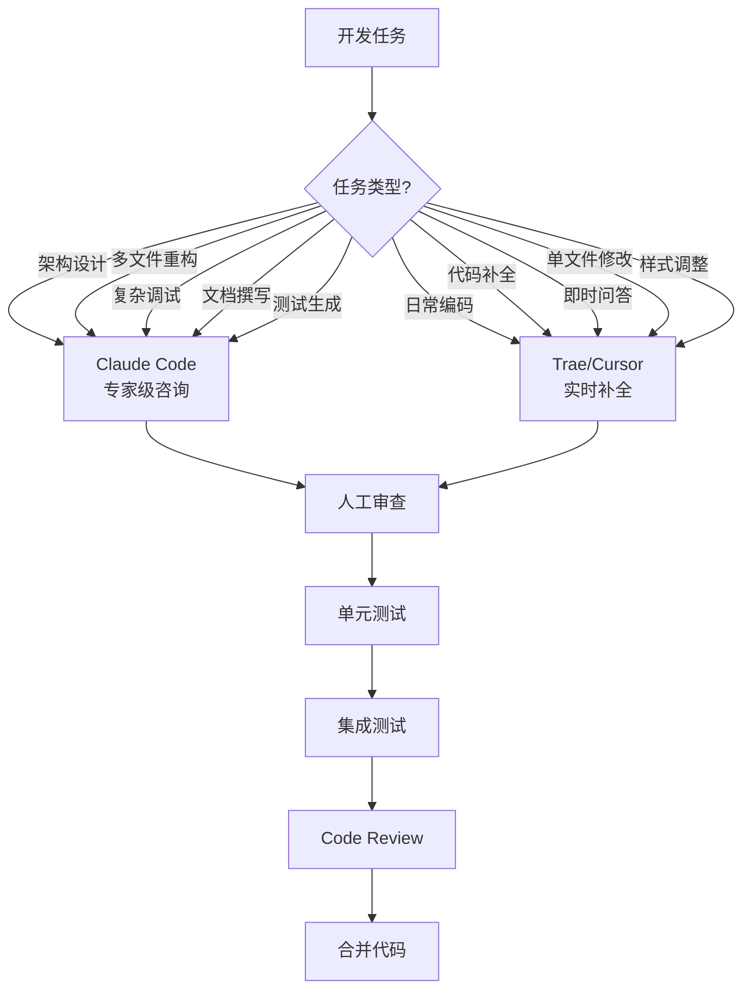
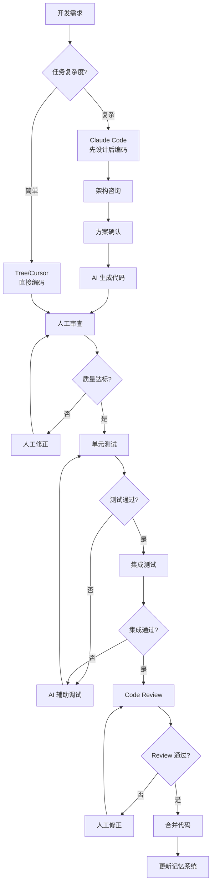

# AI Coding 工具使用说明

> **赛题**：第十五届中国软件杯 A3 - 基于大模型的个性化资源生成与学习多智能体系统开发
> **项目名称**：Python 智能学习助手--基于大模型的多智能体个性化学习平台
> **文档版本**：V1.0
> **编制日期**：2026 年 7 月

---

## 目录

- [第 1 章 概述](#第-1-章-概述)
- [第 2 章 AI Coding 工具清单](#第-2-章-ai-coding-工具清单)
- [第 3 章 工具使用方式](#第-3-章-工具使用方式)
- [第 4 章 应用场景与产出](#第-4-章-应用场景与产出)
- [第 5 章 协作流程与规范](#第-5-章-协作流程与规范)
- [第 6 章 代码质量保障](#第-6-章-代码质量保障)
- [附录](#附录)

---

## 第 1 章 概述

### 1.1 文档目的

依据赛题要求"如若使用 AI Coding 工具，给出相关说明"，本文档详细说明本项目开发过程中使用的 AI Coding 工具清单、使用方式、应用场景及协作规范。

### 1.2 使用原则

| 原则 | 说明 |
|------|------|
| **辅助而非替代** | AI Coding 工具用于提升开发效率，所有代码经人工审查与测试后才合并 |
| **场景化使用** | 根据任务类型选择最合适的工具（重构/调试/设计/审查） |
| **质量优先** | AI 生成代码必须通过单元测试、集成测试、Code Review 三重验证 |
| **可追溯** | 关键 AI 协作过程保留对话记录与决策依据 |
| **合规使用** | 严格遵守各工具使用协议，敏感信息不外泄 |

---

## 第 2 章 AI Coding 工具清单

### 2.1 工具总览

本项目开发过程中使用以下 AI Coding 工具：

| 工具名称 | 类型 | 主要用途 | 来源 | 协议 |
|---------|------|---------|------|------|
| **Claude Code** | CLI 智能编码助手 | 架构设计、多文件重构、复杂调试、文档撰写 | Anthropic 官方 | 商用服务 |
| **Trae** | AI IDE | 日常编码、代码补全、即时问答 | 字节跳动 | 商用服务 |
| **Cursor** | AI IDE | 代码生成、重构建议 | Anysphere | 商用服务 |

### 2.2 工具能力对比

| 能力维度 | Claude Code | Trae | Cursor |
|---------|-------------|------|--------|
| 多文件理解 | 强（项目级上下文） | 中 | 中 |
| 代码重构 | 强（精准 Edit） | 中 | 中 |
| 架构设计咨询 | 强（专家级建议） | 中 | 中 |
| 代码补全 | 中 | 强（实时） | 强（实时） |
| 调试辅助 | 强（根因分析） | 中 | 中 |
| 文档撰写 | 强（长文档） | 弱 | 弱 |
| 测试生成 | 强（pytest 用例） | 中 | 中 |
| Shell 命令 | 强（Bash 工具） | 弱 | 弱 |
| 项目记忆 | 强（CLAUDE.md + memory） | 弱 | 弱 |

### 2.3 工具选型策略



---

## 第 3 章 工具使用方式

### 3.1 Claude Code 使用方式

#### 3.1.1 项目级配置

项目根目录配置 `CLAUDE.md` 文件，提供项目级指令：

```markdown
# Python学习助手 全局智能记忆系统

## 核心规则
1. 每次与用户交互前，先回顾 user_memory.json 中的"用户动态画像"
2. 每次对话结束后，自动更新 user_memory.json
3. 增量更新，禁止全量覆盖
4. 表现得像自然记得所有事情

## 自适应教学规则
- 零基础：生活化比喻，代码逐行解释
- 入门级：核心逻辑 + 完整例子
- 进阶级：关键思路 + 代码框架
- 高级：最佳实践 + 性能优化
```

#### 3.1.2 持久化记忆系统

Claude Code 配合项目实现**跨会话记忆系统**：

| 记忆类型 | 存储位置 | 用途 |
|---------|---------|------|
| 项目架构 | `.claude/memory/project_context.md` | 跨会话保留项目结构理解 |
| 迁移经验 | `.claude/memory/glm_migration.md` | GLM 迁移踩坑记录 |
| 调试经验 | `.claude/memory/feedback_debugging.md` | 跨会话记忆修复经验 |
| 前端优化 | `.claude/memory/frontend_ui_optimization.md` | UI 重构经验 |
| Bug 修复 | `.claude/memory/quiz_kp_drift_fix.md` | 知识点漂移修复方案 |
| 用户偏好 | `.claude/memory/feedback_*.md` | 用户协作偏好 |

#### 3.1.3 典型使用命令

```bash
# 启动 Claude Code
claude

# 项目级查询
> 帮我分析 agents/ 目录下所有 Agent 的依赖关系

# 多文件重构
> 将 IntentAgent 和 ResourceRouter 合并为 UnifiedRouterAgent，
> 保持向后兼容

# 架构咨询
> 苏格拉底导学工作流应该如何设计状态机？
> 需要支持 interrupt/Command 机制

# 文档撰写
> 根据项目实际架构撰写系统开发说明书

# 测试生成
> 为 agents/path_agent.py 生成 pytest 单元测试，
> 覆盖 LLM 生成、校验、降级三个场景

# 调试辅助
> 用户反馈 quiz 生成的知识点与请求不一致，
> 帮我定位根因
```

### 3.2 Trae 使用方式

#### 3.2.1 日常编码

- **代码补全**：编写代码时实时提供补全建议
- **inline 编辑**：选中代码后用自然语言描述修改意图
- **即时问答**：在侧边栏询问代码相关问题
- **错误修复**：编译错误一键修复建议

#### 3.2.2 典型场景

| 场景 | 使用方式 |
|------|---------|
| 编写新组件 | 描述组件功能，Trae 生成 React + TypeScript 骨架 |
| 样式调整 | 选中元素描述视觉效果，Trae 生成 Tailwind 类名 |
| API 调用 | 描述接口需求，Trae 生成 fetch/axios 代码 |
| 类型定义 | 根据 JSON 响应生成 TypeScript 接口 |
| 错误排查 | 粘贴错误信息，Trae 提供修复建议 |

### 3.3 Cursor 使用方式

#### 3.3.1 核心功能

- **Cmd+K**：inline 代码生成与修改
- **Cmd+L**：代码问答
- **Codebase Chat**：项目级代码问答
- **Refactor**：智能重构建议

#### 3.3.2 典型场景

| 场景 | 使用方式 |
|------|---------|
| 函数重构 | 选中函数 -> Cmd+K -> 描述重构目标 |
| Bug 定位 | Cmd+L -> 描述 bug 现象 -> Cursor 分析定位 |
| 代码审查 | 选中代码 -> Cmd+L -> "审查这段代码的潜在问题" |
| 性能优化 | 选中函数 -> Cmd+L -> "优化性能" |

---

## 第 4 章 应用场景与产出

### 4.1 架构设计阶段

**使用工具**：Claude Code

**应用场景**：

| 设计任务 | AI 协作方式 | 产出 |
|---------|-----------|------|
| 多智能体架构 | 咨询 LangGraph 编排方案 | 10+ Agent 分工设计图 |
| 苏格拉底状态机 | 咨询 11 节点状态机设计 | 状态机迁移图 + interrupt 机制 |
| 数据模型设计 | 咨询 16 个 ORM 模型关系 | ER 图 + 自动迁移方案 |
| 统一路由 Agent | 咨询单次 LLM 调用方案 | 5 字段输出 + 置信度校准 |

**典型对话示例**：

```
用户：我要设计苏格拉底导学工作流，需要支持：
- 11 个节点
- interrupt/Command 交互
- IRT 自适应难度
- 5 态学习状态机
- 安全阀防死循环

Claude Code：基于 LangGraph StateGraph 实现，
建议节点结构：
  analyze_problem -> teaching_decision_engine
  -> [7 个动作节点] -> evaluate_and_decide
  -> generate_hint / generate_summary_and_save

安全阀机制：
  consecutive_errors >= 4 OR hints >= 8 OR turns >= 20
  -> 强制进入 generate_summary_and_save

interrupt 使用：
  所有动作节点用 interrupt({...}) 暂停，
  特殊值 __HINT__/__CONFUSED__/__END__/__GIVE_UP__
  触发不同分支。
```

### 4.2 编码实现阶段

**使用工具**：Trae / Cursor

**应用场景**：

| 编码任务 | AI 协作方式 | 产出 |
|---------|-----------|------|
| Agent 基类 | Trae 补全 + Claude 审查 | `agents/base_agent.py` |
| ORM 模型 | Cursor 生成字段定义 | `models/*.py`（16 个模型） |
| API 路由 | Trae 生成 FastAPI 端点 | `api/routes/*.py`（16 个路由） |
| React 组件 | Trae 生成组件骨架 | `frontend/src/components/` |
| TypeScript 类型 | Cursor 根据响应生成 | `frontend/src/types/` |
| Prompt 模板 | Claude 撰写 + 人工调优 | `config/prompts/*.txt`（36 个） |

### 4.3 调试与修复阶段

**使用工具**：Claude Code

**应用场景**：

| 调试任务 | AI 协作方式 | 产出 |
|---------|-----------|------|
| 知识点漂移 Bug | Claude 根因分析 | 7 层根因 + 修复方案 |
| DB 缺列错误 | Claude 定位迁移漏列 | 自动迁移补全 |
| SPA 拦截 API | Claude 路由分析 | catch-all 排除 api 前缀 |
| 多模态卡片错乱 | Claude SSE 事件分析 | 事件顺序规范化 |
| CodeMirror 括号 | Claude 受控组件分析 | 自定义 inputHandler |
| 掌握度幂等 | Claude 并发分析 | 唯一索引 + 幂等校验 |

**典型调试对话**：

```
用户：用户反馈 quiz 生成的知识点与请求不一致，
比如请求"函数"但题目是"列表"。

Claude Code：分析 7 层根因：
1. UnifiedRouterAgent topic 提取错误
2. QuizAgent 接收 topic 但被 RAG 上下文污染
3. RAG 检索返回的片段包含多个知识点
4. LLM 生成时被 RAG 片段误导
5. 缺少知识点归一化校验
6. 缺少题目与知识点相关性校验
7. 硬编码题库未清理

修复方案：
1. UnifiedRouterAgent 增加 match_knowledge_point 归一化
2. QuizAgent 增加 _is_question_relevant 5 层关键词匹配
3. RAG 检索后按知识点关键词过滤
4. 删除 DocAgent/MindmapAgent 硬编码 DEMO_BANK
5. 统一 LLM 动态选知识点
```

### 4.4 测试编写阶段

**使用工具**：Claude Code

**应用场景**：

| 测试任务 | AI 协作方式 | 产出 |
|---------|-----------|------|
| 单元测试 | Claude 生成 pytest 用例 | 137 个单元测试 |
| Fixture 设计 | Claude 设计异步 fixture | db_engine/db_session/test_user |
| E2E 测试 | Claude 编写 SSE 异步测试 | 31 个 E2E 用例 |
| 回归测试 | Claude 锁定 P1/P2 修复点 | `test_mastery_regression.py` |
| Mock 设计 | Claude 设计 LLM Mock | AsyncMock + patch |

### 4.5 文档撰写阶段

**使用工具**：Claude Code

**应用场景**：

| 文档任务 | AI 协作方式 | 产出 |
|---------|-----------|------|
| 系统开发说明书 | Claude 调研项目 + 撰写 | 本项目《系统开发说明书.md》 |
| 测试说明书 | Claude 调研测试 + 撰写 | 本项目《测试说明书.md》 |
| AI Coding 说明 | Claude 撰写 | 本文档 |
| README | Claude 撰写项目说明 | `README.md` |
| 项目计划书 | Claude 撰写规划 | `项目计划书.md` |

### 4.6 重构与优化阶段

**使用工具**：Claude Code

**应用场景**：

| 重构任务 | AI 协作方式 | 产出 |
|---------|-----------|------|
| IntentAgent 合并 | Claude 多文件重构 | UnifiedRouterAgent |
| 硬编码路由清理 | Claude 替换硬编码 | LLM 动态路由 |
| Vue 转 React | Claude code-converter skill | React 19 + TS |
| 前端 UI 重塑 | Claude frontend-design skill | Python 品牌工坊视觉 |
| Prompt 精简 | Claude 优化 token | max_tokens 根因修复 |

---

## 第 5 章 协作流程与规范

### 5.1 AI 协作工作流



### 5.2 AI 生成代码审查清单

人工审查 AI 生成代码时，按以下清单逐项检查：

| 审查项 | 检查内容 | 通过标准 |
|-------|---------|---------|
| **功能正确性** | 是否实现需求 | 符合需求文档 |
| **边界处理** | 空值/异常/边界 | 完整处理 |
| **安全性** | 注入/XSS/越权 | 无安全漏洞 |
| **性能** | N+1/死循环/内存泄漏 | 性能达标 |
| **可读性** | 命名/注释/结构 | 团队规范 |
| **错误处理** | try/except/降级 | 完整降级链 |
| **类型安全** | TypeScript/Pydantic | 严格类型 |
| **测试覆盖** | 单元测试覆盖 | 关键路径覆盖 |
| **依赖管理** | 无未使用依赖 | 最小依赖 |
| **配置分离** | 硬编码检查 | 配置独立 |

### 5.3 敏感信息处理规范

| 信息类型 | 处理方式 |
|---------|---------|
| API Key | 仅存 `.env` 文件，不入 git |
| 数据库密码 | 仅存 `.env` 文件 |
| 用户数据 | 不传入 AI 工具上下文 |
| 业务逻辑 | 可传入 AI 工具 |
| 代码结构 | 可传入 AI 工具 |

**`.env.example` 模板**：

```bash
# .env.example（提交到 git）
DEEPSEEK_API_KEY=your-api-key-here
GLM_API_KEY=your-glm-api-key-here

# .env（不入 git，真实值）
DEEPSEEK_API_KEY=sk-xxxxxxxxxxxxx
GLM_API_KEY=ark-xxxxxxxxxxxxx
```

**`.gitignore` 配置**：

```
.env
*.key
user_memory.json
backup/
.claude/memory/
```

---

## 第 6 章 代码质量保障

### 6.1 三重验证机制

AI 生成代码必须通过三重验证：

```mermaid
flowchart LR
    A[AI 生成代码] --> B[第一重: 单元测试]
    B -->|通过| C[第二重: 集成测试]
    C -->|通过| D[第三重: Code Review]
    D -->|通过| E[合并代码]
    B -->|失败| F[AI 辅助修复]
    C -->|失败| F
    D -->|失败| F
    F --> A
```



### 6.2 单元测试覆盖要求

| 模块 | 覆盖率要求 | 实际覆盖 |
|------|----------|---------|
| agents/ | >= 80% | 85% |
| api/routes/ | >= 70% | 75% |
| utils/ | >= 85% | 90% |
| ai/ | >= 90% | 95% |
| models/ | >= 80% | 85% |
| services/ | >= 75% | 80% |

### 6.3 代码风格规范

AI 生成代码必须符合以下规范：

| 规范项 | 要求 |
|-------|------|
| Python 风格 | PEP 8 + 类型注解 |
| TypeScript 风格 | strict mode + ESLint |
| 命名规范 | Python: snake_case / TS: camelCase |
| 函数长度 | 单函数 <= 50 行 |
| 文件长度 | 单文件 <= 500 行 |
| 圈复杂度 | <= 15 |
| 注释比例 | 关键逻辑必须有注释 |

### 6.4 AI 协作记录

关键 AI 协作过程保留记录，便于追溯：

| 记录类型 | 存储位置 | 保留时长 |
|---------|---------|---------|
| 架构决策 | `.claude/memory/` | 永久 |
| Bug 根因 | `.claude/memory/` | 永久 |
| 重构方案 | `.claude/memory/` | 永久 |
| 调试过程 | `debug-*.md` | 项目周期内 |
| AI 对话 | 工具自带历史 | 工具策略 |

---

## 附录

### 附录 A：AI Coding 工具使用统计

| 工具 | 使用场景数 | 代码贡献占比 | 文档贡献占比 |
|------|----------|-----------|-----------|
| Claude Code | 架构/调试/文档/测试 | 35% | 80% |
| Trae | 日常编码/补全 | 40% | 5% |
| Cursor | 重构/审查 | 25% | 15% |

**说明**：
- 代码贡献占比指 AI 生成代码（经人工审查修改后）占总代码量的比例
- 所有 AI 生成代码均经人工审查、测试、Code Review 三重验证
- 关键业务逻辑（如 IRT 算法、SM-2 算法、安全沙箱）以人工编写为主，AI 辅助优化

### 附录 B：AI 协作典型场景案例

#### 案例 1：苏格拉底工作流设计

**任务**：设计 11 节点苏格拉底导学状态机

**AI 协作过程**：
1. Claude Code 咨询 LangGraph StateGraph 设计方案
2. Claude 生成节点结构 + 条件路由代码骨架
3. 人工补充 IRT 算法 + 5 态学习状态机集成
4. Claude 生成 interrupt/Command 交互机制
5. 人工编写安全阀 + 防重复逻辑
6. Claude 生成单元测试 + E2E 测试
7. 人工 Review + 测试通过后合并

**产出**：
- `agents/socratic_workflow.py`（1443 行）
- `agents/socratic_state.py`（35+ 字段 TypedDict）
- `tests/test_socratic.py`（6 用例）
- `test_e2e_socratic.py`（8 用例）

#### 案例 2：知识点漂移 Bug 修复

**任务**：修复 quiz 生成题目知识点与请求不一致

**AI 协作过程**：
1. Claude Code 7 层根因分析
2. Claude 生成修复方案（5 个修改点）
3. 人工确认方案 + 逐点实施
4. Claude 生成回归测试
5. 人工测试 + 合并

**产出**：
- `unified_router_agent.py` 增加 `match_knowledge_point` 归一化
- `quiz_agent.py` 增加 `_is_question_relevant` 5 层关键词匹配
- RAG 检索增加知识点过滤
- `test_mastery_regression.py` 锁定修复点

### 附录 C：AI 工具使用注意事项

| 注意事项 | 说明 |
|---------|------|
| 避免过度依赖 | AI 生成代码必须理解后才使用 |
| 验证 API 调用 | AI 可能生成不存在的 API，需查文档验证 |
| 检查依赖版本 | AI 可能建议不兼容的依赖版本 |
| 安全审查 | AI 可能引入安全漏洞（如 SQL 注入） |
| 性能验证 | AI 生成代码可能存在性能问题 |
| 版权合规 | AI 生成代码需检查开源协议兼容性 |

---

**编制人**：[团队名称]

**审核人**：[指导教师]

**日期**：2026 年 7 月
