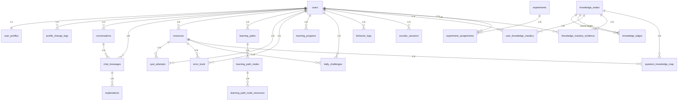
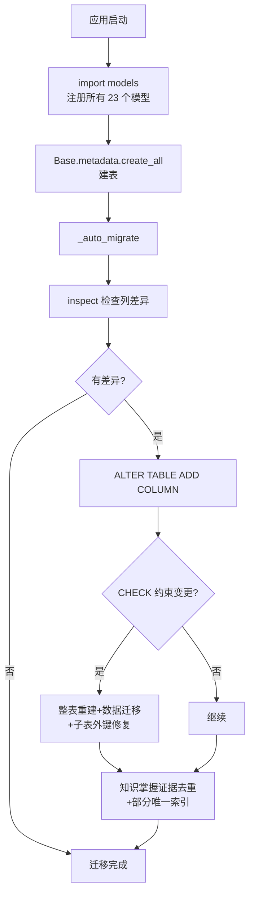

# 数据库设计说明书

> **赛题**：第十五届中国软件杯 A3 - 基于大模型的个性化资源生成与学习多智能体系统开发
> **项目名称**：Python 智能学习助手--基于大模型的多智能体个性化学习平台
> **文档版本**：V1.0
> **编制日期**：2026 年 7 月

---

## 目录

- [第 1 章 概述](#第-1-章-概述)
- [第 2 章 数据库设计](#第-2-章-数据库设计)
- [第 3 章 表设计详解](#第-3-章-表设计详解)
- [第 4 章 索引设计](#第-4-章-索引设计)
- [第 5 章 约束设计](#第-5-章-约束设计)
- [第 6 章 自动迁移机制](#第-6-章-自动迁移机制)
- [附录](#附录)

---

## 第 1 章 概述

### 1.1 文档目的

本文档依据 GB/T 8567-2016《计算机软件文档编制规范》编制，详细描述 Python 智能学习助手项目的数据库设计，包含 23 张表的完整字段字典、索引设计、约束设计、外键关系与自动迁移机制。

### 1.2 数据库选型

| 项目 | 选型 | 说明 |
|------|------|------|
| 数据库 | SQLite 3.45（生产）/ PostgreSQL 15（可迁移） | 零部署成本，ORM 屏蔽差异 |
| ORM | SQLAlchemy 2.0.29 | 异步引擎 + 关系映射 |
| 异步驱动 | aiosqlite 0.20+ | 异步 SQLite 访问 |

### 1.3 设计原则

| 原则 | 说明 |
|------|------|
| 规范化 | 满足第三范式，减少冗余 |
| 完整性 | 主键/外键/CHECK/唯一约束保障数据完整 |
| 性能 | 合理索引，避免 N+1 查询 |
| 可扩展 | 支持 ALTER TABLE 自动迁移 |
| 软删除 | 重要数据通过 is_active 软删除，非物理删除 |

---

## 第 2 章 数据库设计

### 2.1 全局配置

| 配置项 | 值 | 说明 |
|-------|-----|------|
| journal_mode | WAL | Write-Ahead Logging 提升并发 |
| synchronous | NORMAL | 平衡性能与安全 |
| cache_size | 64MB | 内存缓存 |
| foreign_keys | ON | 启用外键约束 |
| check_same_thread | False | 允许跨线程 |
| expire_on_commit | False | 提交后对象不过期 |

### 2.2 ER 图

### 2.3 表分类

| 分类 | 表数 | 表名 |
|------|------|------|
| 用户类 | 3 | users / user_profiles / profile_change_logs |
| 对话类 | 3 | conversations / chat_messages / explanations |
| 资源类 | 1 | resources |
| 路径类 | 3 | learning_paths / learning_path_nodes / learning_path_node_resources |
| 测验类 | 3 | quiz_attempts / error_book / daily_challenges |
| 进度类 | 1 | learning_progress |
| 图谱类 | 5 | knowledge_nodes / knowledge_edges / user_knowledge_mastery / knowledge_mastery_evidence / question_knowledge_map |
| 实验类 | 2 | experiments / experiment_assignments |
| 会话类 | 1 | socratic_sessions |
| 日志类 | 1 | behavior_logs |
| **合计** | **23** | |

---

## 第 3 章 表设计详解

### 3.1 users 表（用户基本信息）

- **表名**：users
- **说明**：用户基本信息表，支持用户名+密码登录（bcrypt）、IRT 能力估计、软删除

| 字段名 | 类型 | 约束 | 默认值 | 说明 |
|--------|------|------|--------|------|
| id | Integer | PK, AUTOINCREMENT, INDEX | - | 用户唯一自增 ID |
| username | String(50) | UNIQUE, NOT NULL, INDEX | - | 用户唯一标识 |
| password_hash | String(128) | NOT NULL | - | 密码哈希值（bcrypt） |
| created_at | DateTime | NOT NULL | server_default=now() | 用户创建时间 |
| updated_at | DateTime | NULLABLE | onupdate=now() | 用户信息最后更新时间 |
| is_active | Boolean | NOT NULL | server_default="1" | 账户激活状态（False=软删除） |
| ability_estimates | Text | NULLABLE | "{}" | 各主题能力估计 JSON：{topic: score} |
| ability_standard_errors | Text | NULLABLE | "{}" | 各主题能力标准误差 JSON |

**索引**：ix_users_id, ix_users_username (unique)
**外键关系**：无（被多表引用，级联删除）
**关系**：profile (UserProfile, 1:1), resources (Resource, 1:N)

### 3.2 user_profiles 表（用户画像）

- **表名**：user_profiles
- **说明**：用户画像表，7 个教育场景核心维度 + 随学随新字段 + 每日一题打卡

| 字段名 | 类型 | 约束 | 默认值 | 说明 |
|--------|------|------|--------|------|
| user_id | Integer | PK, FK->users.id (CASCADE) | - | 共享 users.id 主键 |
| gender | String(10) | NULLABLE | - | 性别：male/female/other |
| age | Integer | NULLABLE | - | 年龄 |
| knowledge_level | String(20) | NOT NULL, CHECK | 'beginner' | beginner/intermediate/advanced |
| learning_style | String(20) | NOT NULL, CHECK | 'mixed' | visual/auditory/kinesthetic/mixed |
| learning_goal | String(20) | NOT NULL, CHECK | 'interest' | exam/interest/employment/competition |
| duration_preference | String(20) | NOT NULL, CHECK | 'medium' | short/medium/long |
| weak_points | JSON | NOT NULL | '[]' | 薄弱知识点数组 |
| mastered_points | JSON | NOT NULL | '[]' | 已掌握知识点数组 |
| motivation_level | String(20) | NOT NULL, CHECK | 'medium' | high/medium/low |
| error_preferences | JSON | NOT NULL | '[]' | top-3 错因类型 |
| current_topic | String(100) | NULLABLE | - | 当前学习知识点 |
| last_study_at | DateTime | NULLABLE | - | 最近学习时间（UTC） |
| current_streak | Integer | NOT NULL | 0 | 当前连续答题天数 |
| longest_streak | Integer | NOT NULL | 0 | 最长连续答题天数 |
| streak_status | String(20) | NOT NULL | 'active' | active/broken |
| recovery_progress | Integer | NOT NULL | 0 | 恢复进度（0-3） |
| last_challenge_date | String(10) | NULLABLE | - | 最后答题日期 YYYY-MM-DD |
| created_at | DateTime | NOT NULL | now() | 画像创建时间 |
| updated_at | DateTime | NULLABLE | onupdate=now() | 最后更新时间 |
| is_active | Boolean | NOT NULL | "1" | 软删除标志 |

**约束**：ck_profile_knowledge_level / ck_profile_learning_style / ck_profile_learning_goal / ck_profile_duration_preference / ck_profile_motivation_level
**外键**：user_id -> users.id (ON DELETE CASCADE)

### 3.3 profile_change_logs 表（画像变更日志）

- **表名**：profile_change_logs
- **说明**：用户画像变更日志表，记录每次画像更新的字段变化

| 字段名 | 类型 | 约束 | 默认值 | 说明 |
|--------|------|------|--------|------|
| id | Integer | PK, AUTOINCREMENT | - | 日志 ID |
| user_id | Integer | FK->users.id(CASCADE), NOT NULL, INDEX | - | 所属用户 ID |
| changed_fields | JSON | NOT NULL | - | 变更字段和新旧值 |
| source | String(20) | NOT NULL | "api" | 变更来源：llm/evaluation/api |
| raw_llm_output | JSON | NULLABLE | - | LLM 原始输出（source=llm 时记录） |
| confidence | Float | NULLABLE | - | LLM 信心度（source=llm 时记录） |
| created_at | DateTime | NOT NULL | now() | 创建时间 |

**索引**：ix_profile_change_logs_user_id
**外键**：user_id -> users.id (ON DELETE CASCADE)

### 3.4 conversations 表（对话会话）

- **表名**：conversations
- **说明**：对话会话表，每个用户可有多个对话

| 字段名 | 类型 | 约束 | 默认值 | 说明 |
|--------|------|------|--------|------|
| id | Integer | PK, AUTOINCREMENT | - | 会话 ID |
| user_id | Integer | FK->users.id(CASCADE), NOT NULL, INDEX | - | 所属用户 ID |
| title | String(200) | NOT NULL | DEFAULT_CONVERSATION_TITLE | 会话标题 |
| created_at | DateTime | NOT NULL | now() | 创建时间 |
| updated_at | DateTime | NOT NULL | onupdate=now() | 最后更新时间 |

**索引**：ix_conversations_user_id
**外键**：user_id -> users.id (ON DELETE CASCADE)
**关系**：messages (ChatMessage, 1:N, cascade delete-orphan)

### 3.5 chat_messages 表（聊天消息）

- **表名**：chat_messages
- **说明**：聊天消息持久化表，按用户隔离，支持 user/assistant/system 三种角色

| 字段名 | 类型 | 约束 | 默认值 | 说明 |
|--------|------|------|--------|------|
| id | Integer | PK, AUTOINCREMENT | - | 消息 ID |
| user_id | Integer | FK->users.id(CASCADE), NOT NULL, INDEX | - | 所属用户 ID |
| conversation_id | Integer | FK->conversations.id(SET NULL), INDEX, NULLABLE | - | 所属对话 ID |
| role | String(20) | NOT NULL | - | 消息角色：user/assistant/system |
| content | Text | NOT NULL | - | 消息内容 |
| content_blocks_json | Text | NULLABLE | - | 结构化内容块 JSON |
| image_urls_json | Text | NULLABLE | - | 图片 URL 列表 JSON |
| created_at | DateTime | NOT NULL | now() | 创建时间 |
| is_bookmarked | Boolean | NOT NULL | "0" | 是否已收藏 |

**索引**：ix_chat_messages_user_id, ix_chat_messages_conversation_id
**外键**：user_id -> users.id(CASCADE), conversation_id -> conversations.id(SET NULL)

### 3.6 resources 表（资源元数据）

- **表名**：resources
- **说明**：资源元数据表，10 种核心资源 + 进度追踪 + RAG 向量库联动

| 字段名 | 类型 | 约束 | 默认值 | 说明 |
|--------|------|------|--------|------|
| id | Integer | PK, AUTOINCREMENT, INDEX | - | 资源 ID |
| task_id | String(100) | NULLABLE, INDEX | - | LangGraph 任务 ID（thread_id） |
| user_id | Integer | FK->users.id(CASCADE), NOT NULL, INDEX | - | 关联用户 ID |
| resource_type | String(20) | NOT NULL, INDEX, CHECK | - | doc/quiz/mindmap/code/video/reading/slides/daily_challenge/daily_extra/multimodal |
| title | String(200) | NOT NULL | - | 资源标题 |
| content | Text | NULLABLE | - | 文本资源内容 |
| file_path | String(500) | NULLABLE | - | 大文件存储路径（video） |
| extra_metadata | JSON | NULLABLE | - | 结构化元数据 |
| vector_db_id | String(100) | NULLABLE, INDEX | - | 向量库文档 ID |
| knowledge_points | JSON | NOT NULL | '[]' | 知识点编码列表 |
| version | Integer | NOT NULL | 1 | 资源版本号 |
| status | String(20) | NOT NULL, INDEX, CHECK | 'pending' | pending/processing/completed/failed |
| progress_percent | Integer | NOT NULL, CHECK | 0 | 0-100 |
| error_message | Text | NULLABLE | - | 生成失败错误信息 |
| in_library | Boolean | NOT NULL | "0" | 是否已加入资源库 |
| note | Text | NULLABLE | - | 用户学习笔记 |
| is_reusable | Boolean | NOT NULL | "0" | 是否可复用（公共资源库） |
| created_at | DateTime | NOT NULL | now() | 创建时间 |
| updated_at | DateTime | NULLABLE | onupdate=now() | 更新时间 |
| is_active | Boolean | NOT NULL | "1" | 软删除标志 |

**约束**：ck_resource_type_valid, ck_resource_status_valid, ck_progress_percent_range
**复合唯一**：uq_user_title_type(user_id, title, resource_type)
**索引**：idx_resource_user_status_type(user_id, status, resource_type)
**外键**：user_id -> users.id (ON DELETE CASCADE)

### 3.7 learning_paths 表（学习路径主表）

- **表名**：learning_paths
- **说明**：学习路径主表，一个用户可有多条路径（不同方向）

| 字段名 | 类型 | 约束 | 默认值 | 说明 |
|--------|------|------|--------|------|
| id | Integer | PK, AUTOINCREMENT | - | 路径 ID |
| user_id | Integer | FK->users.id(CASCADE), NOT NULL, INDEX | - | 关联用户 ID |
| title | String(200) | NOT NULL | - | 路径标题 |
| description | Text | NULLABLE | - | 路径描述 |
| goal | String(200) | NULLABLE | - | 学习目标 |
| topic | String(100) | NOT NULL | 'Python基础' | 路径主题/方向 |
| status | String(20) | NOT NULL, INDEX, CHECK | 'active' | active/paused/completed/archived |
| total_nodes | Integer | NOT NULL | 0 | 总节点数 |
| completed_nodes | Integer | NOT NULL | 0 | 已完成节点数 |
| total_estimated_time | Integer | NOT NULL | 0 | 总预计时长（分钟） |
| progress_percent | Float | NOT NULL | 0.0 | 整体进度（0-100） |
| created_at | DateTime | NOT NULL | now() | 创建时间 |
| updated_at | DateTime | NULLABLE | onupdate=now() | 最后更新时间 |

**约束**：ck_learning_path_status
**索引**：idx_learning_path_user_status(user_id, status), idx_learning_path_user_updated(user_id, updated_at)
**外键**：user_id -> users.id (CASCADE)
**关系**：nodes (LearningPathNode, 1:N, cascade delete-orphan)

### 3.8 learning_path_nodes 表（学习路径节点）

- **表名**：learning_path_nodes
- **说明**：学习路径节点表，每个节点对应一个知识点

| 字段名 | 类型 | 约束 | 默认值 | 说明 |
|--------|------|------|--------|------|
| id | Integer | PK, AUTOINCREMENT | - | 节点 ID |
| learning_path_id | Integer | FK->learning_paths.id(CASCADE), NOT NULL, INDEX | - | 所属路径 ID |
| knowledge_point | String(100) | NOT NULL | - | 知识点名称 |
| description | Text | NULLABLE | - | 节点描述/学习目标 |
| order | Integer | NOT NULL | - | 节点顺序（从 1 开始） |
| prerequisites | JSON | NOT NULL | '[]' | 前置知识点列表 |
| difficulty | Float | NOT NULL, CHECK(0-1) | 0.5 | 知识点难度 |
| estimated_time | Integer | NOT NULL | 15 | 预计学习时长（分钟） |
| mastery_threshold | Float | NOT NULL | 0.7 | 掌握度阈值 |
| mastery | Float | NOT NULL, CHECK(0-1) | 0.0 | 当前掌握度 |
| status | String(20) | NOT NULL, INDEX, CHECK | 'not_started' | not_started/in_progress/completed/needs_review/skipped |
| progress | Float | NOT NULL, CHECK(0-100) | 0.0 | 节点学习进度 |
| node_type | String(20) | NOT NULL | 'new' | new（新学）/review（复习） |
| started_at | DateTime | NULLABLE | - | 开始学习时间 |
| completed_at | DateTime | NULLABLE | - | 完成时间 |
| last_study_at | DateTime | NULLABLE | - | 最后学习时间 |
| created_at | DateTime | NOT NULL | now() | 创建时间 |

**约束**：ck_lp_node_status / ck_lp_node_mastery_range / ck_lp_node_difficulty_range / ck_lp_node_progress_range
**复合唯一**：uq_path_knowledge_point(learning_path_id, knowledge_point)
**索引**：idx_lp_node_path_order, idx_lp_node_status
**外键**：learning_path_id -> learning_paths.id (CASCADE)
**关系**：resources (LearningPathNodeResource, 1:N)

### 3.9 learning_path_node_resources 表（节点资源关联）

- **表名**：learning_path_node_resources
- **说明**：学习路径节点资源关联表，每个节点可关联多种类型资源

| 字段名 | 类型 | 约束 | 默认值 | 说明 |
|--------|------|------|--------|------|
| id | Integer | PK, AUTOINCREMENT | - | 资源关联 ID |
| node_id | Integer | FK->learning_path_nodes.id(CASCADE), NOT NULL, INDEX | - | 所属节点 ID |
| resource_type | String(20) | NOT NULL, CHECK | - | doc/quiz/mindmap/code/video |
| title | String(200) | NOT NULL | - | 资源标题 |
| description | Text | NULLABLE | - | 资源描述 |
| content | Text | NULLABLE | - | 资源内容 |
| resource_id | Integer | FK->resources.id(SET NULL), NULLABLE | - | 关联全局资源 ID |
| duration | Integer | NOT NULL | 0 | 预计时长（分钟） |
| difficulty | Float | NOT NULL | 0.5 | 资源难度（0-1） |
| status | String(20) | NOT NULL, CHECK | 'pending' | pending/generating/completed/failed |
| extra_metadata | JSON | NULLABLE | - | 扩展元数据 |
| is_cached | Boolean | NOT NULL | "0" | 是否已缓存 |
| created_at | DateTime | NOT NULL | now() | 创建时间 |
| updated_at | DateTime | NULLABLE | onupdate=now() | 更新时间 |

**约束**：ck_lp_resource_type, ck_lp_resource_status
**索引**：idx_lp_resource_node_type(node_id, resource_type)
**外键**：node_id -> learning_path_nodes.id(CASCADE), resource_id -> resources.id(SET NULL)

### 3.10 quiz_attempts 表（答题记录）

- **表名**：quiz_attempts
- **说明**：用户答题记录表，支持自适应难度计算与错题本收录

| 字段名 | 类型 | 约束 | 默认值 | 说明 |
|--------|------|------|--------|------|
| id | Integer | PK, AUTOINCREMENT | - | 记录 ID |
| user_id | Integer | FK->users.id(CASCADE), NOT NULL, INDEX | - | 用户 ID |
| resource_id | Integer | FK->resources.id(CASCADE), NOT NULL | - | 关联资源 ID |
| question_index | Integer | NOT NULL | 0 | 题目序号 |
| question_type | String(20) | NOT NULL, CHECK | - | choice/fill/code |
| difficulty | String(20) | NOT NULL | "medium" | 题目难度 |
| knowledge_point | String(100) | NULLABLE | - | 知识点 |
| user_answer | String(2000) | NOT NULL | "" | 用户答案 |
| correct_answer | String(2000) | NOT NULL | "" | 正确答案 |
| is_correct | Boolean | NOT NULL | False | 是否答对 |
| score | Integer | NOT NULL, CHECK(0-10) | 0 | 得分 |
| spent_time | Integer | NOT NULL | 0 | 作答耗时（秒） |
| created_at | DateTime | NOT NULL | now() | 创建时间 |

**约束**：ck_quiz_attempt_type_valid, ck_quiz_attempt_score_range
**索引**：idx_attempt_user_kp(user_id, knowledge_point), idx_attempt_user_time(user_id, created_at), idx_attempt_resource(resource_id, question_index)
**外键**：user_id -> users.id(CASCADE), resource_id -> resources.id(CASCADE)

### 3.11 error_book 表（错题本）

- **表名**：error_book
- **说明**：错题本表，自动收录答错题目，支持艾宾浩斯遗忘曲线（SM-2 算法）复习调度

| 字段名 | 类型 | 约束 | 默认值 | 说明 |
|--------|------|------|--------|------|
| id | Integer | PK, AUTOINCREMENT | - | 记录 ID |
| user_id | Integer | FK->users.id(CASCADE), NOT NULL, INDEX | - | 用户 ID |
| resource_id | Integer | FK->resources.id(CASCADE), NULLABLE | - | 关联资源 ID |
| question_index | Integer | NOT NULL | 0 | 题目序号 |
| question_text | Text | NOT NULL | "" | 题目内容 |
| question_type | String(20) | NOT NULL | "choice" | 题目类型 |
| user_answer | String(2000) | NOT NULL | "" | 用户答案 |
| correct_answer | String(2000) | NOT NULL | "" | 正确答案 |
| explanation | Text | NOT NULL | "" | 解释 |
| knowledge_point | String(100) | NULLABLE | - | 知识点 |
| difficulty | String(20) | NOT NULL | "medium" | 难度 |
| error_type | String(40) | NULLABLE | None | 错因类型 |
| error_count | Integer | NOT NULL | 1 | 错误次数 |
| last_wrong_at | DateTime | NOT NULL | now() | 最近答错时间 |
| mastered | Boolean | NOT NULL | False | 是否已掌握 |
| created_at | DateTime | NOT NULL | now() | 创建时间 |
| next_review_at | DateTime | NULLABLE | - | 下次复习时间 |
| review_interval_days | Float | NOT NULL | 1.0 | 复习间隔（天） |
| easiness_factor | Float | NOT NULL | 2.5 | SM-2 易度因子 |
| repetition_count | Integer | NOT NULL | 0 | 重复次数 |

**复合唯一**：uq_error_book_question(user_id, resource_id, question_index)
**索引**：idx_error_book_user_kp, idx_error_book_user_mastered, idx_error_book_next_review
**外键**：user_id -> users.id(CASCADE), resource_id -> resources.id(CASCADE)

### 3.12 learning_progress 表（学习进度）

- **表名**：learning_progress
- **说明**：用户知识点学习进度表，唯一约束确保同一用户同一知识点仅一条记录

| 字段名 | 类型 | 约束 | 默认值 | 说明 |
|--------|------|------|--------|------|
| id | Integer | PK, AUTOINCREMENT | - | 记录 ID |
| user_id | Integer | FK->users.id(CASCADE), NOT NULL, INDEX | - | 用户 ID |
| topic | String(100) | NOT NULL | - | 知识点主题 |
| status | String(20) | NOT NULL, CHECK | 'not_started' | not_started/in_progress/completed/failed |
| score | Float | NULLABLE, CHECK(0-100) | - | 得分 |
| duration | Integer | NOT NULL, CHECK(>=0) | 0 | 学习时长（秒） |
| is_active | Boolean | NOT NULL | "1" | 软删除标志 |
| created_at | DateTime | NOT NULL | now() | 创建时间 |
| updated_at | DateTime | NULLABLE | onupdate=now() | 更新时间 |

**约束**：ck_progress_status, ck_progress_score_range, ck_progress_duration_non_negative
**复合唯一**：uq_user_topic(user_id, topic)
**索引**：idx_progress_user_status, idx_progress_user_updated
**外键**：user_id -> users.id (CASCADE)

### 3.13 daily_challenges 表（每日一题）

- **表名**：daily_challenges
- **说明**：每日一题挑战记录表，每用户每天最多一题，配合 streak 系统

| 字段名 | 类型 | 约束 | 默认值 | 说明 |
|--------|------|------|--------|------|
| id | Integer | PK, AUTOINCREMENT | - | 记录 ID |
| user_id | Integer | FK->users.id(CASCADE), NOT NULL, INDEX | - | 用户 ID |
| challenge_date | String(10) | NOT NULL | - | 挑战日期 YYYY-MM-DD |
| resource_id | Integer | FK->resources.id(CASCADE), NOT NULL | - | 关联题目资源 ID |
| is_correct | Boolean | NULLABLE | - | 是否答对（未作答为 None） |
| user_answer | String(2000) | NULLABLE | - | 用户提交答案 |
| completed_at | DateTime | NULLABLE | - | 完成时间 |
| created_at | DateTime | NOT NULL | now() | 创建时间 |

**复合唯一**：uq_user_daily_challenge(user_id, challenge_date)
**索引**：idx_daily_user_date(user_id, challenge_date)
**外键**：user_id -> users.id(CASCADE), resource_id -> resources.id(CASCADE)

### 3.14 experiments 表（A/B 测试实验）

- **表名**：experiments
- **说明**：A/B 测试实验表，定义名称、变体配置、流量分配

| 字段名 | 类型 | 约束 | 默认值 | 说明 |
|--------|------|------|--------|------|
| id | Integer | PK, AUTOINCREMENT | - | 实验 ID |
| name | String(100) | UNIQUE, NOT NULL | - | 实验名称 |
| description | Text | NOT NULL | "" | 实验描述 |
| status | String(20) | NOT NULL, INDEX | "draft" | 实验状态：draft/active/completed |
| variants | JSON | NOT NULL | {} | 变体配置 |
| traffic_allocation | Float | NOT NULL | 1.0 | 流量分配比例 |
| created_at | DateTime | NOT NULL | now() | 创建时间 |
| updated_at | DateTime | NOT NULL | onupdate=now() | 更新时间 |

**索引**：idx_experiment_status(status)
**外键**：无

### 3.15 experiment_assignments 表（实验分组记录）

- **表名**：experiment_assignments
- **说明**：实验分组记录表，确定性哈希分配用户到变体

| 字段名 | 类型 | 约束 | 默认值 | 说明 |
|--------|------|------|--------|------|
| id | Integer | PK, AUTOINCREMENT | - | 记录 ID |
| experiment_id | Integer | FK->experiments.id(CASCADE), NOT NULL | - | 实验 ID |
| user_id | Integer | FK->users.id(CASCADE), NOT NULL | - | 用户 ID |
| variant | String(50) | NOT NULL | - | 分配的变体 |
| assigned_at | DateTime | NOT NULL | now() | 分配时间 |

**复合唯一**：uq_exp_assignment(experiment_id, user_id)
**索引**：idx_exp_assign_user(user_id), idx_exp_assign_exp_variant(experiment_id, variant)
**外键**：experiment_id -> experiments.id(CASCADE), user_id -> users.id(CASCADE)

### 3.16 explanations 表（消息详解）

- **表名**：explanations
- **说明**：消息详解记录表，绑定到具体消息的解释内容，支持追问

| 字段名 | 类型 | 约束 | 默认值 | 说明 |
|--------|------|------|--------|------|
| id | Integer | PK, AUTOINCREMENT | - | 详解 ID |
| user_id | Integer | FK->users.id(CASCADE), NOT NULL, INDEX | - | 所属用户 ID |
| conversation_id | Integer | FK->conversations.id(CASCADE), NULLABLE, INDEX | - | 所属会话 ID |
| message_id | Integer | FK->chat_messages.id(CASCADE), NULLABLE | - | 绑定的消息 ID |
| selected_text | Text | NOT NULL | - | 被解释的原文 |
| explanation | Text | NOT NULL | - | AI 生成的解释内容 |
| follow_ups | JSON | NULLABLE | '[]' | 追问记录数组 |
| created_at | DateTime | NOT NULL | now() | 创建时间 |
| updated_at | DateTime | NULLABLE | onupdate=now() | 最后更新时间 |

**索引**：idx_explanation_conversation(conversation_id, created_at), idx_explanation_message(message_id), ix_explanations_user_id, ix_explanations_conversation_id
**外键**：user_id -> users.id(CASCADE), conversation_id -> conversations.id(CASCADE), message_id -> chat_messages.id(CASCADE)

### 3.17 knowledge_nodes 表（全局知识点目录）

- **表名**：knowledge_nodes
- **说明**：Python 全局知识点目录（共享真相），稳定 string code 关联

| 字段名 | 类型 | 约束 | 默认值 | 说明 |
|--------|------|------|--------|------|
| id | Integer | PK, AUTOINCREMENT | - | 节点 ID |
| code | String(60) | UNIQUE, NOT NULL, INDEX | - | 稳定 string ID（如 py_list_basic） |
| name | String(100) | NOT NULL | - | 中文显示名 |
| module | String(40) | NOT NULL, INDEX | - | 所属模块（basics/datatypes/...） |
| level | Integer | NOT NULL, CHECK(1-3) | 1 | 层级 1=基础 2=进阶 3=高级 |
| description | Text | NULLABLE | - | 节点描述/学习目标 |
| difficulty | Float | NOT NULL, CHECK(0-1) | 0.3 | 难度 |
| estimated_time | Integer | NOT NULL | 15 | 预计学习时长（分钟） |
| mastery_threshold | Float | NOT NULL, CHECK(0-100) | 50.0 | 掌握度阈值 |
| aliases | JSON | NOT NULL | '[]' | 别名数组（name-based 回退匹配） |
| is_active | Integer | NOT NULL | 1 | 是否启用（0=下线） |
| created_at | DateTime | NOT NULL | now() | 创建时间 |

**约束**：ck_knode_level, ck_knode_difficulty_range, ck_knode_threshold_range
**索引**：idx_knode_module_level(module, level), ix_knowledge_nodes_code(unique), ix_knowledge_nodes_module
**外键**：无（被多表引用）

### 3.18 knowledge_edges 表（知识点依赖边）

- **表名**：knowledge_edges
- **说明**：知识点依赖边（有向图）

| 字段名 | 类型 | 约束 | 默认值 | 说明 |
|--------|------|------|--------|------|
| id | Integer | PK, AUTOINCREMENT | - | 边 ID |
| source_code | String(60) | FK->knowledge_nodes.code(CASCADE), NOT NULL, INDEX | - | 前置节点 code |
| target_code | String(60) | FK->knowledge_nodes.code(CASCADE), NOT NULL, INDEX | - | 后续节点 code |
| edge_type | String(20) | NOT NULL, CHECK | 'prerequisite' | prerequisite/contains/related |
| created_at | DateTime | NOT NULL | now() | 创建时间 |

**约束**：ck_kedge_type, ck_kedge_no_self_loop(source_code != target_code)
**复合唯一**：uq_kedge_source_target_type(source_code, target_code, edge_type)
**索引**：idx_kedge_target(target_code, edge_type), idx_kedge_source(source_code, edge_type)
**外键**：source_code -> knowledge_nodes.code(CASCADE), target_code -> knowledge_nodes.code(CASCADE)

### 3.19 user_knowledge_mastery 表（用户掌握状态）

- **表名**：user_knowledge_mastery
- **说明**：用户每知识点掌握状态（4 态：locked/available/learning/mastered）

| 字段名 | 类型 | 约束 | 默认值 | 说明 |
|--------|------|------|--------|------|
| id | Integer | PK, AUTOINCREMENT | - | 记录 ID |
| user_id | Integer | FK->users.id(CASCADE), NOT NULL, INDEX | - | 用户 ID |
| node_code | String(60) | FK->knowledge_nodes.code(CASCADE), NOT NULL, INDEX | - | 关联知识点 code |
| mastery_score | Float | NOT NULL, CHECK(0-100) | 0.0 | 掌握度 |
| state | String(20) | NOT NULL, CHECK | 'available' | locked/available/learning/mastered |
| evidence_count | Integer | NOT NULL, CHECK(>=0) | 0 | 累计证据数 |
| quiz_correct_count | Integer | NOT NULL | 0 | 测验答对次数 |
| quiz_total_count | Integer | NOT NULL | 0 | 测验总答题次数 |
| code_practice_count | Integer | NOT NULL | 0 | 代码实践成功次数 |
| last_evidence_at | DateTime | NULLABLE | - | 最近一次证据时间 |
| calculated_at | DateTime | NOT NULL | now() | 掌握度最近计算时间 |
| created_at | DateTime | NOT NULL | now() | 创建时间 |

**约束**：ck_ukm_score_range, ck_ukm_state, ck_ukm_evidence_non_negative
**复合唯一**：uq_ukm_user_node(user_id, node_code)
**索引**：idx_ukm_user_state(user_id, state), idx_ukm_user_node(user_id, node_code)
**外键**：user_id -> users.id(CASCADE), node_code -> knowledge_nodes.code(CASCADE)

### 3.20 knowledge_mastery_evidence 表（不可变掌握证据）

- **表名**：knowledge_mastery_evidence
- **说明**：不可变掌握证据（一次写入永不修改，支持掌握度重算）

| 字段名 | 类型 | 约束 | 默认值 | 说明 |
|--------|------|------|--------|------|
| id | Integer | PK, AUTOINCREMENT | - | 证据 ID |
| user_id | Integer | FK->users.id(CASCADE), NOT NULL, INDEX | - | 用户 ID |
| node_code | String(60) | FK->knowledge_nodes.code(CASCADE), NOT NULL, INDEX | - | 关联知识点 code |
| source_type | String(20) | NOT NULL, CHECK | - | quiz_attempt/path_node/code_run/review/manual |
| source_id | Integer | NULLABLE | - | 来源记录 ID（可空） |
| score | Float | NOT NULL, CHECK(0-100) | - | 本次证据得分 |
| weight | Float | NOT NULL, CHECK(0-1) | 1.0 | 证据权重 |
| detail | JSON | NULLABLE | - | 附加信息 |
| created_at | DateTime | NOT NULL | now() | 创建时间 |

**约束**：ck_kme_source_type, ck_kme_score_range, ck_kme_weight_range
**索引**：idx_kme_user_node(user_id, node_code, created_at), idx_kme_source(source_type, source_id)
**部分唯一索引**：uq_kme_user_node_source(user_id, node_code, source_type, source_id) WHERE source_id IS NOT NULL（幂等去重）
**外键**：user_id -> users.id(CASCADE), node_code -> knowledge_nodes.code(CASCADE)

### 3.21 question_knowledge_map 表（题目-知识点映射）

- **表名**：question_knowledge_map
- **说明**：题目到知识点映射（一题可考察多知识点，含权重）

| 字段名 | 类型 | 约束 | 默认值 | 说明 |
|--------|------|------|--------|------|
| id | Integer | PK, AUTOINCREMENT | - | 记录 ID |
| resource_id | Integer | FK->resources.id(CASCADE), NOT NULL, INDEX | - | 关联资源 ID |
| question_index | Integer | NOT NULL | 0 | 题目序号（0-based） |
| node_code | String(60) | FK->knowledge_nodes.code(CASCADE), NOT NULL, INDEX | - | 关联知识点 code |
| weight | Float | NOT NULL, CHECK(0-1) | 1.0 | 该题对该知识点考察权重 |
| created_at | DateTime | NOT NULL | now() | 创建时间 |

**约束**：ck_qkm_weight_range
**复合唯一**：uq_qkm_res_qidx_node(resource_id, question_index, node_code)
**索引**：idx_qkm_resource_qidx(resource_id, question_index), idx_qkm_node(node_code)
**外键**：resource_id -> resources.id(CASCADE), node_code -> knowledge_nodes.code(CASCADE)

### 3.22 socratic_sessions 表（苏格拉底教学会话）

- **表名**：socratic_sessions
- **说明**：苏格拉底教学会话记录，采集动作序列、响应时间、掌握度变化用于教学效果分析

| 字段名 | 类型 | 约束 | 默认值 | 说明 |
|--------|------|------|--------|------|
| id | Integer | PK, AUTOINCREMENT | - | 会话 ID |
| user_id | Integer | NOT NULL, INDEX | - | 用户 ID |
| thread_id | String(64) | NOT NULL, UNIQUE, INDEX | - | 会话线程 ID |
| conversation_id | Integer | NULLABLE | - | 关联对话 ID |
| topic | String(200) | NOT NULL | - | 主题 |
| knowledge_points | JSON | NULLABLE | - | 知识点数组 |
| total_actions | Integer | - | 0 | 总动作数 |
| total_correct | Integer | - | 0 | 正确回答数 |
| total_wrong | Integer | - | 0 | 错误回答数 |
| total_hints | Integer | - | 0 | 提示使用数 |
| total_duration_sec | Float | - | 0.0 | 总时长（秒） |
| action_sequence | JSON | NULLABLE | - | 动作序列数组 |
| initial_mastery | JSON | NULLABLE | - | 初始掌握度 {知识点: 0.0} |
| final_mastery | JSON | NULLABLE | - | 最终掌握度 |
| avg_response_time_ms | Float | - | 0.0 | 平均 LLM 响应时间 |
| max_response_time_ms | Float | - | 0.0 | 最大 LLM 响应时间 |
| llm_call_count | Integer | - | 0 | LLM 调用总次数 |
| action_distribution | JSON | NULLABLE | - | 动作分布统计 |
| decision_reasons | JSON | NULLABLE | - | 决策原因汇总 |
| learning_state_changes | JSON | NULLABLE | - | 学习状态变化数组 |
| end_reason | String(50) | NULLABLE | - | 结束原因：completed/user_ended/max_errors/timeout |
| summary | Text | NULLABLE | - | 学习总结 |
| created_at | DateTime | - | datetime.utcnow | 创建时间 |
| updated_at | DateTime | - | onupdate=utcnow | 更新时间 |

**索引**：ix_socratic_sessions_user_id, ix_socratic_sessions_thread_id(unique)
**外键**：无显式外键（仅逻辑关联）

### 3.23 behavior_logs 表（行为日志）

- **表名**：behavior_logs
- **说明**：用户学习行为日志表，定义于 `utils/behavior_tracker.py`

| 字段名 | 类型 | 约束 | 默认值 | 说明 |
|--------|------|------|--------|------|
| id | Integer | PK, AUTOINCREMENT, INDEX | - | 日志 ID |
| user_id | Integer | FK->users.id(CASCADE), NOT NULL, INDEX | - | 用户 ID |
| behavior_type | String(50) | NOT NULL, INDEX, CHECK | - | view_resource/complete_quiz/ask_question/study_session/watch_video/read_doc |
| resource_id | Integer | NULLABLE | - | 关联资源 ID |
| resource_type | String(20) | NULLABLE | - | 资源类型 |
| knowledge_point | String(100) | NULLABLE, INDEX | - | 知识点 |
| duration_seconds | Integer | NULLABLE | - | 持续时长（秒） |
| extra_data | JSON | NULLABLE | - | 额外数据 |
| created_at | DateTime | NOT NULL | now() | 创建时间 |

**约束**：ck_behavior_type_valid
**索引**：idx_behavior_user_type_time(user_id, behavior_type, created_at), ix_behavior_logs_user_id, ix_behavior_logs_behavior_type, ix_behavior_logs_knowledge_point
**外键**：user_id -> users.id (ON DELETE CASCADE)

---

## 第 4 章 索引设计

### 4.1 索引统计

| 索引类型 | 数量 | 说明 |
|---------|------|------|
| 单列索引 | 35 | 单字段索引 |
| 复合索引 | 18 | 多字段组合索引 |
| 唯一索引 | 8 | 唯一约束 |
| 部分唯一索引 | 1 | uq_kme_user_node_source（WHERE source_id IS NOT NULL） |
| **合计** | **62** | |

### 4.2 关键索引说明

| 索引名 | 表 | 字段 | 用途 |
|-------|-----|------|------|
| ix_users_username | users | username | 登录查询 |
| idx_resource_user_status_type | resources | user_id, status, resource_type | 资源列表查询 |
| idx_attempt_user_kp | quiz_attempts | user_id, knowledge_point | IRT 能力估计 |
| idx_error_book_next_review | error_book | next_review_at | 待复习错题查询 |
| idx_behavior_user_type_time | behavior_logs | user_id, behavior_type, created_at | 行为统计聚合 |
| idx_kme_user_node | knowledge_mastery_evidence | user_id, node_code, created_at | 证据聚合重算 |
| idx_ukm_user_state | user_knowledge_mastery | user_id, state | 掌握状态查询 |
| uq_kme_user_node_source | knowledge_mastery_evidence | user_id, node_code, source_type, source_id | 幂等去重（部分唯一） |

---

## 第 5 章 约束设计

### 5.1 约束统计

| 约束类型 | 数量 | 说明 |
|---------|------|------|
| PRIMARY KEY | 23 | 每表一个主键 |
| FOREIGN KEY | 28 | 跨表引用 |
| UNIQUE | 8 | 唯一约束 |
| CHECK | 25 | 枚举值/范围校验 |
| NOT NULL | 120+ | 非空约束 |

### 5.2 关键 CHECK 约束

| 表 | 约束名 | 约束内容 |
|----|-------|---------|
| user_profiles | ck_profile_knowledge_level | knowledge_level IN ('beginner','intermediate','advanced') |
| user_profiles | ck_profile_learning_style | learning_style IN ('visual','auditory','kinesthetic','mixed') |
| resources | ck_resource_type_valid | resource_type IN (10 种类型) |
| resources | ck_progress_percent_range | progress_percent BETWEEN 0 AND 100 |
| learning_path_nodes | ck_lp_node_mastery_range | mastery BETWEEN 0 AND 1 |
| quiz_attempts | ck_quiz_attempt_score_range | score BETWEEN 0 AND 10 |
| knowledge_edges | ck_kedge_no_self_loop | source_code != target_code |
| knowledge_mastery_evidence | ck_kme_weight_range | weight BETWEEN 0 AND 1 |

### 5.3 外键 ON DELETE 策略

| 策略 | 数量 | 说明 |
|------|------|------|
| CASCADE | 25 | 父记录删除时级联删除子记录 |
| SET NULL | 3 | 父记录删除时子记录外键置空 |
| 无外键约束 | 2 | 仅逻辑关联（socratic_sessions.conversation_id, behavior_logs.resource_id） |

---

## 第 6 章 自动迁移机制

### 6.1 迁移流程

`models/database.py:497` `init_db` 自动迁移流程：

### 6.2 迁移覆盖表

| 表 | 迁移内容 |
|----|---------|
| chat_messages | 新增 content_blocks_json / image_urls_json / is_bookmarked |
| users | 新增 ability_estimates / ability_standard_errors |
| error_book | 新增 error_type / error_count / last_wrong_at / mastered |
| user_profiles | 新增 streak 相关字段 |
| resources | 新增 in_library / note / is_reusable（CHECK 约束变更时整表重建） |
| explanations | 新增 follow_ups |
| knowledge_mastery_evidence | 重复证据去重 + 部分唯一索引 |

---

## 附录

### 附录 A：数据量估算

| 表 | 预估数据量（1000 用户） | 增长率 |
|----|----------------------|-------|
| users | 1000 | 慢 |
| user_profiles | 1000 | 慢 |
| chat_messages | 1,000,000 | 快 |
| resources | 100,000 | 中 |
| quiz_attempts | 500,000 | 快 |
| error_book | 200,000 | 中 |
| behavior_logs | 10,000,000 | 极快 |
| knowledge_mastery_evidence | 2,000,000 | 快 |

### 附录 B：性能优化建议

| 优化项 | 建议 |
|-------|------|
| behavior_logs 分表 | 月度分表，避免单表过大 |
| chat_messages 归档 | 6 个月前消息归档到冷存储 |
| 索引定期维护 | ANALYZE 更新统计信息 |
| 向量库独立部署 | ChromaDB 独立服务，避免内存竞争 |
| PostgreSQL 迁移 | 用户量超 10000 时迁移 |

---

**编制人**：[团队名称]

**审核人**：[指导教师]

**日期**：2026 年 7 月
