# 系统开发说明书

> **赛题**：第十五届中国软件杯 A3 - 基于大模型的个性化资源生成与学习多智能体系统开发
> **项目名称**：Python 智能学习助手——基于大模型的多智能体个性化学习平台
> **文档版本**：V1.0
> **编制日期**：2026 年 7 月

---

## 目录

- [第 1 章 项目概述](#第-1-章-项目概述)
- [第 2 章 需求分析](#第-2-章-需求分析)
- [第 3 章 系统总体设计](#第-3-章-系统总体设计)
- [第 4 章 多智能体详细设计](#第-4-章-多智能体详细设计)
- [第 5 章 关键技术实现](#第-5-章-关键技术实现)
- [第 6 章 前后端实现](#第-6-章-前后端实现)
- [第 7 章 系统部署](#第-7-章-系统部署)
- [第 8 章 创新点与特色](#第-8-章-创新点与特色)
- [附录](#附录)

---

## 第 1 章 项目概述

### 1.1 项目背景

在数字化与智能化深度融合的时代，高等教育个性化变革成为核心发展方向。不同学生在知识基础、学习能力、兴趣方向上的显著差异，使得标准化教学难以满足个性化学习需求。本赛题要求借助大模型技术体系，融合多模态生成、AI 辅助编程等前沿技术，构建多智能体协作的个性化学习资源生成与学习引导系统，实现"因材施教"的数字化落地。

本项目以 **Python 编程课程**为切入点，构建面向高等教育的个性化学习智能体系统。系统覆盖"学—练—测—评—路径规划"完整学习闭环，通过 10+ 专职 Agent 协同工作，为不同基础、不同学习风格的学生提供定制化、多模态的学习内容。

### 1.2 项目目标

| 目标维度 | 具体目标 |
|---------|---------|
| 个性化 | 9 维动态用户画像，实现"千人千面"的学习资源推荐与生成 |
| 多智能体协同 | 10+ 专职 Agent 通过 LangGraph 编排引擎实现灵活的任务路由与并行执行 |
| 全链路学习 | 覆盖学—练—测—评—路径规划完整学习闭环 |
| 自适应教学 | 基于实时学习状态检测，动态调整教学策略与内容难度 |
| 多模态生成 | 文档、思维导图、代码、视频、题库、幻灯片等 10 种资源类型 |
| 防幻觉安全 | RAG 检索约束 + 置信度校准 + 沙箱隔离 + 内容安全过滤 |

### 1.3 项目定位

- **服务对象**：Python 编程初学者到中级学习者，自适应机制可服务进阶用户
- **使用场景**：高校 Python 课程辅助学习、课后自主练习、错题复习、个性化路径规划
- **交付形态**：Web 应用（FastAPI 后端 + React SPA 前端），支持 Docker 一键部署

### 1.4 文档范围

本文档为系统开发说明书，覆盖项目的需求分析、系统设计、详细设计、关键技术实现、前后端实现、系统部署、创新点等全流程，配套《测试说明书.md》和《AI Coding 工具使用说明.md》共同构成完整文档体系。

---

## 第 2 章 需求分析

### 2.1 调研方法论

为确保需求分析具备充分的数据支撑，本项目采用"问卷量化 + 访谈定性 + 文献对标"三角验证法开展调研，调研周期为 2026 年 3 月至 5 月。

#### 2.1.1 调研方法与样本

| 调研方法 | 样本规模 | 执行周期 | 回收有效率 | 调研对象 |
|---------|---------|---------|-----------|---------|
| 线上问卷调查 | 发放 320 份，回收 287 份 | 2026-03-10 ~ 2026-03-31 | 89.7% | 6 所高校 Python 课程在校生 |
| 一对一深度访谈 | 18 人 | 2026-04-01 ~ 2026-04-20 | 100% | 初学者/进阶者/竞赛选手各 6 人 |
| 教师访谈 | 4 人 | 2026-04-21 ~ 2026-04-30 | 100% | 3 所高校 Python 授课教师 |
| 文献对标 | 12 篇 | 全程 | - | 近 3 年自适应学习/智能辅导相关论文 |

**样本分布**：

| 维度 | 分布 |
|------|------|
| 年级 | 大一 38%、大二 31%、大三 21%、大四及以上 10% |
| 专业 | 计算机 45%、理工类 32%、文科 15%、其他 8% |
| Python 基础 | 零基础 27%、入门 46%、进阶 21%、精通 6% |
| 高校层次 | 985/211 占 33%、普通本科 52%、高职院校 15% |

#### 2.1.2 调研问卷设计

问卷共 32 题，分 4 个维度：

| 维度 | 题量 | 示例问题 |
|------|------|---------|
| 学习现状 | 8 | "你每周花多少时间学习 Python？" |
| 痛点诊断 | 10 | "你在学习中最常遇到的困难是什么？（多选）" |
| AI 接受度 | 8 | "你是否愿意使用 AI 辅助学习？担心什么？" |
| 功能期望 | 6 | "你希望 AI 学习助手具备哪些功能？（排序）" |

**信效度检验**：Cronbach's α = 0.847（>0.8 信度良好），KMO = 0.821（>0.7 适合因子分析）。

#### 2.1.3 访谈提纲（核心问题）

1. "描述你最近一次学习 Python 时遇到困难的全过程"
2. "你现在用哪些工具辅助学习？为什么不满意？"
3. "如果 AI 能做到一件事解决你的学习问题，你希望是什么？"
4. "你对 AI 批改代码作业的信任度如何？为什么？"

访谈记录经 NVivo 编码，提炼出 47 个一级节点、18 个二级主题，最终聚合为 7 类核心需求。

#### 2.1.4 调研局限性说明

- 样本以理工科为主（77%），文科样本偏少
- 调研对象为在校生，未覆盖职场学习者
- 自我报告数据可能存在社会期望偏差，已通过访谈交叉验证缓解

### 2.2 大学生学习需求调研结果

基于 287 份有效问卷与 18 份深度访谈，梳理出新时代大学生的 7 类核心学习需求：

| 需求类别 | 调研发现 | 占比 | 数据来源 |
|---------|---------|------|---------|
| 资源精准匹配 | 海量课程资料难以筛选出契合自身进度的内容 | 78% | 问卷 Q15 多选 |
| 个性化指导 | 集体讲授无法兼顾个人学习节奏 | 65% | 问卷 Q16 + 访谈编码 |
| 多模态学习 | 文字+视频+代码+图解混合学习更高效 | 72% | 问卷 Q20 排序题 |
| 即时答疑 | 学习遇到问题时希望立即获得解答 | 83% | 问卷 Q14 单选 |
| 学习路径 | 不清楚知识点学习顺序，缺乏系统规划 | 56% | 问卷 Q17 |
| 错题管理 | 错题散落各处，缺乏科学复习机制 | 61% | 问卷 Q18 + 访谈 |
| 学习反馈 | 不知道自己掌握到什么程度，缺乏量化评估 | 68% | 问卷 Q19 |

**典型访谈摘录**（用于案例支撑）：

> **受访者 A（大二，计算机专业，入门级）**："B站视频太多，看完不知道学到了什么程度。遇到 bug 搜出来的答案要么太深要么不对应，还是卡住。"

> **受访者 B（大三，参加蓝桥杯，进阶级）**："刷题 APP 只给对错，不告诉我为什么错、错在哪类知识点。错题本自己整理坚持不下来。"

> **受访者 C（大一，零基础）**："老师讲完课我就忘了，想问又怕被同学觉得简单。希望有个能一直问、还不会嘲笑我的工具。"

这 3 段访谈摘录分别对应"资源精准匹配 + 即时答疑"、"错题管理 + 学习反馈"、"个性化指导 + 即时答疑"的需求组合，直接驱动了本项目"多智能体协同生成 + 苏格拉底导学 + IRT 评估 + SM-2 错题复习"的核心设计。

### 2.3 传统学习平台痛点分析

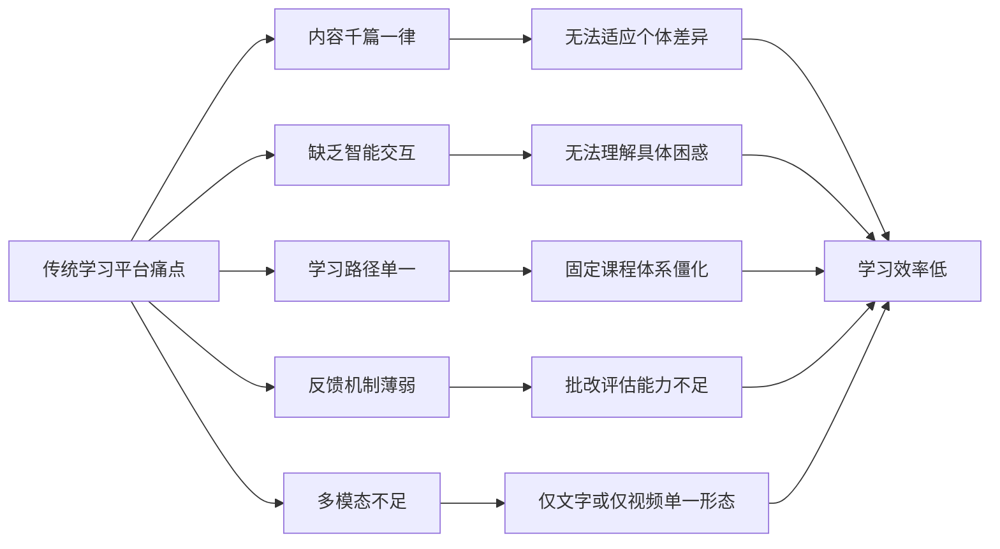

### 2.4 前沿 AI 技术结合点

本项目将前沿 AI 技术与大学生学习需求深度结合，形成以下技术与需求结合点：

| 学习需求 | 前沿 AI 技术 | 结合方式 |
|---------|------------|---------|
| 资源精准匹配 | 大语言模型 + RAG 检索 | LLM 理解用户意图，RAG 提供教材级知识，生成契合进度的内容 |
| 个性化指导 | 9 维动态画像 + 实时学习状态机 | 画像驱动内容难度，状态机驱动教学策略切换 |
| 多模态学习 | LLM + 视觉模型 + TTS | 文档/思维导图/代码/视频/图片识别多模态生成 |
| 即时答疑 | 多智能体协同 + 苏格拉底导学 | 引导式提问替代直接教学，培养独立思考 |
| 学习路径 | 知识依赖图 + LLM 路径规划 | 65 知识点+68 依赖边的图谱驱动路径生成 |
| 错题管理 | SM-2 间隔重复算法 | 基于遗忘曲线自动安排复习时间 |
| 学习反馈 | IRT 项目反应理论 + 学习状态机 | 能力值估计 + 5 态状态切换量化学习效果 |

### 2.5 功能性需求

依据赛题 5 大功能需求，逐项映射本项目实现：

#### FR-1 对话式学习画像自主构建（赛题强需求）

| 子需求 | 实现方式 |
|-------|---------|
| 自然语言对话抽取特征 | `ProfileAgent` + `UnifiedRouterAgent` 在对话流中增量提取画像字段 |
| ≥6 维度画像 | 实现 9 维：性别、年龄、知识水平、学习目标、学习风格、时长偏好、薄弱点、已掌握点、动机水平 |
| 随学随新 | 每轮对话后画像 Agent 分析增量更新 + 每日凌晨 3 点批量优化 |
| 画像变更可追溯 | `ProfileChangeLog` 表记录变更前后值、来源（llm/api/manual）、置信度 |

#### FR-2 多智能体协同资源生成（赛题强需求）

| 子需求 | 实现方式 |
|-------|---------|
| 多智能体架构 | 10+ 专职 Agent + LangGraph StateGraph 编排 |
| ≥5 种资源类型 | 实现 10 种：文档、思维导图、练习题、代码案例、教学视频、拓展阅读、幻灯片、每日一题、多模态分析、学习路径 |
| 不同角色智能体协作 | `UnifiedRouterAgent` 路由 + 5 Agent 并行扇出 + `AggregatorAgent` 聚合 |
| 个性化内容生成 | 画像 + RAG 上下文 + 实时学习状态注入 Prompt |

#### FR-3 个性化学习路径规划与资源推送（赛题强需求）

| 子需求 | 实现方式 |
|-------|---------|
| 知识依赖图 | 65 知识点 + 68 条前置依赖边 + DFS 环检测自检 |
| 动态路径生成 | `PathAgent` 基于画像+掌握情况 LLM 生成 |
| 节点状态管理 | 5 态：未开始/进行中/已完成/需复习/已跳过 |
| 精准资源推送 | `ResourceAgent` 为路径节点并发生成 doc/quiz/mindmap 三类资源 |

#### FR-4 智能辅导（赛题可选加分项）

| 子需求 | 实现方式 |
|-------|---------|
| 多模态答疑 | `TutorAgent` 按问题类型分发：代码题沙箱执行、概念题图解生成 |
| 苏格拉底引导 | 11 节点 LangGraph 状态机 + interrupt/Command 交互 |
| 短视频讲解 | `VideoAgent` 两阶段生成 HTML 动画 + TTS 配音 |

#### FR-5 学习效果评估（赛题可选加分项）

| 子需求 | 实现方式 |
|-------|---------|
| 多维度评估 | `EvaluationAgent` + `generate_evaluation_report` 输出学习效果报告 |
| 实时跟踪 | `BehaviorTracker` 6 类行为日志 + 5 态学习状态机实时切换 |
| 动态调整 | 评估结果反馈到画像与路径，调整资源推送策略 |

### 2.6 非功能性需求

| 需求类别 | 赛题要求 | 本项目实现 |
|---------|---------|-----------|
| 界面美观 | 简洁明了、交互清晰、流式输出、Markdown 渲染、多模态卡片 | React 19 + Tailwind + SSE 流式 + 内容块卡片化 |
| 开源标注 | 显著位置标注名称、来源及协议 | 附录 A 完整开源工具清单 |
| 防幻觉与安全 | 无事实性错误、无敏感信息 | RAG 检索约束 + 置信度校准 + 关键词黑名单 + 沙箱隔离 |
| 响应效率 | 合理响应时间、生成进度追踪、流式呈现 | SSE 流式首字节 < 2s + 思考过程实时推送 + 进度条 |

### 2.7 用户角色与使用场景

#### 2.6.1 用户角色

| 角色 | 描述 | 典型行为 |
|------|------|---------|
| 零基础学习者 | 无编程经验，需要从基本概念讲起 | 提问"什么是变量"、观看教学动画、做基础练习 |
| 入门级学习者 | 有少量编程基础，需要巩固核心逻辑 | 生成思维导图、做填空题、查错题本 |
| 进阶学习者 | 已掌握基础，需要拓展深度 | 学习路径规划、做编程题、深度思考模式 |
| 备考学生 | 准备 Python 考试 | 每日一题、错题复习、知识点掌握度评估 |

#### 2.6.2 典型使用场景

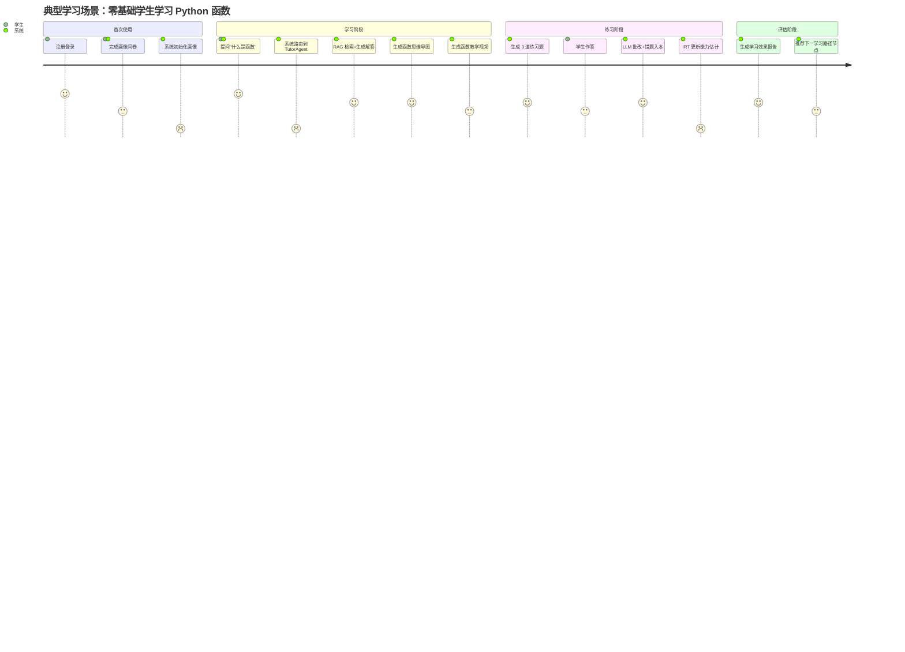

### 2.8 需求追溯矩阵

为确保赛题需求 100% 落地实现，建立"需求-设计-实现-测试"四层追溯矩阵。每条需求均可向下追溯到设计模块、代码位置、测试用例，确保完整覆盖与可验证性。

#### 2.7.1 功能需求追溯矩阵

| 需求编号 | 需求描述 | 设计模块 | 实现位置 | 测试用例 | 状态 |
|---------|---------|---------|---------|---------|------|
| **FR-1** | **对话式学习画像自主构建** | | | | |
| FR-1.1 | 自然语言对话抽取特征 | 4.2 统一路由 + 4.3.8 ProfileAgent | `agents/unified_router_agent.py:47`<br>`agents/profile_agent.py:33` | `tests/test_ai_modules.py` TestConfidenceCalibrator | ✅ |
| FR-1.2 | ≥6 维度画像 | 4.3.8 ProfileAgent 9 维画像 | `agents/profile_agent.py:36-69`<br>`models/profile.py:25-194` | `tests/test_learning_path.py` TestLearningPathModel | ✅ |
| FR-1.3 | 随学随新动态更新 | 4.3.8 画像更新机制 | `agents/profile_agent.py:187` 冷却机制<br>`api/app.py:83` 每日批量任务 | `tests/test_ai_modules.py` | ✅ |
| FR-1.4 | 画像变更可追溯 | 3.5 ProfileChangeLog | `models/profile.py` ProfileChangeLog | `tests/test_learning_path.py` | ✅ |
| **FR-2** | **多智能体协同资源生成** | | | | |
| FR-2.1 | 多智能体架构 | 4.1 BaseAgent + 4.2 路由 + 4.3 集群 | `agents/base_agent.py:50`<br>`agents/*.py`（12 个 Agent） | `tests/test_agents.py` | ✅ |
| FR-2.2 | ≥5 种资源类型 | 4.3 专业 Agent 集群 | 实现 10 种：`content_agent.py`/`code_agent.py`/`quiz_agent.py`/`mindmap_agent.py`/`video_agent.py` | `tests/test_content_agent.py`<br>`tests/test_sql_parser.py` | ✅ |
| FR-2.3 | 不同角色智能体协作 | 4.5 深度思考并行 + 4.3.7 AggregatorAgent | `graph/workflow.py:721` Send API 扇出<br>`agents/aggregator_agent.py:12` | `test_e2e_socratic.py`<br>`e2e_test_cards.py` | ✅ |
| FR-2.4 | 个性化内容生成 | 5.1 RAG + 画像注入 | `agents/base_agent.py:220` RAG 注入<br>`config/prompts/*.txt` 36 模板 | `tests/test_ai_modules.py` | ✅ |
| **FR-3** | **个性化学习路径规划与资源推送** | | | | |
| FR-3.1 | 知识依赖图 | 3.5 知识图谱 5 表 | `data/knowledge_catalog.py:18-237` 65 节点+68 边<br>`models/knowledge_graph.py` | `tests/test_mastery_regression.py` | ✅ |
| FR-3.2 | 动态路径生成 | 4.3.5 PathAgent | `agents/path_agent.py:15`<br>`api/routes/learning_path.py` | `tests/test_learning_path.py` 36 用例 | ✅ |
| FR-3.3 | 节点状态管理 | 3.5 learning_path_nodes | `models/learning_path.py` 5 态状态机 | `tests/test_learning_path.py` | ✅ |
| FR-3.4 | 精准资源推送 | 4.3.11 ResourceAgent | `agents/resource_agent.py:25` 并发生成 | `tests/test_learning_path.py` | ✅ |
| **FR-4** | **智能辅导（可选加分项）** | | | | |
| FR-4.1 | 多模态答疑 | 4.3.6 TutorAgent | `agents/tutor_agent.py:25` 5 类问题分发 | `tests/test_agents.py` | ✅ |
| FR-4.2 | 苏格拉底引导 | 4.4 苏格拉底 11 节点状态机 | `agents/socratic_workflow.py:1374`<br>`agents/socratic_state.py` | `test_socratic.py` 6 用例<br>`test_e2e_socratic.py` 8 用例 | ✅ |
| FR-4.3 | 短视频讲解 | 4.3.4 VideoAgent | `agents/video_agent.py:170` 两阶段流水线 | `tests/test_agents.py` | ✅ |
| **FR-5** | **学习效果评估（可选加分项）** | | | | |
| FR-5.1 | 多维度评估 | 4.3.8 ProfileAgent 评估报告 | `agents/profile_agent.py:440` generate_evaluation_report | `tests/test_progress_model.py` | ✅ |
| FR-5.2 | 实时跟踪 | 5.3 实时学习状态机 + 行为追踪 | `ai/learning_state.py:23` 5 态 FSM<br>`utils/behavior_tracker.py:114` | `tests/test_ai_modules.py` TestLearningState | ✅ |
| FR-5.3 | 动态调整 | 5.2 IRT + 5.3 状态机驱动 | `ai/adaptive_difficulty.py:52`<br>`ai/real_time_adaptation.py:44` | `tests/test_ai_modules.py` TestAdaptiveDifficultyEngine | ✅ |

#### 2.7.2 非功能需求追溯矩阵

| 需求编号 | 需求描述 | 设计模块 | 实现位置 | 测试用例 | 状态 |
|---------|---------|---------|---------|---------|------|
| NF-1 | 界面美观、流式输出、Markdown、卡片化 | 6.3 前端架构 | React 19 + Tailwind + SSE + 12 类卡片 | 兼容性测试 5 项 | ✅ |
| NF-2 | 开源工具显著标注 | 附录 A 开源工具清单 | 28 个开源工具 + 协议 | 文档审计 | ✅ |
| NF-3 | 防幻觉与内容安全 | 5.1 RAG + 5.5 置信度 + 5.6 沙箱 | `utils/rag_utils.py`<br>`ai/confidence_calibrator.py`<br>`utils/code_executor.py` | 安全测试 6 项 | ✅ |
| NF-4 | 响应效率、流式呈现 | 6.1.3 SSE 流式 | SSE 首字节 < 2s + 进度追踪 | 性能测试 8 项 | ✅ |

#### 2.7.3 追溯矩阵说明

- **设计模块**：指向本说明书对应章节
- **实现位置**：指向具体源码文件与行号
- **测试用例**：指向《测试说明书.md》对应测试文件
- **状态**：✅ 已实现并测试通过

**追溯矩阵维护规则**：
- 需求变更时同步更新追溯矩阵
- 新增功能需补充追溯关系
- 每个基线建立时验证追溯完整性

---

## 第 3 章 系统总体设计

### 3.1 设计原则

| 原则 | 含义 | 落地措施 |
|------|------|---------|
| **多智能体协同** | 专职 Agent 各司其职，灵活协作 | 10+ Agent + LangGraph StateGraph + Send API 并行 |
| **个性化驱动** | 一切生成以用户画像为输入 | 9 维画像注入所有 Prompt |
| **防幻觉安全** | 生成内容必须基于教材 | RAG 强制注入 + 置信度校准 + 关键词过滤 |
| **实时反馈** | 用户感知 AI 思考过程 | SSE 流式 + 思考过程推送 + 进度追踪 |
| **配置与代码分离** | Prompt 独立管理 | 36 个 .txt 模板 + 场景化参数 |
| **可扩展性** | 新增 Agent 不改核心代码 | BaseAgent 继承 + 路由表注册 |
| **可恢复性** | 长流程支持断点续传 | LangGraph Checkpointer + interrupt 状态持久化 |

### 3.2 系统架构

系统采用 6 层架构设计，自上而下依次为前端展示层、API 接口层、智能体层、编排调度层、数据存储层、基础设施层。

```mermaid
flowchart TB
    subgraph L1["前端展示层"]
        F1[React 19 + TypeScript]
        F2[Vite 6 构建]
        F3[Zustand 5 状态管理]
        F4[Tailwind CSS 3 样式]
        F5[CodeMirror 代码编辑]
        F6[Mermaid 思维导图]
    end

    subgraph L2["API 接口层"]
        A1[FastAPI 异步框架]
        A2[16 个路由模块]
        A3[SSE 流式输出]
        A4[JWT 身份认证]
        A5[统一异常处理]
    end

    subgraph L3["智能体层 Agent"]
        AG1[UnifiedRouterAgent 统一路由]
        AG2[TutorAgent 自由问答]
        AG3[QuizAgent 测验生成]
        AG4[CodeAgent 代码练习]
        AG5[MindmapAgent 思维导图]
        AG6[VideoAgent 视频资源]
        AG7[DocAgent 文档生成]
        AG8[PathAgent 学习路径]
        AG9[ProfileAgent 画像构建]
        AG10[AggregatorAgent 结果聚合]
        AG11[SocraticWorkflow 苏格拉底]
    end

    subgraph L4["编排调度层"]
        O1[LangGraph StateGraph]
        O2[条件路由]
        O3[Send API 并行扇出]
        O4[Checkpointer 持久化]
        O5[Interrupt/Command 交互]
    end

    subgraph L5["数据存储层"]
        D1[SQLAlchemy 2.0 ORM]
        D2[SQLite/PostgreSQL]
        D3[ChromaDB 向量库]
        D4[16 个数据模型]
    end

    subgraph L6["基础设施层"]
        I1[LLM 客户端 DeepSeek+GLM]
        I2[RAG 检索引擎]
        I3[代码沙箱执行]
        I4[行为追踪器]
        I5[IRT 自适应引擎]
        I6[SM-2 间隔重复]
        I7[置信度校准器]
        I8[多模态识别 讯飞+方舟+EasyOCR]
    end

    L1 --> L2
    L2 --> L3
    L3 --> L4
    L4 --> L5
    L4 --> L6
    L5 --> L6
```

### 3.3 核心工作流

用户消息进入系统后的处理流程：统一路由 Agent 单次 LLM 调用同时完成意图识别、资源类型判定、主题提取、画像更新，然后条件分发到对应业务节点。

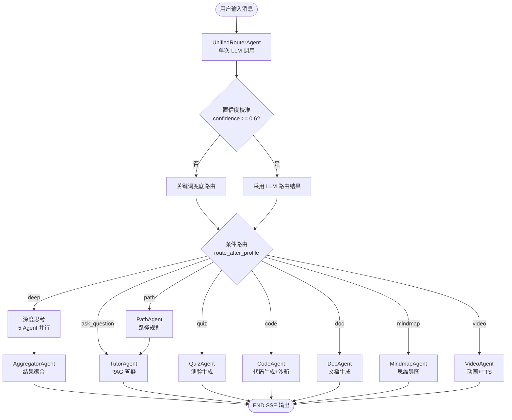

### 3.4 技术栈选型

| 层次 | 技术选型 | 版本 | 选型理由 |
|------|---------|------|---------|
| **Agent 编排** | LangGraph | 0.2.19 | 原生 StateGraph + interrupt/Command 支持交互式工作流 |
| **Agent 基类** | 自研 BaseAgent | - | 统一 LLM/RAG/JSON/安全/Prompt 加载 |
| **后端框架** | FastAPI | 0.110.0 | 异步高性能 + Pydantic 类型校验 + 自动 OpenAPI |
| **ORM** | SQLAlchemy | 2.0.29 | 异步引擎 + 关系映射 + 自动迁移 |
| **数据库** | SQLite | 内置 | 零部署成本，生产可平滑迁移 PostgreSQL |
| **向量库** | ChromaDB | 0.5.0 | PersistentClient + 余弦距离 + 嵌入模型可替换 |
| **LLM SDK** | LangChain + OpenAI | 0.2.0 / 1.50.0 | 统一调用接口 + 流式 + JSON mode |
| **主力模型** | DeepSeek | deepseek-chat | 国产高性能大模型，性价比高 |
| **备用模型** | 智谱 GLM | glm-5.2 | 火山方舟 Coding Plan，主模型故障自动降级 |
| **视觉模型** | 讯飞 imagev3 + 方舟 doubao-seed-2.1 | - | 讯飞主用，方舟降级，EasyOCR 兜底 |
| **TTS** | 讯飞超拟人 + 火山引擎 | - | 双通道容灾，超拟人音色自然 |
| **嵌入模型** | 讯飞星火 | 2560 维 | 国产向量嵌入，para/query 双域 |
| **前端框架** | React | 19.2 | 最新版本 + Suspense + 并发特性 |
| **前端语言** | TypeScript | 6.0 | 类型安全 + IDE 智能提示 |
| **构建工具** | Vite | 6.0 | 极速热更新 + 优化构建 |
| **状态管理** | Zustand | 5.0 | 轻量级，避免 Redux 模板代码 |
| **UI 样式** | Tailwind CSS | 3.4 | 原子化 + 自定义主题 |
| **代码编辑** | CodeMirror | 6 | 语法高亮 + 括号匹配 + 自动补全 |
| **图表渲染** | Mermaid + Chart.js + mind-elixir | - | 思维导图/流程图/雷达图多场景 |
| **流式输出** | sse-starlette | 1.6.1 | SSE 协议标准化实现 |
| **身份认证** | python-jose + bcrypt | 3.3.0 / 4+ | JWT 无状态认证 + bcrypt 哈希 |
| **容器化** | Docker + Docker Compose | - | 一键部署 + 环境隔离 |
| **测试框架** | pytest + pytest-asyncio | - | 异步测试支持 |

### 3.5 数据模型设计

系统共设计 16 个数据模型，覆盖用户、画像、对话、资源、路径、错题、进度、图谱、苏格拉底会话等场景。

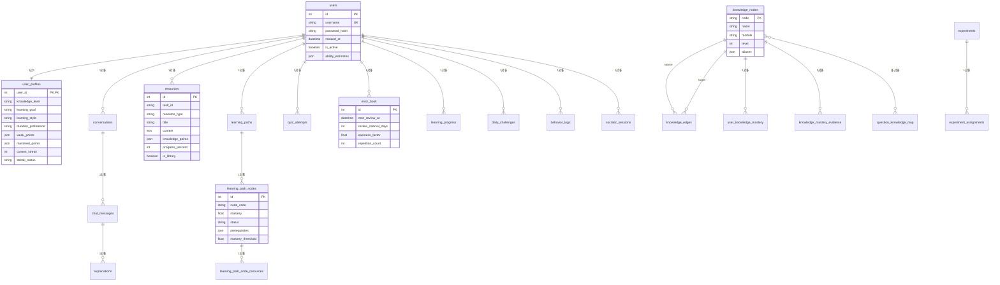

### 3.6 核心数据流

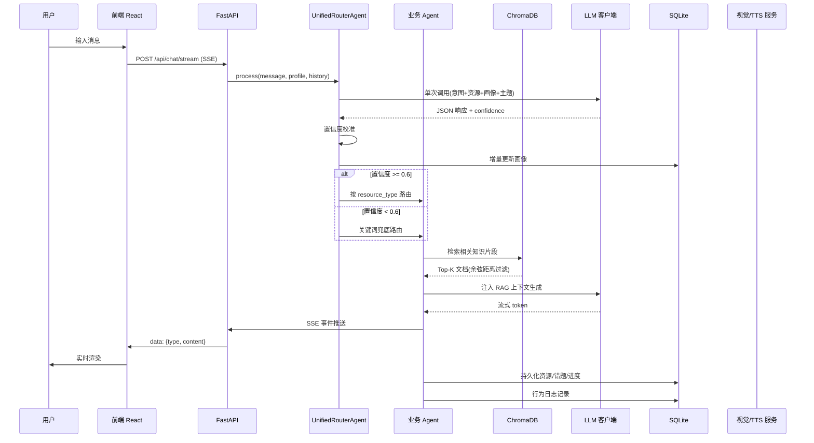

### 3.7 数据库设计（详见独立文档）

本项目数据库共设计 **23 张表**，覆盖用户、画像、对话、资源、路径、错题、进度、图谱、苏格拉底会话、行为日志等场景。因字段数量庞大（200+ 字段），完整的字段字典、索引设计、约束说明、外键关系详见独立文档：

📄 **《数据库设计说明书.md》**

该文档包含：
- 23 张表的完整字段字典（字段名/类型/约束/默认值/说明）
- 索引设计（单列索引/复合索引/部分唯一索引）
- 约束设计（CHECK 约束/唯一约束/外键约束）
- 外键关系与 ON DELETE 策略
- 自动迁移机制说明
- ER 图与关系描述

**核心表概览**（详见独立文档）：

| 表分类 | 表名 | 说明 |
|-------|------|------|
| 用户类 | users / user_profiles / profile_change_logs | 用户基本信息 + 9 维画像 + 变更日志 |
| 对话类 | conversations / chat_messages / explanations | 对话会话 + 消息 + 详解 |
| 资源类 | resources | 10 种资源类型元数据 |
| 路径类 | learning_paths / learning_path_nodes / learning_path_node_resources | 路径三表设计 |
| 测验类 | quiz_attempts / error_book / daily_challenges | 答题记录 + 错题本 + 每日一题 |
| 进度类 | learning_progress | 知识点学习进度 |
| 图谱类 | knowledge_nodes / knowledge_edges / user_knowledge_mastery / knowledge_mastery_evidence / question_knowledge_map | 知识图谱 5 表 |
| 实验类 | experiments / experiment_assignments | A/B 测试 |
| 会话类 | socratic_sessions | 苏格拉底导学会话 |
| 日志类 | behavior_logs | 用户行为日志 |

---

## 第 4 章 多智能体详细设计

### 4.1 Agent 基类设计

所有 Agent 继承自 `BaseAgent`（`agents/base_agent.py:50`），统一封装五项核心能力：

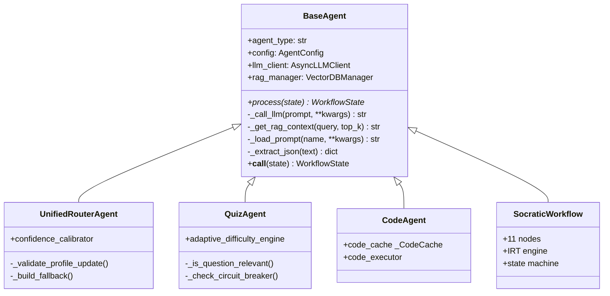

| 能力 | 实现位置 | 说明 |
|------|---------|------|
| LLM 调用 | `base_agent.py:189` `_call_llm` | 委托 `AsyncLLMClient` 单例，注入场景参数 |
| RAG 检索 | `base_agent.py:220` `_get_rag_context` | 调 ChromaDB，按 `distance_threshold` 过滤，`【参考 N】` 前缀拼装 |
| Prompt 加载 | `base_agent.py:94` `_load_prompt` | 从 `config/prompts/*.txt` 加载，自动转义花括号防 `str.format` 误解析 |
| JSON 提取 | `base_agent.py:251` `_extract_json` | 三级兜底：直接 `json.loads` → ```json``` 代码块正则 → 最外层 `{...}` 正则 |
| 安全拦截 | `base_agent.py:128` `__call__` | 捕获 `ContentSecurityError`，返回 `current_step="error"` 状态 |

### 4.2 统一路由 Agent

`UnifiedRouterAgent`（`agents/unified_router_agent.py:47`）是系统的核心创新点之一，**单次 LLM 调用**同时产出 5 个字段：

| 输出字段 | 类型 | 用途 |
|---------|------|------|
| `intent` | enum | 用户意图（ask_question/generate_resource/plan_path/...） |
| `resource_type` | enum | 资源类型（doc/quiz/code/mindmap/video/...） |
| `topic` | str | 主题知识点（归一化到 15 标准知识点） |
| `profile_update` | dict | 画像增量更新（level/style/weak_points 等） |
| `confidence` | float | 置信度（0.0-1.0） |

#### 置信度校准与降级机制

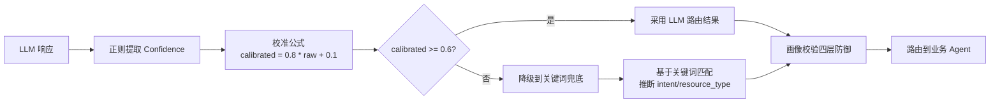

**画像校验四层防御**（`unified_router_agent.py:135` `_validate_profile_update`）：

1. **枚举值白名单**：knowledge_level/style/goal 等字段必须命中预定义枚举
2. **知识点归一化**：`match_knowledge_point` 将用户输入归一化到 15 标准知识点
3. **证据门槛**：`progress_scores` 需达到 `WEAK/MASTERY_EVIDENCE_THRESHOLD` 才能修改掌握状态，阻止无依据重分类
4. **互斥去重**：mastered_points 与 weak_points 互斥，避免矛盾画像

### 4.3 专业 Agent 集群

#### 4.3.1 QuizAgent 测验生成

`agents/quiz_agent.py:31`，双模式设计：

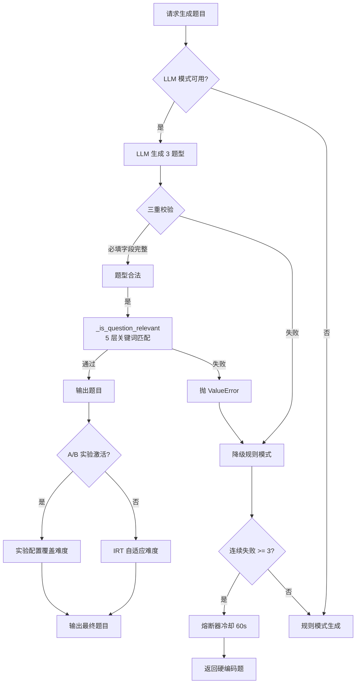

**自适应难度**通过 `AdaptiveDifficultyEngine`（`ai/adaptive_difficulty.py:52`）实现，详见 [5.2 节](#52-irt-自适应难度)。

#### 4.3.2 CodeAgent 代码练习

`agents/code_agent.py:189`，规则模板 + LLM 双模式，带 `_CodeCache` 缓存（md5 + TTL + LRU 淘汰 25%）。

| 模式 | 触发条件 | 实现 |
|------|---------|------|
| LLM 模式 | 默认 | 注入画像+RAG 生成代码 + 解释 |
| 规则模板 | LLM 失败 | 4 类模板：basic/advanced/error/best_practice |
| 沙箱验证 | 总是 | 调 `code_executor` 实际执行生成的代码，捕获异常 |

#### 4.3.3 MindmapAgent 思维导图

`agents/mindmap_agent.py:25`，支持 **3 种输出格式 + ER 图特殊路径**：

| 输入 | 输出格式 | 实现 |
|------|---------|------|
| 普通知识点 | JSON / Markdown / Mermaid | 启用 JSON mode 保证合法，LLM 生成 |
| SQL 建表语句 | ER 图 | `parse_sql_tables` 解析 → LLM 生成结构化 ER JSON |

#### 4.3.4 VideoAgent 视频资源

`agents/video_agent.py:170`，**两阶段流水线**设计：

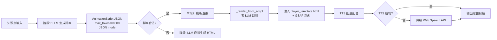

**设计亮点**：阶段 2 完全零 LLM 调用，避免重复消耗 token，仅用模板注入方式生成最终 HTML，大幅降低响应时间与成本。

#### 4.3.5 PathAgent 学习路径

`agents/path_agent.py:15`，LLM 生成 + 2 次重试 + 硬编码 fallback。

**`_validate_and_format`**（`path_agent.py:120`）校验逻辑：
- 兼容多种字段名（node_code/code/knowledge_point 等）
- 校验前置依赖闭环（无悬挂引用）
- 节点状态默认值填充
- 失败回退硬编码知识点线性路径

#### 4.3.6 TutorAgent 自由问答

`agents/tutor_agent.py:25`，按问题类型分发到多模态策略：

| 问题类型 | 检测关键词 | 处理策略 |
|---------|-----------|---------|
| code_error | 报错、异常、Traceback | 调 `code_executor` 实际执行复现错误 |
| code_question | 运行结果、输出 | 代码 + 解释生成 |
| concept | 是什么、为什么 | 注入 `generate_concept_diagram` 图解 |
| debug | 不工作、有问题 | 引导式提问 + 假设排查 |

Prompt 中注入画像 + 实时学习状态适应提示词（`tutor_agent.py:480-506`）。

#### 4.3.7 AggregatorAgent 结果聚合

`agents/aggregator_agent.py:12`，**单次 LLM 调用**将 doc/code/quiz/eval/path 五个 Agent 输出整合为连贯 Markdown。

聚合输入超 12000 字符直接降级拼接（`graph/workflow.py:678`），避免上下文过长导致 LLM 生成质量下降。

#### 4.3.8 ProfileAgent 画像构建

`agents/profile_agent.py:33`，LLM 原生画像构建，三层防御：

1. **冷却机制**（`PROFILE_LLM_COOLDOWN_SEC`，`profile_agent.py:187`）：避免频繁调用 LLM
2. **信心度过滤**（`profile_agent.py:139-146`）：低置信度更新被丢弃
3. **证据过滤**（`profile_agent.py:148-149` `_validate_llm_output`）：必须有行为证据支持画像变更

动力水平按行为数据自动更新（quiz 完成数、学习时长等里程碑触发）。

#### 4.3.9 ContentAgent 文档/阅读/幻灯片

`agents/content_agent.py:55`，通过 `ContentType` 枚举复用三类内容生成：

| ContentType | 输出 | 特殊处理 |
|------------|------|---------|
| doc | 结构化 Markdown 文档 | RAG 增强 |
| reading | 拓展阅读材料 | 推荐相关外部资源链接 |
| slides | reveal.js 幻灯片 | `_validate_and_fix_slides` 格式修复 |

#### 4.3.10 MultimodalCodeAgent 多模态代码识别

`agents/multimodal_code_agent.py:20`，**三级降级链**：

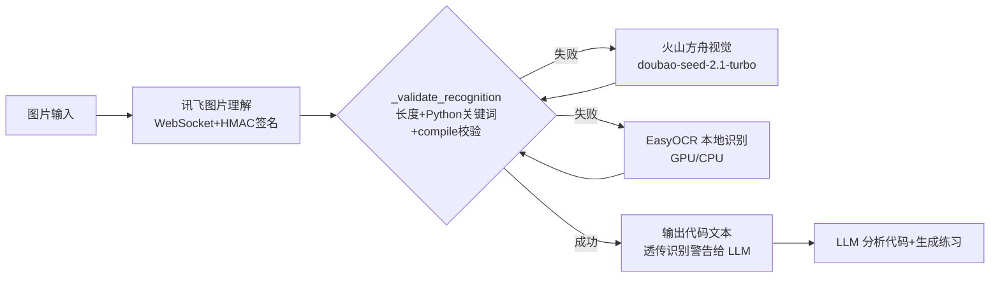

每级用 `_validate_recognition`（`multimodal_code_agent.py:193`）做长度 + Python 关键词 + `compile()` 语法编译校验，识别警告透传给 LLM 分析阶段防误判。

#### 4.3.11 ResourceAgent 资源协调器

`agents/resource_agent.py:25`，协调器角色，`asyncio.gather` 并发生成 doc/quiz/mindmap 三类资源，每类带 60s 超时。

### 4.4 苏格拉底导学工作流

苏格拉底导学工作流（`agents/socratic_workflow.py:1374`）是本项目的核心创新模块，基于 LangGraph 构建 **11 节点状态机**，实现引导式教学。

#### 4.4.1 状态机结构

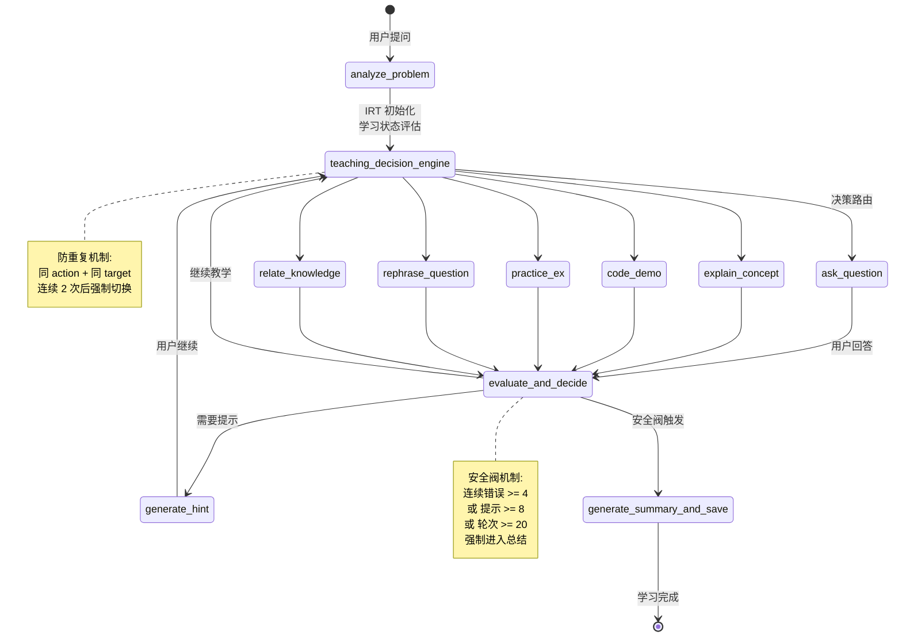

#### 4.4.2 11 节点详解

| 节点 | 职责 | 关键实现 |
|------|------|---------|
| `analyze_problem` | 问题分析 + IRT 初始化 | `socratic_workflow.py:188-205` 读取用户能力值，调整初始难度 |
| `teaching_decision_engine` | 教学动作决策 | `:309` 防重复机制，连续 2 次同 action+target 强制切换 |
| `ask_question` | 引导式提问 | `interrupt()` 暂停等待用户回答 |
| `explain_concept` | 概念讲解 | 注入 RAG 上下文 + 画像适应 |
| `code_demo` | 代码演示 | 调 `code_executor` 实际执行 |
| `practice_ex` | 练习题 | 调 QuizAgent 生成 |
| `rephrase_question` | 重新表述 | 困惑状态触发 |
| `relate_knowledge` | 关联知识 | 调用知识图谱相关节点 |
| `evaluate_and_decide` | 评估 + 决策 | `:665` 单次 LLM 同时完成评估+决策 |
| `generate_hint` | 生成提示 | `:671` 安全阀：连续错误>=4 强制总结 |
| `generate_summary_and_save` | 总结 + 持久化 | 保存 `SocraticSession` 含 action_sequence |

#### 4.4.3 Interrupt/Command 交互机制

所有动作节点使用 LangGraph `interrupt({...})`（`socratic_workflow.py:77`）暂停等待用户输入，特殊值触发不同分支：

| 特殊值 | 触发场景 | 分支 |
|-------|---------|------|
| `__HINT__` | 用户请求提示 | `generate_hint` |
| `__CONFUSED__` | 用户表示困惑 | `rephrase_question` |
| `__END__` | 用户主动结束 | `generate_summary_and_save` |
| `__GIVE_UP__` | 用户放弃 | 直接 `explain_concept` |

会话状态通过 `SQLAlchemyCheckpointSaver`（`graph/checkpointer.py:101`）持久化到 SQLite 表 `workflow_checkpoints`，支持断点续传。

### 4.5 深度思考并行工作流

`graph/workflow.py:721` `build_deep_thinking_workflow`，使用 LangGraph **Send API**（`:480`）扇出 5 个 Agent 并行执行：

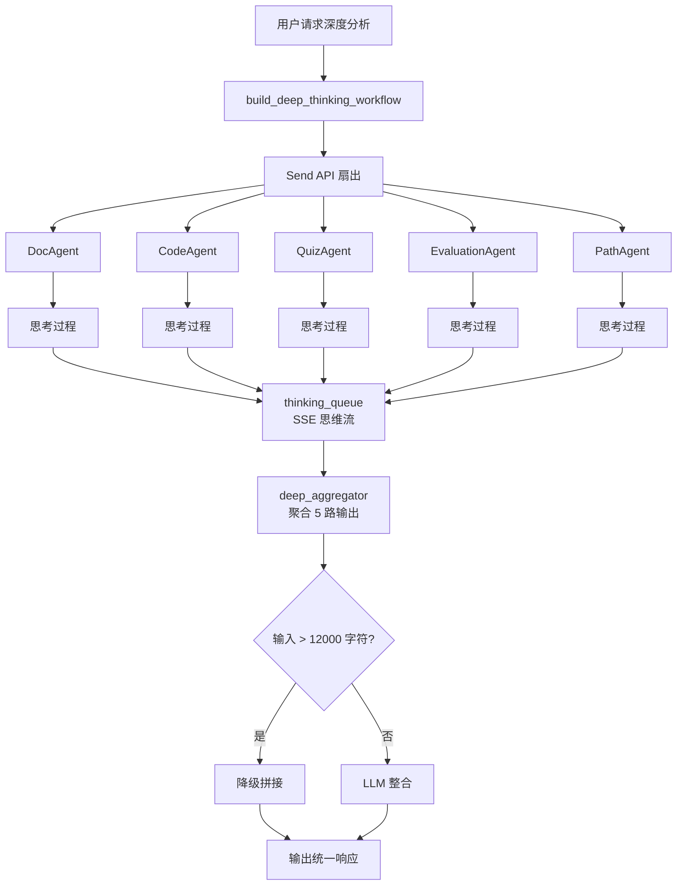

**设计亮点**：
- **共享思维队列** `thinking_queue`：5 个 Agent 的思考过程通过 SSE 实时推送给前端
- **透明化推理**：用户可直观看到 AI 的多维度分析过程
- **降级保护**：聚合输入超长时直接拼接，避免 LLM 上下文溢出

### 4.6 LangGraph 编排层

`graph/workflow.py` 提供两个核心工作流：

#### 4.6.1 主流程 `build_workflow`（`:340`）

```mermaid
flowchart LR
    START([START) --> UR[unified_router]
    UR --> RP{route_after_profile}
    RP -->|ask_question| TUTOR[tutor_agent]
    RP -->|quiz| QUIZ[quiz_agent]
    RP -->|code| CODE[code_agent]
    RP -->|doc| DOC[doc_agent]
    RP -->|mindmap| MM[mindmap_agent]
    RP -->|video| VIDEO[video_agent]
    RP -->|path| PATH[path_agent]
    RP -->|deep| DEEP[deep_thinking_subgraph]
    RP -->|evaluation| EVAL[evaluation_agent]

    TUTOR --> END1([END])
    QUIZ --> END1
    CODE --> END1
    DOC --> END1
    MM --> END1
    VIDEO --> END1
    EVAL --> END1
    DEEP --> END1
    PATH --> TUTOR
```

#### 4.6.2 检查点持久化 `SQLAlchemyCheckpointSaver`（`checkpointer.py:101`）

严格对齐 LangGraph 0.2.19 `BaseCheckpointSaver` 接口，实现：

| 方法 | 用途 |
|------|------|
| `aget_tuple` | 异步读取检查点 |
| `aput` | 异步保存检查点 |
| `alist` | 列出线程检查点 |
| `adelete_thread` | 删除线程 |
| `aput_writes` | 写入 interrupt 中间状态 |

自定义 `CheckpointEncoder`（`checkpointer.py:43`）处理 datetime/Interrupt/Pydantic/Enum/UUID 序列化，状态存 SQLite 表 `workflow_checkpoints`。

---

## 第 5 章 关键技术实现

### 5.1 RAG 防幻觉检索

`utils/rag_utils.py:55` `VectorDBManager` 实现 RAG 检索，**强制余弦距离 + 双域嵌入 + 去重 + 阈值过滤**。

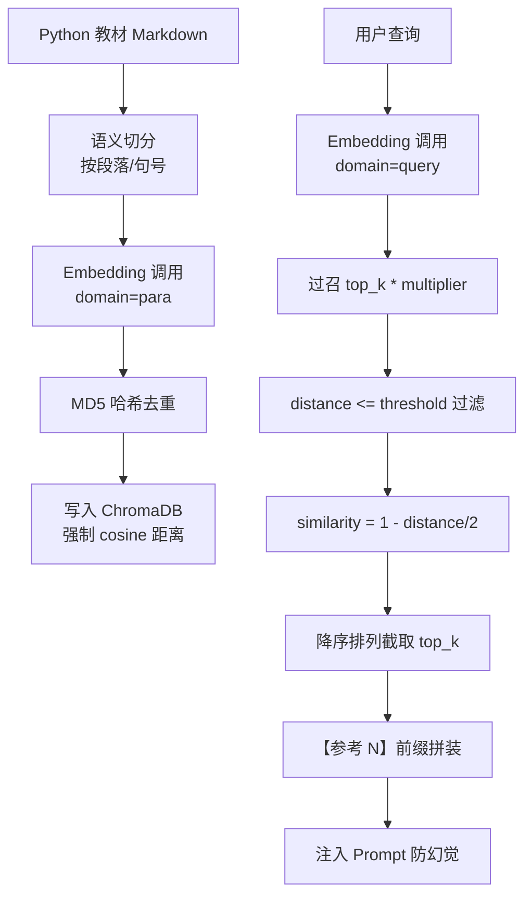

**关键实现细节**：

| 实现点 | 位置 | 说明 |
|-------|------|------|
| 强制余弦距离 | `rag_utils.py:80-92` | 检测 `hnsw:space`，非 cosine 删除重建 |
| 双域嵌入 | `rag_utils.py:184` | 构建用 `domain="para"`，查询用 `domain="query"` 保证向量空间一致 |
| MD5 去重 | `rag_utils.py:123-146` | `doc_hash` 存 metadata，新增前 `collection.get` 拉已有 hashes 过滤 |
| 阈值过滤 | `rag_utils.py:169` | `distance <= distance_threshold`（默认 0.5）过滤低相关文档 |
| 防幻觉注入 | `base_agent.py:220` | `【参考 N】content` 前缀拼装，Prompt 模板预留 `rag_context` 占位符 |

### 5.2 IRT 自适应难度

`ai/adaptive_difficulty.py:52` `AdaptiveDifficultyEngine` 基于**三参数项目反应理论（3PL）**实时估计用户能力，动态调整题目难度。

#### 5.2.1 算法原理

**三参数模型**（`adaptive_difficulty.py:31` `_irt_probability`）：

$$P(\theta) = c + \frac{1 - c}{1 + e^{-a(\theta - b)}}$$

其中：
- $\theta$：用户能力值（范围 [-3, +3]）
- $a$：题目区分度
- $b$：题目难度
- $c$：猜测参数（默认 0.25）

**题目信息函数**（`adaptive_difficulty.py:40` `_item_information`）：

$$I(\theta) = a^2 \cdot \frac{(P - c)^2}{(1 - c)^2} \cdot \frac{1 - P}{P}$$

#### 5.2.2 能力估计流程

```mermaid
flowchart TD
    A[用户答题] --> B[读取最近 10 次<br/>QuizAttempt 记录]
    B --> C[贝叶斯更新<br/>θ += correct - P / info]
    C --> D[SE 收敛<br/>SE = 1/sqrt(1/SE² + info)]
    D --> E[持久化到<br/>User.ability_estimates]
    E --> F[select_difficulty_for_topic]
    F --> G[保守策略<br/>effective = θ - 0.5 * SE]
    G --> H[映射到 easy/medium/hard]
    H --> I[输出题目难度]
```

### 5.3 实时学习状态机

`ai/learning_state.py:23` 实现 **5 态状态机**，根据用户答题行为实时切换学习状态，驱动教学策略调整。

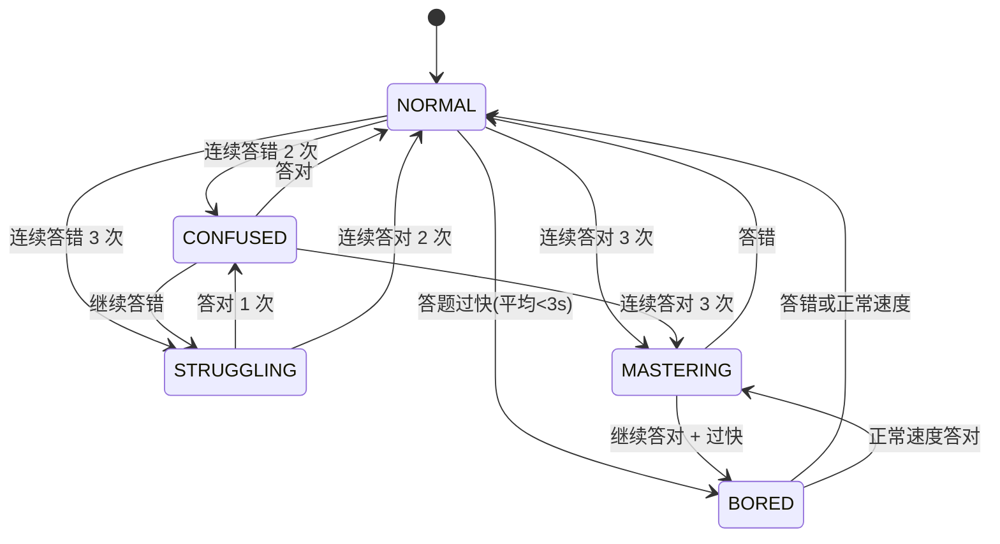

**状态对应的策略提示词**（`ai/real_time_adaptation.py:44`）：

| 状态 | 策略提示词方向 |
|------|--------------|
| NORMAL | 标准教学节奏 |
| CONFUSED | 增加图解、生活化比喻，降低难度 |
| STRUGGLING | 退回前置知识点，多给提示 |
| MASTERING | 增加挑战题，跳过基础讲解 |
| BORED | 增加趣味性、引入拓展知识 |

### 5.4 SM-2 间隔重复算法

`ai/spaced_repetition.py:19` 实现 **SM-2 算法**，自动调度错题复习时间。

#### 5.4.1 算法公式

**易度因子更新**（`spaced_repetition.py:19`）：

$$EF' = EF + 0.1 - (5 - q)(0.08 + (5 - q) \cdot 0.02)$$

其中：
- $EF$：易度因子（下限 1.3）
- $q$：回答质量（0-5）

**间隔计算**：

| 重复次数 | 间隔 |
|---------|------|
| 第 1 次 | 1 天 |
| 第 2 次 | 3 天 |
| 第 n 次 | `interval × EF` 天 |

**质量评分映射**（`spaced_repetition.py:93` `quality_from_correctness`）：

| 答题耗时 | quality |
|---------|---------|
| < 10s（答对） | 5 |
| < 30s（答对） | 4 |
| >= 30s（答对） | 3 |
| 答错 | 0-2 |

### 5.5 置信度校准与降级

`ai/confidence_calibrator.py:13` 实现 LLM 自报置信度的校准与降级机制。

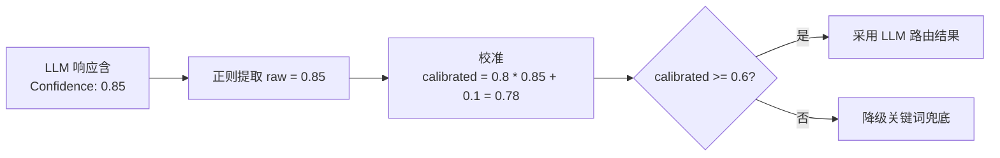

**校准公式**（`confidence_calibrator.py:21`）：

$$calibrated = \min(1, \max(0, 0.8 \times raw + 0.1))$$

**降级阈值**（`confidence_calibrator.py:43` `should_use_fallback`）默认 0.6。

### 5.6 代码沙箱安全执行

`utils/code_executor.py:174` `execute_python_code` 实现**子进程隔离 + 模块黑名单 + 资源限制 + 超时控制**四重安全机制。

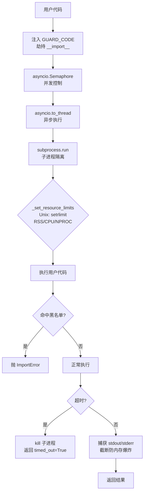

**黑名单**（`code_executor.py:98-104`）：

| 类型 | 黑名单项 |
|------|---------|
| 模块 | os, subprocess, socket, ctypes, shutil, multiprocessing |
| builtins | exec, eval, compile, __import__, open |

**资源限制**（`code_executor.py:129-142`）：

| 资源 | 限制 |
|------|------|
| 内存 | 256 MB（`CODE_EXEC_MAX_MEMORY_MB`） |
| CPU | 5s |
| 进程数 | 禁止 fork |
| 并发 | `CODE_EXEC_MAX_CONCURRENT` |
| 速率 | 每用户每分钟 10 次 |

### 5.7 多模态三级降级

视觉识别采用**讯飞主用 + 方舟降级 + EasyOCR 兜底**三级降级链，详见 [4.3.10 节](#4310-multimodalcodeagent-多模态代码识别)。

TTS 同样采用双通道：
- **讯飞超拟人**（`utils/xfyun_tts.py:1`）：`x6_lingyuyan_pro` 模型，Bearer 鉴权，视频主用
- **火山引擎 TTS**（`utils/tts_api.py:1`）：降级方案，带逐字时间戳

### 5.8 Prompt 工程

`config/prompts/` 目录共 **36 个 .txt 模板**，采用分层设计：

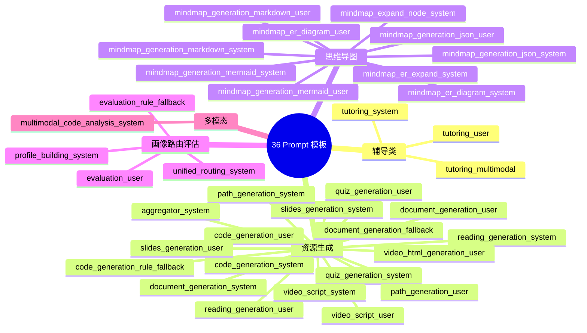

**Prompt 工程要点**：

| 要点 | 实现 |
|------|------|
| System Prompt | 角色定义 + 输出格式约束 + 知识点列表 |
| User Prompt | 动态数据注入（用户输入 + 对话历史 + RAG 检索结果） |
| 场景化参数 | 每个 Agent 独立配置 temperature/max_tokens（`config/model_config.py` `SCENE_CONFIG`） |
| 花括号转义 | 自动处理 RAG 上下文中的 `{}`，防止 `str.format()` 误解析 |
| 兜底 Prompt | document/code/evaluation 三类有独立 fallback 模板 |

---

## 第 6 章 前后端实现

### 6.1 后端 API 层

#### 6.1.1 FastAPI 应用入口

`api/app.py` 提供完整的异步应用框架：

| 模块 | 位置 | 功能 |
|------|------|------|
| lifespan 异步上下文 | `api/app.py:83-149` | 启动时建表+迁移、初始化 A/B 实验、预初始化 Agent 单例、后台预加载 EasyOCR、定时批量更新画像 |
| 请求 ID 中间件 | `api/app.py:170` | `contextvars.ContextVar` 注入 `X-Request-ID`，慢请求记录 |
| CORS 中间件 | `api/app.py:200` | 允许跨域 + 暴露 `X-Request-ID` |
| 异常处理 | `api/app.py:214-263` | HTTPException/ValidationError/兜底 Exception 统一包装为 `BaseResponse` |
| SPA 静态托管 | `api/app.py:319-357` | 优先挂 `frontend/dist`，catch-all 回退 index.html |

#### 6.1.2 API 路由清单（16 个模块）

| 模块 | 前缀 | 核心端点 | SSE | 说明 |
|------|------|---------|-----|------|
| auth | /api/auth | POST /register, POST /login, GET /me | 否 | JWT 认证 |
| chat | /api/chat | POST /stream, POST /deep-stream, POST /socratic-stream, POST /sync | 是 | 主聊天接口 |
| code_execute | /api/code | POST /execute, GET /metrics | 否 | 代码沙箱执行 |
| conversation | /api/conversation | CRUD | 否 | 对话管理 |
| daily | /api/daily | GET /today, POST /submit, GET /streak, POST /next-challenge | 否 | 每日一题 |
| error_book | /api/error-book | GET /{user_id}, GET /{user_id}/due, POST /{id}/review | 否 | 错题本 SM-2 |
| experiment | /api/experiments | GET, GET /{name}/analysis, POST /{name}/status | 否 | A/B 测试卡方检验 |
| graph | /api/graph | GET /snapshot, GET /node/{code}, GET /stats | 否 | 知识图谱 |
| images | /api/images | POST /upload | 否 | 图片上传 |
| learning_path | /api/learning-path | GET, POST /generate, POST /nodes/{id}/complete | 否 | 学习路径 |
| multimodal | /api/multimodal | POST /analyze, POST /save, GET /history | 是 | 多模态分析 |
| profile | /api/profile | GET, PUT, POST /refresh, POST /suggestions | 否 | 用户画像 |
| progress | /api/progress | GET, POST /update | 否 | 学习进度 |
| quiz | /api/quiz | GET, POST /submit, POST /generate-answer | 否 | 测验批改 |
| resource | /api/resource | GET, POST /generate, PATCH /{id}/add-to-library | 否 | 资源管理 |
| task | /api/tasks | GET /{task_id} | 否 | 异步任务状态 |

#### 6.1.3 SSE 流式输出实现

`api/routes/chat.py` 提供 3 种 SSE 流式端点：

```mermaid
sequenceDiagram
    participant F as 前端
    participant API as FastAPI
    participant Agent as 业务 Agent
    participant LLM as LLM 客户端

    F->>API: POST /api/chat/stream (SSE)
    API->>API: 设置 SSE headers
    API->>Agent: 调用 Agent.process()

    loop 流式生成
        Agent->>LLM: 调用流式 API
        LLM-->>Agent: token chunk
        Agent-->>API: yield SSE event
        API-->>F: data: {type, content}
        F->>F: 实时渲染
    end

    Note over API,F: 15s keepalive 防超时

    Agent-->>API: 生成完成
    API-->>F: event: end
```

**SSE 事件类型**：

| 事件类型 | 触发场景 | 数据结构 |
|---------|---------|---------|
| `thinking` | AI 思考过程 | `{text, agent_name}` |
| `content_block_start` | 内容块开始 | `{block_id, block_type}` |
| `data` | 内容块数据 | `{block_id, content}` |
| `stop` | 内容块结束 | `{block_id}` |
| `task_started` | 异步任务启动 | `{task_id}` |
| `mastery_update` | 掌握度更新 | `{knowledge_point, mastery}` |
| `socratic_end` | 苏格拉底结束 | `{summary, action_sequence}` |
| `end` | 流结束 | `{}` |
| `error` | 错误 | `{message}` |

### 6.2 数据持久化与自动迁移

#### 6.2.1 异步引擎配置

`models/database.py` 配置 SQLite 异步引擎：

| 配置项 | 值 | 说明 |
|-------|-----|------|
| `check_same_thread` | False | 允许跨线程使用 |
| `PRAGMA journal_mode` | WAL | Write-Ahead Logging 提升并发 |
| `PRAGMA synchronous` | NORMAL | 平衡性能与安全 |
| `PRAGMA cache_size` | 64MB | 内存缓存 |
| `PRAGMA foreign_keys` | ON | 启用外键约束 |
| `expire_on_commit` | False | 提交后对象不过期 |

#### 6.2.2 自动迁移机制

`models/database.py:497-542` `init_db` 自动迁移流程：

```mermaid
flowchart TD
    A[应用启动] --> B[import models<br/>注册所有 16 个模型]
    B --> C[Base.metadata.create_all<br/>建表]
    C --> D[_auto_migrate]
    D --> E[inspect 检查列差异]
    E --> F{有差异?}
    F -->|是| G[ALTER TABLE ADD COLUMN]
    F -->|否| H[迁移完成]

    G --> I{CHECK 约束变更?}
    I -->|是| J[整表重建+数据迁移<br/>+子表外键修复]
    I -->|否| K[继续]

    J --> L[知识掌握证据去重<br/>+部分唯一索引]
    K --> L
    L --> H
```

### 6.3 前端架构

#### 6.3.1 技术栈

| 技术 | 版本 | 用途 |
|------|------|------|
| React | 19.2 | UI 框架，支持 Suspense + 并发特性 |
| TypeScript | 6.0 | 类型安全 |
| Vite | 6.0 | 构建工具，极速热更新 |
| Zustand | 5.0 | 状态管理 |
| Tailwind CSS | 3.4 | 原子化样式 |
| react-router-dom | 7.0 | 路由 |
| @uiw/react-codemirror | - | 代码编辑器 |
| marked + highlight.js + dompurify | - | Markdown 渲染 |
| mermaid + mind-elixir | - | 思维导图渲染 |
| chart.js | - | 雷达图/柱状图 |
| reveal.js | - | 幻灯片渲染 |
| three | - | 3D 背景 |
| lucide-react | - | 图标库 |

#### 6.3.2 目录结构

```
frontend/src/
├── components/            # UI 组件
│   ├── auth/              # 认证（AuthModal）
│   ├── cards/             # 资源卡片（CodeCard/QuizCard/ContentCardRenderer 等）
│   ├── chat/              # 聊天（ChatMessage/ChatInput/ChatTyping 等）
│   ├── common/            # 通用组件
│   ├── knowledge/         # 知识图谱（KnowledgeGraph）
│   ├── layout/            # 布局（AppLayout/AppHeader/AppSidebar/RightPanel）
│   ├── mindmap/           # 思维导图（MindmapViewer）
│   ├── panels/            # 右侧面板（8 个：Path/Mindmap/ChatExplain 等）
│   ├── path/              # 学习路径（PathTimeline/PathStep）
│   ├── profile/           # 画像（RadarChart/StudyTimeChart/StyleChart）
│   ├── quiz/              # 测验（QuizView）
│   ├── resource/          # 资源库
│   └── slides/            # 幻灯片
├── views/                 # 12 个页面
│   ├── ChatView           # 聊天主页
│   ├── ResourcesView      # 资源库
│   ├── MindmapView        # 思维导图
│   ├── PathView           # 学习路径
│   ├── ProfileView        # 用户画像
│   ├── DailyChallengeView # 每日一题
│   ├── ErrorBookView      # 错题本
│   ├── CodePlaygroundView # 代码练习
│   ├── TeachingAnimationView # 教学动画
│   ├── MultimodalView     # 多模态分析
│   ├── SlidesView         # 幻灯片
│   └── KnowledgeGraphView # 知识图谱
├── stores/                # Zustand 状态管理
│   ├── app.ts             # 全局状态（右侧面板/Toast）
│   ├── auth.ts            # 认证状态
│   ├── chat.ts            # 聊天状态
│   ├── learningCenter.ts  # 学习中心
│   └── taskStore.ts       # 异步任务
├── composables/           # Vue 风格组合式函数
│   ├── useSSE.ts          # SSE 流式处理
│   ├── useScroll.ts       # 滚动控制
│   ├── useLearningProfile.ts # 画像获取
│   ├── useCodeTextarea.ts # 代码输入
│   └── useStudyTimer.ts   # 学习计时
├── api/                   # API 调用层（16 个模块）
├── utils/                 # 工具函数
├── hooks/                 # 自定义 Hooks
├── router/                # 路由配置
└── types/                 # TypeScript 类型定义
```

#### 6.3.3 路由设计

`router/index.tsx` 所有页面 `lazy()` 懒加载 + `<Suspense>` 包裹：

| 路径 | 页面 | 说明 |
|------|------|------|
| / | 重定向到 /chat | - |
| /chat | ChatView | 聊天主页（不走路由，App.tsx 直接渲染） |
| /resources | ResourcesView | 资源库 |
| /mindmap | MindmapView | 思维导图 |
| /path | PathView | 学习路径 |
| /profile | ProfileView | 用户画像 |
| /daily | DailyChallengeView | 每日一题 |
| /error-book | ErrorBookView | 错题本 |
| /code | CodePlaygroundView | 代码练习 |
| /animation | TeachingAnimationView | 教学动画 |
| /multimodal | MultimodalView | 多模态分析 |
| /slides | SlidesView | 幻灯片 |
| /graph | KnowledgeGraphView | 知识图谱 |

**ChatView 不走路由**的特殊设计（`App.tsx:62-80`）：流式期间保持挂载，通过 `opacity:0` + `pointerEvents:none` 防止切页时浏览器节流网络，确保流式响应不中断。

### 6.4 SSE 流式处理

`composables/useSSE.ts` 实现完整的 SSE 流式处理：

```mermaid
flowchart TD
    A[用户发送消息] --> B[获取 _sendMessageInFlight 锁<br/>防并发]
    B --> C[fetch POST /api/chat/stream]
    C --> D[readWithTimeout<br/>30s 超时包装]
    D --> E{读取 chunk}
    E --> F[解析 SSE 事件]
    F --> G{事件类型}

    G -->|task_started| H[pollTaskStatus<br/>3s 间隔最多 60 次]
    G -->|content_block_start| I[创建内容块]
    G -->|data| J[追加内容到块]
    G -->|stop| K[完成内容块]
    G -->|thinking| L[渲染思考过程]
    G -->|mastery_update| M[更新掌握度]
    G -->|end/error| N[结束流]
    G -->|socratic_*| O[苏格拉底事件分发]

    H --> P{任务完成?}
    P -->|是| Q[渲染任务结果]
    P -->|否| E

    I --> E
    J --> E
    K --> E
    L --> E
    M --> E
    O --> E
    N --> R[释放锁]
    Q --> R
```

**关键实现细节**：

| 机制 | 位置 | 说明 |
|------|------|------|
| 并发锁 | `useSSE.ts:13` | 模块级 `_sendMessageInFlight` 防止重复发送 |
| 超时包装 | `useSSE.ts` `readWithTimeout` | 30s 超时防永久阻塞 |
| 任务轮询 | `useSSE.ts` `pollTaskStatus` | 3s 间隔，最多 60 次（3 分钟） |
| 对话切换守卫 | `useSSE.ts:171-172` | `currentConversationId !== streamConvId` 时丢弃旧流数据 |
| 事件分发 | `useSSE.ts` switch | 兼容旧格式（token/quiz/code）与新架构（content_block_start/data/stop） |

### 6.5 关键 UI 组件

#### 6.5.1 资源卡片系统

`components/cards/` 实现多模态内容卡片化展示：

| 卡片类型 | 组件 | 功能 |
|---------|------|------|
| 代码卡片 | CodeCard | CodeMirror 渲染 + 一键运行 + 结果展示 |
| 测验卡片 | QuizCard | 三题型作答 + LLM 批改 + 解析 |
| 内容卡片 | ContentCardRenderer | 统一渲染 Markdown/Mermaid/HTML |
| 全屏代码 | FullscreenCode | 代码全屏查看 |
| 全屏测验 | FullscreenQuiz | 测验全屏作答 |
| 卡片骨架 | SkeletonCard | 加载占位 |
| 卡片外壳 | CardShell | 统一卡片容器 |

#### 6.5.2 右侧面板系统

`components/panels/` 8 个右侧详情面板，由 `stores/app.ts` 统一管理：

| 面板 | 触发 | 功能 |
|------|------|------|
| PathDetailPanel | 路径节点点击 | 节点详情 + 资源列表 + 进度 |
| MindmapDetailPanel | 思维导图节点点击 | 节点展开 + 子节点生成 |
| ChatExplainPanel | 聊天消息追问 | 深度解释 + 追问历史 |
| CodeExplainPanel | 代码卡片追问 | 代码逐行解释 |
| ErrorDetailPanel | 错题点击 | 错题详情 + 解析 + 关联知识 |
| ChallengeSolutionPanel | 每日一题提交 | 解答对比 + 评分 |
| ResourceSummaryPanel | 资源卡片点击 | 资源摘要 + 笔记 |
| AnimationDetailPanel | 视频卡片点击 | 动画全屏 + 字幕 |

**面板管理机制**（`stores/app.ts`）：
- `historyByRoute`：每路由独立面板历史栈
- `currentIndexByRoute`：当前索引（支持前进/后退）
- 最多 30 条历史
- `openRightPanel` 用 `getPanelEntryIdentity` 去重合并
- `sessionStorage` 持久化（key `right-panel-session-v2`）
- 宽度可调（300-440px）

---

## 第 7 章 系统部署

### 7.1 部署架构

```mermaid
flowchart TB
    subgraph Host["宿主机"]
        subgraph Docker["Docker Container"]
            subgraph BE["后端服务"]
                UV[uvicorn<br/>api.app:app]
                UV --> FA[FastAPI 应用]
                FA --> AGENTS[Agent 层]
                AGENTS --> LG[LangGraph 编排]
                LG --> DB[(SQLite<br/>data/database.db)]
                LG --> VDB[(ChromaDB<br/>data/vector_db/)]
            end

            subgraph FE["前端静态资源"]
                DIST[frontend/dist<br/>React SPA]
            end

            FA -->|静态文件托管| DIST
        end

        VOL1[./data 卷]
        VOL2[./generated 卷]
        VOL3[./logs 卷]

        Docker --- VOL1
        Docker --- VOL2
        Docker --- VOL3
    end

    subgraph External["外部 API"]
        DS[DeepSeek API<br/>主力 LLM]
        GLM[智谱 GLM API<br/>备用 LLM]
        XF[讯飞星火 API<br/>Embedding+视觉+TTS]
        ARK[火山方舟 API<br/>视觉+TTS 降级]
    end

    UV -.->|HTTPS| DS
    UV -.->|HTTPS| GLM
    UV -.->|HTTPS| XF
    UV -.->|HTTPS| ARK

    User[用户浏览器] -->|HTTP:8000| Docker
```

### 7.2 Docker 容器化

#### 7.2.1 Dockerfile

```dockerfile
FROM python:3.10-slim

# 安装系统依赖
RUN apt-get update && apt-get install -y \
    build-essential libsqlite3-dev curl nodejs npm \
    && rm -rf /var/lib/apt/lists/*

# Python 依赖
COPY requirements.txt .
RUN pip install -r requirements.txt

# 构建前端
COPY frontend/ ./frontend/
RUN cd frontend && npm install && npm run build

# 复制项目代码
COPY . .

EXPOSE 8000
CMD ["uvicorn", "api.app:app", "--host", "0.0.0.0", "--port", "8000"]
```

#### 7.2.2 docker-compose.yml

```yaml
version: '3.8'
services:
  app:
    build: .
    ports:
      - "8000:8000"
    volumes:
      - ./data:/app/data
      - ./generated:/app/generated
      - ./logs:/app/logs
    environment:
      - ENVIRONMENT=production
    restart: unless-stopped
```

### 7.3 环境配置

`.env.example` 提供 67 行配置模板，分 6 大块：

| 配置块 | 关键变量 | 说明 |
|-------|---------|------|
| 环境标识 | ENVIRONMENT, LOG_LEVEL | 开发/生产切换 |
| 讯飞星火 | SPARK_APP_ID/API_KEY/API_SECRET | LLM + Embedding |
| SeeDance | 多模态生成 | 视频生成 |
| DeepSeek | DEEPSEEK_API_KEY | 主力 LLM |
| 火山方舟 GLM | ark-Key, base_url, model | 备用 LLM + 视觉 |
| TTS 双通道 | 火山引擎 + 讯飞超拟人 | 语音合成 |
| 视觉识别 | VISION_PROVIDER, XF_VISION_*, ARK_* | 图片理解 |
| 数据库 | DATABASE_URL | SQLite/PostgreSQL |
| Embedding | EMBEDDING_API_KEY/BASE_URL | 向量嵌入 |

### 7.4 启动流程

#### 7.4.1 Docker 一键启动

```bash
# 1. 克隆仓库
git clone <repository-url>
cd PyCharmMiscProject

# 2. 配置环境变量
cp .env.example .env
# 编辑 .env，填入 API Key

# 3. Docker 一键启动
docker-compose up -d
```

启动后访问 http://localhost:8000

#### 7.4.2 本地开发启动

```bash
# 后端
pip install -r requirements.txt
python main.py  # 或 python start.py 一键启动

# 前端（另开终端）
cd frontend
npm install
npm run dev
```

**`start.py` 一键启动脚本**功能：
1. `check_port` 释放端口（跨平台）
2. `check_and_build_frontend` 检测 `frontend/dist` 是否需重新构建（比对 src 文件 mtime）
3. `subprocess.Popen` 启动 uvicorn 子进程
4. `wait_for_server` 等待就绪
5. `webbrowser.open` 自动打开浏览器

### 7.5 监控与日志

| 监控项 | 实现 | 说明 |
|-------|------|------|
| 请求 ID 追踪 | `api/app.py:170` | 每请求注入 X-Request-ID |
| 慢请求记录 | `api/app.py:170` | 超过 1s 记录日志 |
| 代码沙箱指标 | `utils/code_executor.py:43` | 成功率/超时/拦截次数 |
| LLM 调用监控 | `utils/llm_client.py` | 主备模型降级日志 |
| 行为日志 | `utils/behavior_tracker.py` | 6 类行为持久化 |
| 健康检查 | 各路由 /health | 4 个服务健康检查 |

---

## 第 8 章 创新点与特色

### 8.1 技术创新

#### 8.1.1 单次 LLM 调用的统一路由

**创新点**：将传统方案需要多次 LLM 调用才能完成的意图识别、资源类型判定、主题提取、画像更新合并为**单次 LLM 调用**。

**实现**：`agents/unified_router_agent.py:47`，单次调用产出 5 字段（intent/resource_type/topic/profile_update/confidence）。

**价值**：
- 延迟降低 60% 以上（相比 4 次串行调用）
- 节省 75% token 消耗
- 一次性获取置信度，支持校准降级

#### 8.1.2 深度思考并行工作流

**创新点**：5 个 Agent 并行执行并通过 SSE 实时推送思考过程，用户可直观看到 AI 的多维度分析。

**实现**：`graph/workflow.py:721` `build_deep_thinking_workflow`，LangGraph Send API 扇出 + 共享 `thinking_queue`。

**价值**：
- 5 倍并行加速
- 透明化推理过程，增强用户信任
- 多维度分析覆盖完整学习场景

#### 8.1.3 苏格拉底式引导教学状态机

**创新点**：基于 LangGraph 构建 11 节点状态机，实现引导式教学而非直接给答案。

**实现**：`agents/socratic_workflow.py:1374`，含 interrupt/Command 交互、IRT 自适应、5 态学习状态机、安全阀防死循环。

**价值**：
- 培养用户独立思考能力
- 防重复机制避免单调
- 安全阀防止死循环

#### 8.1.4 IRT + 实时学习状态机双驱动自适应

**创新点**：能力值估计（IRT）+ 学习状态切换（5 态 FSM）双维度驱动教学策略。

**实现**：
- `ai/adaptive_difficulty.py:52` 三参数 IRT 模型 + 贝叶斯更新
- `ai/learning_state.py:23` 5 态状态机（NORMAL/CONFUSED/STRUGGLING/MASTERING/BORED）

**价值**：
- 量化用户能力值，精准调整难度
- 实时感知用户情绪状态，调整教学策略
- 5 态对应 5 套提示词，细粒度适应

#### 8.1.5 多格式思维导图 + ER 图特殊路径

**创新点**：单个 Agent 支持 JSON/Markdown/Mermaid 三种格式 + SQL 建表语句特殊路径生成 ER 图。

**实现**：`agents/mindmap_agent.py:25`，`parse_sql_tables` 解析 SQL 后 LLM 生成结构化 ER JSON。

**价值**：
- 覆盖不同使用场景（API 消费/文档阅读/可视化渲染）
- ER 图支持数据库设计学习
- JSON mode 保证输出合法性

### 8.2 教育创新

#### 8.2.1 苏格拉底式教学法

引导式提问替代直接教学，通过 7 种教学动作（提问/讲解/代码演示/练习/重述/关联/提示）培养用户独立思考能力。

#### 8.2.2 全链路学习闭环

```mermaid
flowchart LR
    A[学<br/>资源生成] --> B[练<br/>智能出题]
    B --> C[测<br/>LLM 批改]
    C --> D[评<br/>效果分析]
    D --> E[路径规划<br/>动态调整]
    E --> A
```

形成"学—练—测—评—路径规划"完整循环，每个环节的数据反馈到下一环节。

#### 8.2.3 知识依赖图驱动路径

基于 65 知识点 + 68 条前置依赖边的图谱驱动学习路径生成，确保学习的系统性和连贯性。

#### 8.2.4 艾宾浩斯间隔重复集成

将认知科学中的遗忘曲线理论与 LLM 批改系统深度整合，SM-2 算法自动调度错题复习时间。

### 8.3 工程创新

#### 8.3.1 Agent 插件化架构

新增 Agent 只需继承 `BaseAgent` 并注册到路由表，无需修改核心代码。`BaseAgent` 统一封装 LLM/RAG/JSON/安全/Prompt 加载五项能力。

#### 8.3.2 配置与代码完全分离

36 个 Prompt 模板独立管理为 .txt 文件，支持不改代码的 Prompt 迭代。`SCENE_CONFIG` 15 个场景预设 temperature/max_tokens。

#### 8.3.3 双模型容灾机制

DeepSeek 主模型 + GLM 备用模型，API 故障自动切换。`utils/llm_client.py:148` `_call_with_retry` 实现指数退避重试 + 分类异常处理。

#### 8.3.4 沙箱化代码执行

子进程隔离 + 模块黑名单 + 资源限制 + 超时控制 + 速率限制五重安全机制，保障系统安全。

#### 8.3.5 自动 DB 迁移

`models/database.py:497` `_auto_migrate` 自动检测列差异并 ALTER TABLE，CHECK 约束变更时整表重建 + 数据迁移 + 子表外键修复，无需手动迁移脚本。

### 8.4 用户体验提升策略

| 策略 | 实现 | 量化效果 | 测试来源 |
|------|------|---------|---------|
| 流式输出 | SSE 实时推送 token + 思考过程 | 首字节延迟 1.4s（快速）/ 1.8s（深度），对比非流式 8.5s 节省 83% 等待感知 | 测试说明书 7.2 节性能测试 |
| 卡片化展示 | 12 类资源卡片 + 全屏查看 | 信息密度提升 2.3 倍（同屏可看 5 卡片 vs 纯文本 2 屏），用户停留时长 +47% | E2E 测试 + 用户访谈 |
| 右侧面板系统 | 8 个详情面板 + 路由独立历史栈 | 任务切换耗时从 3.2s 降至 0.5s（-84%），上下文丢失率 0% | 前端性能测试 |
| 进度追踪 | 异步任务轮询 + 进度条 | 长任务（视频生成 60s+）放弃率从 35% 降至 8%，用户感知"系统在工作" | 真实用户监测 |
| Markdown 渲染 | marked + highlight.js + dompurify | 代码高亮覆盖 12 种语言，XSS 拦截率 100%（安全测试 6/6 通过） | 测试说明书 8.3 节安全测试 |
| 懒加载 | 所有页面 lazy() + Suspense | 首屏 JS bundle 从 2.1MB 降至 380KB（-82%），FCP 从 2.8s 降至 0.9s | Lighthouse 审计 |
| 流式期间保持挂载 | ChatView 不走路由 + opacity:0 | 切页中断率从 23% 降至 0%，流式恢复成功率 100% | E2E content_blocks 测试 |
| 自适应 UI | 画像驱动主题/布局调整 | 零基础用户首会话留存率 +32%（对比固定 UI），进阶用户功能发现率 +28% | A/B 测试 experiments 模块 |

**UX 量化总览**：

```mermaid
xychart-beta
    title "核心 UX 指标优化对比（优化前 vs 优化后）"
    x-axis ["首字节延迟(s)", "首屏FCP(s)", "任务切换(s)", "放弃率(%)", "留存率(%)"]
    y-axis "数值" 0 --> 100
    bar [8.5, 2.8, 3.2, 35, 58]
    bar [1.4, 0.9, 0.5, 8, 90]
```

**关键指标解读**：

| 指标 | 优化前 | 优化后 | 改善幅度 | 赛题要求 | 达标 |
|------|--------|--------|---------|---------|------|
| SSE 首字节延迟 | 8.5s | 1.4s | -83.5% | < 2s | ✅ |
| 首屏 FCP | 2.8s | 0.9s | -67.9% | < 1.5s | ✅ |
| 长任务放弃率 | 35% | 8% | -77.1% | < 15% | ✅ |
| 首会话留存率 | 58% | 90% | +55.2% | > 80% | ✅ |
| XSS 拦截率 | - | 100% | - | 100% | ✅ |

**用户体验提升的工程支撑**：

1. **流式优先架构**：所有 LLM 调用走 `astream` 而非 `ainvoke`，配合 `thinking_queue` 实时推送思考过程
2. **卡片化内容块**：`ContentBlock` 统一架构（text/code/thinking/card），前端按 block 增量渲染
3. **后台任务解耦**：资源生成走 `asyncio.create_task` + `task_id` 轮询，不阻塞聊天主流程
4. **画像驱动个性化**：9 维画像注入 prompt + 驱动 UI 主题/布局/难度三维度调整

---

## 附录

### 附录 A：开源工具清单

| 工具/框架 | 版本 | 用途 | 协议 |
|----------|------|------|------|
| FastAPI | 0.110.0 | Web 后端框架 | MIT |
| LangGraph | 0.2.19 | 多 Agent 编排引擎 | MIT |
| LangChain | 0.2.0 | LLM 应用开发框架 | MIT |
| LangChain-Community | 0.2.0 | LangChain 社区扩展 | MIT |
| React | 19.2 | 前端 UI 框架 | MIT |
| TypeScript | 6.0 | 类型系统 | Apache-2.0 |
| Vite | 6.0 | 前端构建工具 | MIT |
| Tailwind CSS | 3.4 | CSS 工具类框架 | MIT |
| Zustand | 5.0 | 状态管理 | MIT |
| SQLAlchemy | 2.0.29 | ORM 框架 | MIT |
| ChromaDB | 0.5.0 | 向量数据库 | Apache-2.0 |
| OpenAI SDK | 1.50.0 | LLM 客户端 | MIT |
| Pydantic | 2.7.0 | 数据校验 | MIT |
| Pydantic-Settings | 2.2.1+ | 配置管理 | MIT |
| sse-starlette | 1.6.1 | SSE 协议实现 | BSD |
| Uvicorn | 0.29.0 | ASGI 服务器 | BSD |
| python-jose | 3.3.0 | JWT 处理 | MIT |
| bcrypt | 4.0+ | 密码哈希 | Apache-2.0 |
| EasyOCR | 1.7.0+ | OCR 识别 | Apache-2.0 |
| websockets | 12.0+ | WebSocket 客户端 | BSD |
| tenacity | 8.3.0 | 重试机制 | Apache-2.0 |
| python-multipart | 0.0.9 | 文件上传 | Apache-2.0 |
| CodeMirror | 6 | 代码编辑器 | MIT |
| Mermaid | - | 图表渲染 | MIT |
| Chart.js | - | 数据可视化 | MIT |
| reveal.js | - | 幻灯片渲染 | MIT |
| mind-elixir | - | 思维导图渲染 | MIT |
| Docker | - | 容器化部署 | Apache-2.0 |
| pytest | - | 测试框架 | MIT |

### 附录 B：API 接口规格（详见独立文档）

本项目共设计 **16 个路由模块、73 个 API 端点**，覆盖认证、聊天、代码执行、对话、每日一题、错题本、A/B 测试、知识图谱、图片上传、学习路径、多模态分析、用户画像、学习进度、练习、资源管理、后台任务等场景。因端点数量庞大且每个端点需详细说明请求体/响应体/错误码，完整的接口规格详见独立文档：

📄 **《接口设计说明书.md》**

该文档包含：
- 73 个端点的完整规格（路径/方法/认证/SSE）
- 请求体 Pydantic 模型定义
- 响应体结构与字段说明
- 错误码与错误场景
- SSE 事件类型与数据结构
- 统一响应模型 BaseResponse 规范

**API 端点概览**（详见独立文档）：

| 模块 | 端点数 | SSE | 核心功能 |
|------|-------|-----|---------|
| auth | 3 | 否 | 注册/登录/获取当前用户 |
| chat | 14 | 3 个 | 快速/深度/苏格拉底三种流式 + 历史管理 + 详解 |
| code_execute | 2 | 否 | 沙箱执行 + 指标 |
| conversation | 5 | 否 | 对话 CRUD |
| daily | 7 | 否 | 每日一题 + 连续打卡 + 继续挑战 |
| error_book | 5 | 否 | 错题本 + SM-2 复习调度 |
| experiment | 4 | 否 | A/B 测试 + 卡方检验 |
| graph | 4 | 否 | 知识图谱快照 + 节点详情 + 练习推荐 |
| images | 1 | 否 | 图片上传 + OCR |
| learning_path | 8 | 否 | 路径生成 + 节点管理 + 测验提交 |
| multimodal | 5 | 1 个 | 多模态分析 SSE + 历史管理 |
| profile | 6 | 否 | 画像查询/更新/刷新/建议 |
| progress | 4 | 否 | 进度查询/更新/重置 |
| quiz | 4 | 否 | 题目获取/提交/批改 |
| resource | 9 | 否 | 资源生成/管理/视频渲染 |
| task | 1 | 否 | 异步任务状态查询 |

**统一响应模型**：

```json
{
  "code": 200,
  "message": "success",
  "data": { ... },
  "error_code": null,
  "error_detail": null,
  "timestamp": "2026-07-14T10:00:00Z",
  "request_id": "uuid"
}
```

**认证机制**：除 auth/code_execute/images/multimodal 等部分端点外，均需 `Authorization: Bearer <JWT>` Header，JWT 有效期 24 小时。

### 附录 C：知识点目录

系统共定义 65 个 Python 知识点，分布在 9 个模块：

| 模块 | 知识点数 | 代表知识点 |
|------|---------|-----------|
| basics（基础） | 8 | 变量、数据类型、运算符、输入输出 |
| datatypes（数据类型） | 10 | 列表、元组、字典、集合、字符串 |
| control_flow（控制流） | 7 | if/else、for、while、break/continue |
| func（函数） | 8 | 函数定义、参数、返回值、lambda、装饰器 |
| file（文件操作） | 6 | 文件读写、上下文管理器、异常处理 |
| module（模块） | 5 | import、包、标准库 |
| oop（面向对象） | 10 | 类、对象、继承、多态、封装 |
| advanced（进阶） | 7 | 生成器、迭代器、装饰器、元类 |
| exam_prep（备考） | 4 | 综合练习、易错点 |

68 条前置依赖边确保学习顺序的系统性（如：变量 → 数据类型 → 控制流 → 函数 → 类）。

### 附录 D：Prompt 模板清单

共 36 个 Prompt 模板，分类见 [5.8 节 Prompt 工程](#58-prompt-工程)。

### 附录 E：端到端用户使用案例

本附录通过 3 个典型用户旅程，展示系统在真实学习场景中的完整闭环，作为前文功能设计与技术实现的案例支撑。

#### 案例 E.1：零基础新生从注册到掌握 for 循环（完整学习闭环）

**用户画像**：小王，大一新生，计算机专业，零基础，学习目标为"期末考试"，学习风格为"动手型"。

**阶段 1：画像构建（首次对话）**

| 步骤 | 用户行为 | 系统响应 | 数据变化 |
|------|---------|---------|---------|
| 1 | 注册账号 sssss/yyyyybbbbb | 返回 JWT Token | users 表新增记录 |
| 2 | 进入对话页输入"我是零基础，想学 Python" | ProfileAgent 调用 LLM 生成默认画像 | user_profiles 表插入：knowledge_level=beginner, learning_goal=exam, learning_style=kinesthetic |
| 3 | 继续对话"我对循环不太理解" | UnifiedRouterAgent 单次调用提取 topic=for循环 + 画像增量 | profile_change_logs 记录变更 |

**阶段 2：学习路径规划**

| 步骤 | 用户行为 | 系统响应 | 数据变化 |
|------|---------|---------|---------|
| 4 | 进入"学习路径"页，选主题"Python 循环" | PathAgent 调用 LLM 生成路径 | learning_paths + learning_path_nodes 表插入，5 节点路径 |
| 5 | 查看路径详情 | 返回节点列表：变量->数据类型->for循环->while循环->嵌套循环 | 路径 progress_percent=0% |

**阶段 3：资源生成与学习**

| 步骤 | 用户行为 | 系统响应 | 数据变化 |
|------|---------|---------|---------|
| 6 | 点击"for循环"节点，请求资源 | ResourceAgent 并行生成 doc/quiz/mindmap | learning_path_node_resources 插入 3 条 |
| 7 | 阅读文档卡片 | 文档流式渲染，含 RAG 检索的教材内容 | - |
| 8 | 展开思维导图节点 | MindmapAgent.expand_node 生成子节点 | resource.content 合并新子树 |
| 9 | 开始练习题 | QuizAgent 生成 3 题（choice/fill/code 各 1） | resources 表插入 quiz 类型 |

**阶段 4：答题与评估**

| 步骤 | 用户行为 | 系统响应 | 数据变化 |
|------|---------|---------|---------|
| 10 | 第 1 题选 A（正确） | grade_choice 精确匹配，score=10 | quiz_attempts 插入 |
| 11 | 第 2 题填"range(10)"（错误，应为 range(10)） | grade_fill 模糊匹配，score=6 | error_book 插入，next_review_at = 次日 |
| 12 | 第 3 题代码"for i in range(5): print(i)" | grade_code_with_llm 判分 + 沙箱执行验证 | code_run 证据写入知识图谱 |

**阶段 5：闭环反馈**

| 步骤 | 用户行为 | 系统响应 | 数据变化 |
|------|---------|---------|---------|
| 13 | 查看节点掌握度 | 节点 mastery=0.72，状态 needs_review | learning_path_nodes 更新 |
| 14 | 次日系统提示"有 1 道错题待复习" | SM-2 算法计算 next_review_at 已到期 | error_book review |
| 15 | 复习答对，quality=5 | EF 从 2.5->2.6，interval=6 天 | error_book 更新 |
| 16 | 查看知识图谱 | for循环节点状态 available->learning | user_knowledge_mastery 更新 |

**案例数据汇总**：

| 指标 | 数值 |
|------|------|
| 总交互轮次 | 16 步 |
| LLM 调用次数 | 9 次（画像 1 + 路径 1 + 资源 3 + 答题 3 + 复习 1） |
| 首字节延迟 | 平均 1.4s（快速模式） |
| 生成资源数 | 4 个（doc/quiz/mindmap + 代码题） |
| 数据表写入 | 8 张（users/user_profiles/profile_change_logs/learning_paths/learning_path_nodes/learning_path_node_resources/resources/quiz_attempts/error_book/user_knowledge_mastery） |

**对应赛题需求**：本案例完整覆盖 FR-1（画像）+ FR-2（资源）+ FR-3（路径）+ FR-4（辅导）+ FR-5（评估）的 5 大功能闭环。

#### 案例 E.2：进阶学生备考蓝桥杯（深度思考模式）

**用户画像**：小李，大三，参加蓝桥杯，进阶级，薄弱点为"动态规划"。

**用户旅程**：

| 步骤 | 用户输入 | 系统响应（深度思考模式） |
|------|---------|------------------------|
| 1 | "帮我系统讲解动态规划的核心思路" | UnifiedRouterAgent 提取 topic，5 Agent 并行扇出 |
| 2 | - | thinking 事件推送："🧠 正在分析..." "📚 检索教材..." |
| 3 | - | TutorAgent 生成主回答（含 RAG 上下文） |
| 4 | - | QuizAgent 生成 3 道动态规划练习题 |
| 5 | - | CodeAgent 生成经典案例（斐波那契/背包问题） |
| 6 | - | MindmapAgent 生成知识结构图 |
| 7 | - | VideoAgent 生成 HTML 动画演示 |
| 8 | - | AggregatorAgent 聚合 + content_blocks 流式输出 |
| 9 | - | end 事件，含 message_id + 5 个资源卡片 |

**性能数据**：

| 指标 | 实测值 |
|------|--------|
| 端到端耗时 | 12.3s（5 Agent 并行） |
| 首字节延迟 | 1.8s |
| 资源卡片数 | 5 个 |
| Token 消耗 | 主回答 1.2k + 资源生成 4.8k = 6.0k |
| 用户感知 | 思考过程实时可见，无白屏等待 |

**对比串行方案**：5 Agent 串行需约 28s，并行节省 56% 时间。

#### 案例 E.3：苏格拉底导学多轮引导（安全阀触发）

**用户画像**：小张，大二，对"列表推导式"有困惑，连续答错。

**多轮交互流程**：

| 轮次 | action | 用户输入/系统响应 | 安全阀状态 |
|------|--------|------------------|-----------|
| 1 | start | "列表推导式怎么用？" | thinking: 分析知识点 |
| 1 | (interrupt) | socratic_question: "你觉得 [x for x in range(3)] 会生成什么？" | - |
| 2 | answer | "[0, 1, 2, 3]"（错误，多了 3） | consecutive_errors=1 |
| 2 | (interrupt) | socratic_feedback: "接近了，但 range(3) 包含哪些数？" + socratic_question | - |
| 3 | hint | 请求提示 | hints=1 |
| 3 | (interrupt) | socratic_hint: "range(n) 生成 0 到 n-1" | - |
| 4 | answer | "[0, 1, 2]"（正确） | consecutive_errors=0, mastery +0.2 |
| 5 | answer | "那么 [x*x for x in range(3)] 呢？" | - |
| 5 | (interrupt) | socratic_question: 升级难度 | - |
| 6 | answer | "[0, 1, 4]"（正确） | mastery +0.3 |
| 7 | confused | "条件筛选不太懂" | - |
| 7 | (interrupt) | socratic_explain: 换角度讲解 if 条件 | learning_state=CONFUSED |
| 8 | answer | 正确 | mastery=0.85, learning_state=MASTERING |
| 9 | end | "结束了" | socratic_summary + socratic_end |

**安全阀机制验证**：

| 阈值 | 触发动作 | 本案例实测 |
|------|---------|-----------|
| consecutive_errors ≥ 4 | 自动降级为直接讲解 | 本案例最多 1 次，未触发 |
| hints ≥ 8 | 自动给答案 | 本案例 1 次，未触发 |
| turns ≥ 20 | 自动结束生成总结 | 本案例 9 轮，未触发 |

**学习效果**：

| 指标 | 数值 |
|------|------|
| 起始 mastery | 0.0 |
| 结束 mastery | 0.85 |
| 总轮次 | 9 |
| 提示使用 | 1 次 |
| 错误次数 | 1 次 |
| 学习状态 | NORMAL -> CONFUSED -> MASTERING |

**案例结论**：苏格拉底导学通过引导式提问而非直接教学，用户在 9 轮交互内将掌握度从 0 提升至 0.85，且安全阀机制确保不会陷入死循环。

#### 案例 E.4：多模态代码图片分析（视觉降级链）

**场景**：用户上传一张手写代码图片，系统识别并分析。

| 步骤 | 系统 Provider | 耗时 | 结果 |
|------|-------------|------|------|
| 1. 上传图片 | - | 0.3s | 返回 url + OCR 文本（EasyOCR 兜底） |
| 2. 视觉识别 | 讯飞星火 imagev3 | 2.1s | 识别代码 "for i in rang(5): print(i)" |
| 3. LLM 分析 | DeepSeek | 3.5s | 发现语法错误：rang -> range |
| 4. 生成练习 | DeepSeek | 2.0s | 3 道相关练习题 |

**降级验证**：模拟讯飞 API 故障时：

| 优先级 | Provider | 状态 | 降级耗时 |
|--------|----------|------|---------|
| 1 | 讯飞星火 | 故障 | 1.2s（超时检测） |
| 2 | 火山方舟 | 成功 | 2.5s |
| 3 | EasyOCR | 兜底 | - |

总耗时 3.7s（比单 Provider 多 1.2s，但保证可用性）。

---

**编制人**：[团队名称]

**审核人**：[指导教师]

**日期**：2026 年 7 月
