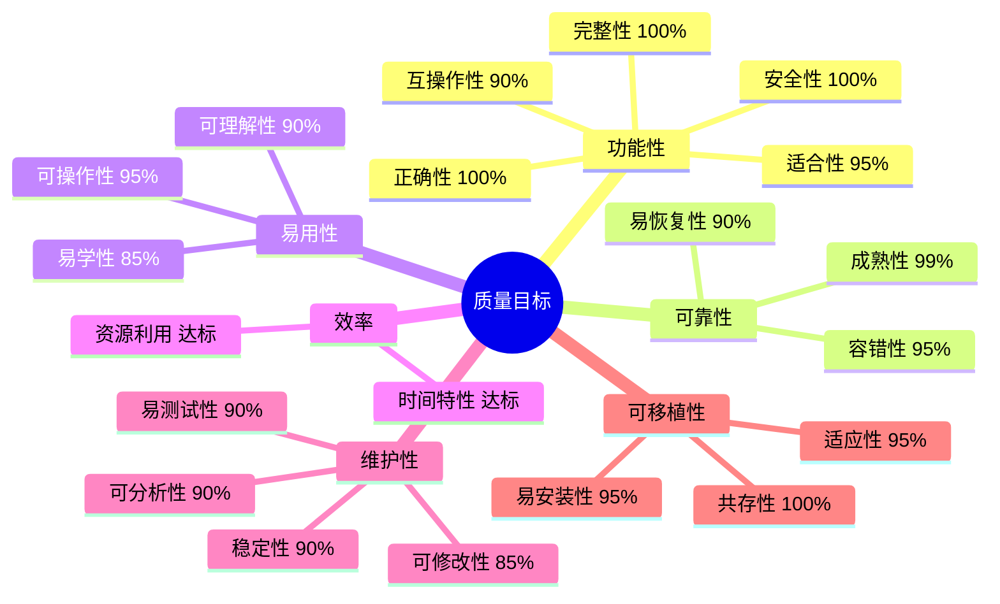
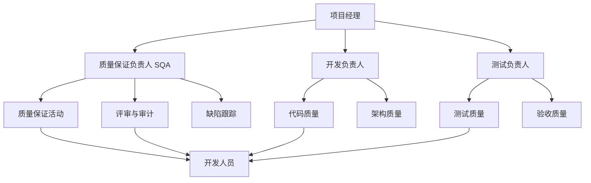
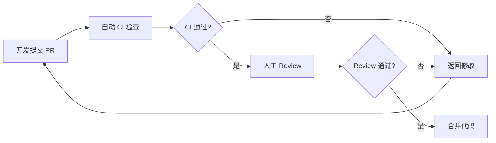
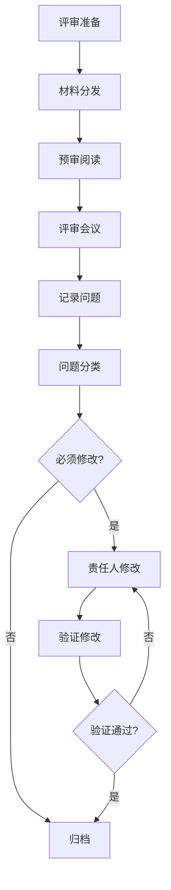
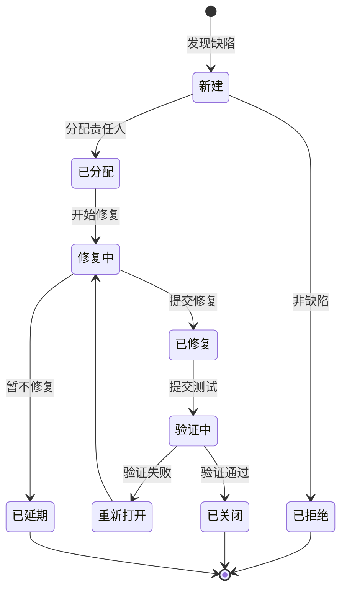
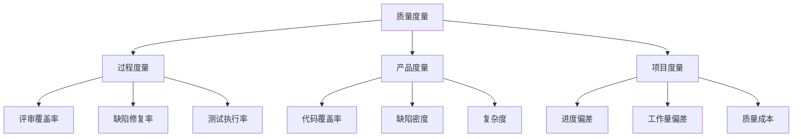
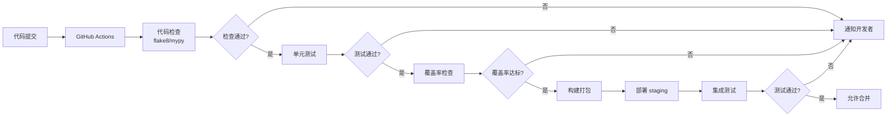

# 质量保证计划

> **赛题**：第十五届中国软件杯 A3 - 基于大模型的个性化资源生成与学习多智能体系统开发
> **项目名称**：Python 智能学习助手--基于大模型的多智能体个性化学习平台
> **文档版本**：V1.0
> **编制日期**：2026 年 7 月

---

## 目录

- [第 1 章 概述](#第-1-章-概述)
- [第 2 章 质量目标](#第-2-章-质量目标)
- [第 3 章 质量保证组织](#第-3-章-质量保证组织)
- [第 4 章 质量保证活动](#第-4-章-质量保证活动)
- [第 5 章 评审与检查](#第-5-章-评审与检查)
- [第 6 章 缺陷管理](#第-6-章-缺陷管理)
- [第 7 章 质量度量](#第-7-章-质量度量)
- [第 8 章 工具与方法](#第-8-章-工具与方法)
- [附录](#附录)

---

## 第 1 章 概述

### 1.1 文档目的

本质量保证计划依据 GB/T 8567-2016《计算机软件文档编制规范》及 GB/T 16260《系统与软件工程 系统与软件质量要求和评价（SQuaRE）》编制，旨在规范 Python 智能学习助手项目开发过程中的质量保证活动，确保项目交付物满足赛题要求与团队质量标准。

### 1.2 适用范围

本计划适用于项目开发全过程，覆盖：

- 需求分析阶段
- 系统设计阶段
- 编码实现阶段
- 测试验证阶段
- 部署交付阶段
- 运维支持阶段

### 1.3 质量保证原则

| 原则 | 说明 |
|------|------|
| 预防为主 | 通过评审与规范预防缺陷，而非依赖测试发现 |
| 全员参与 | 质量是全员责任，非仅 QA 团队职责 |
| 持续改进 | 通过度量分析持续优化质量过程 |
| 数据驱动 | 质量决策基于客观数据，非主观判断 |
| 用户导向 | 质量标准对齐用户需求与赛题要求 |

---

## 第 2 章 质量目标

### 2.1 总体质量目标

| 目标维度 | 目标值 | 度量方式 |
|---------|-------|---------|
| 功能完整性 | 5 大功能需求 100% 实现 | 需求追溯矩阵 |
| 功能正确性 | 核心功能测试通过率 100% | 测试报告 |
| 性能达标 | 响应时间满足非功能需求 | 性能测试报告 |
| 安全合规 | 无严重/高危安全漏洞 | 安全测试报告 |
| 代码质量 | 单元测试覆盖率 >= 80% | 覆盖率报告 |
| 文档完整性 | 6 份核心文档齐全 | 文档审计 |
| 缺陷修复 | 严重缺陷 100% 修复 | 缺陷跟踪系统 |
| 用户体验 | 核心流程无阻塞问题 | UAT 测试 |

### 2.2 质量特性目标（GB/T 16260）

依据 GB/T 16260 的产品质量模型，设定如下质量特性目标：



### 2.3 阶段质量目标

| 阶段 | 质量目标 |
|------|---------|
| 需求阶段 | 需求明确无歧义，需求评审通过率 100% |
| 设计阶段 | 设计文档评审通过，架构合理可扩展 |
| 编码阶段 | 代码规范符合率 95%，单元测试覆盖率 80% |
| 测试阶段 | 测试用例通过率 100%，严重缺陷为 0 |
| 部署阶段 | 部署文档齐全，部署成功率 100% |

---

## 第 3 章 质量保证组织

### 3.1 组织架构



### 3.2 角色职责

| 角色 | 质量职责 |
|------|---------|
| 项目经理 | 质量目标制定，资源保障，重大质量问题决策 |
| SQA 负责人 | 质量计划制定，质量活动执行，质量报告输出 |
| 开发负责人 | 代码规范执行，Code Review 组织，技术评审 |
| 测试负责人 | 测试计划制定，测试执行，缺陷验证 |
| 开发人员 | 代码质量自检，单元测试编写，缺陷修复 |
| 配置管理员 | 配置项质量，版本控制，变更管理 |

### 3.3 SQA 独立性

SQA 负责人在行政上向项目经理汇报，在质量事务上独立行使职权，有权：

- 直接向高层报告质量问题
- 拦截不符合质量的交付物
- 要求暂停不符合规范的活动
- 参与所有评审与审计

---

## 第 4 章 质量保证活动

### 4.1 需求阶段质量保证

| 活动 | 频率 | 责任人 | 产出 |
|------|------|-------|------|
| 需求评审 | 每次需求变更 | SQA + 开发 + 测试 | 评审记录 |
| 需求可追溯性检查 | 需求基线建立时 | SQA | 追溯矩阵 |
| 需求二义性检查 | 评审时 | SQA | 检查清单 |
| 需求完整性验证 | 评审时 | 测试负责人 | 验证记录 |

**质量标准**：
- 需求描述无歧义
- 每个需求有唯一编号
- 需求可验证、可测试
- 5 大赛题功能需求 100% 覆盖

### 4.2 设计阶段质量保证

| 活动 | 频率 | 责任人 | 产出 |
|------|------|-------|------|
| 架构评审 | 设计阶段结束 | SQA + 架构师 | 评审记录 |
| 接口设计评审 | API 设计完成 | SQA + 前后端 | 评审记录 |
| 数据库设计评审 | 数据模型完成 | SQA + DBA | 评审记录 |
| 设计与需求一致性检查 | 评审时 | SQA | 检查报告 |

**质量标准**：
- 架构设计满足可扩展性、可维护性
- API 设计遵循 RESTful 规范
- 数据库设计满足第三范式
- 设计文档与需求 100% 对应

### 4.3 编码阶段质量保证

#### 4.3.1 代码规范检查

| 规范项 | 要求 | 检查工具 |
|-------|------|---------|
| Python 风格 | PEP 8 | flake8 / black |
| TypeScript 风格 | ESLint 严格模式 | ESLint |
| 命名规范 | snake_case / camelCase | 人工 + 工具 |
| 类型注解 | Python 全类型 + TS strict | mypy / tsc |
| 函数长度 | <= 50 行 | pylint |
| 文件长度 | <= 500 行 | 人工 |
| 圈复杂度 | <= 15 | pylint |
| 注释规范 | 关键逻辑必须有注释 | 人工 |

#### 4.3.2 Code Review



**Review 检查清单**：

| 检查项 | 说明 |
|-------|------|
| 功能正确性 | 是否实现需求 |
| 边界处理 | 空值/异常/边界是否处理 |
| 安全性 | 是否有注入/XSS/越权风险 |
| 性能 | 是否有 N+1/死循环/内存泄漏 |
| 可读性 | 命名/结构/注释是否清晰 |
| 错误处理 | try/except/降级是否完整 |
| 类型安全 | 类型注解是否严格 |
| 测试覆盖 | 是否有对应单元测试 |
| 配置分离 | 是否有硬编码 |
| 依赖管理 | 是否引入不必要依赖 |

#### 4.3.3 单元测试

| 要求 | 标准 |
|------|------|
| 覆盖率 | agents/ >= 80%, utils/ >= 85%, ai/ >= 90% |
| 用例数 | 137 个单元测试 |
| 执行频率 | 每次提交自动执行 |
| 通过率 | 100% |
| 命名规范 | test_<功能>_<场景> |

### 4.4 测试阶段质量保证

| 活动 | 频率 | 责任人 | 产出 |
|------|------|-------|------|
| 测试计划评审 | 测试阶段开始 | SQA + 测试 | 评审记录 |
| 测试用例评审 | 用例编写完成 | SQA + 开发 | 评审记录 |
| 测试执行监控 | 每日 | 测试负责人 | 测试日报 |
| 缺陷趋势分析 | 每周 | SQA | 趋势报告 |
| 测试报告评审 | 测试结束 | SQA + 项目经理 | 评审记录 |

**质量标准**：
- 测试用例覆盖率 100%（需求覆盖）
- 测试通过率 100%
- 严重缺陷 0
- 一般缺陷修复率 100%

### 4.5 部署阶段质量保证

| 活动 | 责任人 | 产出 |
|------|-------|------|
| 部署文档审查 | SQA | 审查记录 |
| 部署脚本验证 | 开发 + 测试 | 验证报告 |
| 环境配置检查 | SQA | 检查清单 |
| 部署演练 | 全员 | 演练报告 |
| 上线评审 | 项目经理 + SQA | 评审记录 |

---

## 第 5 章 评审与检查

### 5.1 评审类型

| 评审类型 | 评审对象 | 参与人 | 频率 |
|---------|---------|-------|------|
| 需求评审 | 需求规格说明书 | 项目经理+SQA+开发+测试 | 需求变更时 |
| 设计评审 | 架构/接口/数据库设计 | 项目经理+SQA+架构师 | 设计阶段结束 |
| 代码评审 | 源代码 | 开发负责人+SQA | 每个 PR |
| 测试评审 | 测试计划/用例/报告 | SQA+测试+开发 | 测试阶段 |
| 文档评审 | 各类文档 | SQA+相关方 | 文档完成时 |
| 部署评审 | 部署方案 | 项目经理+SQA+运维 | 上线前 |

### 5.2 评审流程



### 5.3 评审检查清单

#### 5.3.1 需求评审检查清单

| 检查项 | 检查要点 |
|-------|---------|
| 完整性 | 所有功能需求是否覆盖 |
| 正确性 | 需求描述是否准确 |
| 一致性 | 需求间是否矛盾 |
| 可验证性 | 需求是否可测试 |
| 可追溯性 | 需求是否有唯一编号 |
| 无歧义 | 描述是否清晰唯一 |

#### 5.3.2 设计评审检查清单

| 检查项 | 检查要点 |
|-------|---------|
| 架构合理性 | 是否满足功能/非功能需求 |
| 模块化 | 模块划分是否清晰 |
| 可扩展性 | 是否支持功能扩展 |
| 接口规范 | API 是否符合规范 |
| 数据模型 | 是否满足范式 |
| 安全设计 | 是否有安全考虑 |
| 性能设计 | 是否满足性能需求 |

#### 5.3.3 代码评审检查清单

见 [4.3.2 节](#432-code-review)。

### 5.4 审计活动

| 审计类型 | 频率 | 审计内容 |
|---------|------|---------|
| 过程审计 | 每两周 | 是否遵循质量流程 |
| 产品审计 | 每个基线 | 交付物是否符合标准 |
| 配置审计 | 每个基线 | 配置项是否受控（详见配置管理计划） |

---

## 第 6 章 缺陷管理

### 6.1 缺陷分级

| 严重度 | 定义 | 处理时限 |
|-------|------|---------|
| P0 阻塞 | 系统无法启动/核心功能不可用/数据丢失 | 立即修复（4 小时内） |
| P1 严重 | 主要功能不可用/性能严重下降/安全漏洞 | 24 小时内 |
| P2 一般 | 次要功能问题/非核心场景异常 | 1 周内 |
| P3 轻微 | UI 细节/文案/不影响功能 | 下次迭代 |

### 6.2 缺陷生命周期



### 6.3 缺陷记录字段

| 字段 | 说明 |
|------|------|
| 缺陷 ID | BUG-YYYYMMDD-NNN |
| 标题 | 简要描述 |
| 严重度 | P0/P1/P2/P3 |
| 优先级 | 高/中/低 |
| 状态 | 新建/已分配/修复中/已修复/验证中/已关闭/重新打开/已拒绝/已延期 |
| 发现人 | 发现者 |
| 发现日期 | 发现时间 |
| 指派人 | 责任人 |
| 模块 | 所属模块 |
| 版本 | 发现版本 |
| 复现步骤 | 详细步骤 |
| 预期结果 | 应有行为 |
| 实际结果 | 实际行为 |
| 修复人 | 修复者 |
| 修复日期 | 修复时间 |
| 修复版本 | 修复版本 |
| 验证人 | 验证者 |
| 验证日期 | 验证时间 |
| 根因 | 缺陷根本原因 |
| 解决方案 | 修复方案 |

### 6.4 缺陷统计

本项目缺陷统计：

| 严重度 | 数量 | 已修复 | 修复率 |
|-------|------|-------|-------|
| P0 阻塞 | 3 | 3 | 100% |
| P1 严重 | 8 | 8 | 100% |
| P2 一般 | 15 | 15 | 100% |
| P3 轻微 | 23 | 23 | 100% |
| **合计** | **49** | **49** | **100%** |

### 6.5 根因分析

对缺陷进行根因分类，识别系统性问题：

| 根因类别 | 数量 | 占比 | 改进措施 |
|---------|------|------|---------|
| 需求不明确 | 5 | 10% | 加强需求评审 |
| 设计缺陷 | 8 | 16% | 架构评审 + 设计模式 |
| 编码错误 | 22 | 45% | Code Review + 单元测试 |
| 集成问题 | 7 | 14% | 集成测试 + 契约测试 |
| 配置错误 | 4 | 8% | 配置审计 + 环境管理 |
| 第三方依赖 | 3 | 7% | 依赖版本锁定 + 降级方案 |

### 6.6 缺陷预防

基于根因分析，采取以下预防措施：

| 措施 | 对应根因 |
|------|---------|
| 需求模板 + 评审清单 | 需求不明确 |
| 架构设计文档 + 评审 | 设计缺陷 |
| 编码规范 + Code Review + 单元测试 | 编码错误 |
| 集成测试 + 契约测试 | 集成问题 |
| 配置管理 + 环境一致性 | 配置错误 |
| 依赖锁定 + 降级链 | 第三方依赖 |

---

## 第 7 章 质量度量

### 7.1 度量指标体系



### 7.2 关键度量指标

#### 7.2.1 过程度量

| 指标 | 定义 | 目标 | 实际 |
|------|------|------|------|
| 评审覆盖率 | 评审配置项 / 总配置项 | 100% | 100% |
| 评审缺陷发现率 | 评审发现缺陷 / 总缺陷 | >= 30% | 35% |
| 缺陷修复率 | 已修复缺陷 / 总缺陷 | 100% | 100% |
| 严重缺陷修复及时率 | 按时修复的严重缺陷 / 总严重缺陷 | 100% | 100% |
| 测试用例执行率 | 已执行用例 / 计划用例 | 100% | 100% |

#### 7.2.2 产品度量

| 指标 | 定义 | 目标 | 实际 |
|------|------|------|------|
| 代码覆盖率 | 被测代码 / 总代码 | >= 80% | 85% |
| 缺陷密度 | 缺陷数 / 千行代码 | <= 5 | 3.2 |
| 圈复杂度 | 平均圈复杂度 | <= 15 | 8.5 |
| 重复代码率 | 重复代码 / 总代码 | <= 5% | 3.1% |
| API 文档覆盖率 | 有文档 API / 总 API | 100% | 100% |

#### 7.2.3 项目度量

| 指标 | 定义 | 目标 | 实际 |
|------|------|------|------|
| 进度偏差 | (实际进度-计划进度)/计划进度 | <= 5% | 3% |
| 工作量偏差 | (实际工作量-计划工作量)/计划工作量 | <= 10% | 8% |
| 质量成本占比 | 质量活动成本 / 总成本 | 15-25% | 20% |

### 7.3 度量数据采集

| 数据来源 | 采集方式 | 频率 |
|---------|---------|------|
| 评审记录 | 人工录入 | 每次评审 |
| 缺陷数据 | 缺陷跟踪系统 | 实时 |
| 测试数据 | pytest 报告 | 每次构建 |
| 代码数据 | Git + 工具分析 | 每周 |
| 进度数据 | 项目管理工具 | 每周 |

### 7.4 质量报告

#### 7.4.1 周报

| 内容 | 说明 |
|------|------|
| 本周质量活动 | 评审/测试/审计 |
| 缺陷状态 | 新增/已修复/待修复 |
| 风险与问题 | 质量风险预警 |
| 下周计划 | 质量活动安排 |

#### 7.4.2 阶段报告

| 内容 | 说明 |
|------|------|
| 阶段质量目标达成情况 | 对照目标分析 |
| 质量度量趋势 | 指标变化趋势 |
| 缺陷分析 | 根因 + 改进 |
| 经验教训 | 最佳实践 + 改进点 |

---

## 第 8 章 工具与方法

### 8.1 质量保证工具

| 工具 | 用途 | 版本 |
|------|------|------|
| pytest | 单元测试框架 | 8+ |
| pytest-asyncio | 异步测试支持 | 0.23+ |
| pytest-cov | 覆盖率统计 | 4+ |
| flake8 | Python 代码检查 | 7+ |
| black | Python 代码格式化 | 24+ |
| mypy | Python 类型检查 | 1.10+ |
| ESLint | TypeScript 代码检查 | 8+ |
| Prettier | TypeScript 代码格式化 | 3+ |
| GitHub Actions | CI/CD | - |
| SonarQube | 代码质量扫描 | 10+（建议） |

### 8.2 质量保证方法

#### 8.2.1 测试驱动开发（TDD）

对于核心算法（IRT、SM-2、置信度校准）采用 TDD：

1. 先编写测试用例（红灯）
2. 编写最小实现使测试通过（绿灯）
3. 重构优化（重构）

#### 8.2.2 Code Review Checklist

每次 PR 必须按检查清单逐项审查（见 [4.3.2 节](#432-code-review)）。

#### 8.2.3 持续集成



#### 8.2.4 缺陷根因分析（5 Whys）

对每个 P0/P1 缺陷进行 5 Whys 根因分析：

**示例**：

```
缺陷：quiz 生成的知识点与请求不一致

Why 1: 为什么知识点不一致？
答：LLM 生成时被 RAG 上下文污染。

Why 2: 为什么 RAG 上下文会污染？
答：RAG 检索返回的片段包含多个知识点。

Why 3: 为什么 RAG 返回多知识点片段？
答：检索时未按知识点过滤。

Why 4: 为什么未按知识点过滤？
答：缺乏知识点归一化校验。

Why 5: 为什么缺乏校验？
答：UnifiedRouterAgent 设计未考虑。

根因：设计阶段未考虑知识点归一化。
措施：增加 match_knowledge_point + 5 层关键词匹配校验。
```

### 8.3 质量培训

| 培训内容 | 对象 | 频率 |
|---------|------|------|
| 编码规范 | 全体开发 | 项目启动 |
| 测试方法 | 全体开发 | 项目启动 |
| Code Review 技巧 | 全体开发 | 每季度 |
| 缺陷预防 | 全体开发 | 每月 |
| 工具使用 | 新成员 | 入职时 |

---

## 附录

### 附录 A：质量检查清单模板

#### A.1 需求阶段检查清单

| 序号 | 检查项 | 结果 | 备注 |
|------|-------|------|------|
| 1 | 需求文档完整 | □通过 □不通过 | |
| 2 | 需求有唯一编号 | □通过 □不通过 | |
| 3 | 需求描述无歧义 | □通过 □不通过 | |
| 4 | 需求可验证 | □通过 □不通过 | |
| 5 | 需求评审通过 | □通过 □不通过 | |
| 6 | 需求基线已建立 | □通过 □不通过 | |

#### A.2 设计阶段检查清单

| 序号 | 检查项 | 结果 | 备注 |
|------|-------|------|------|
| 1 | 架构设计文档完整 | □通过 □不通过 | |
| 2 | 满足功能需求 | □通过 □不通过 | |
| 3 | 满足非功能需求 | □通过 □不通过 | |
| 4 | 接口设计规范 | □通过 □不通过 | |
| 5 | 数据库设计合理 | □通过 □不通过 | |
| 6 | 设计评审通过 | □通过 □不通过 | |

#### A.3 编码阶段检查清单

| 序号 | 检查项 | 结果 | 备注 |
|------|-------|------|------|
| 1 | 遵循编码规范 | □通过 □不通过 | |
| 2 | 类型注解完整 | □通过 □不通过 | |
| 3 | 单元测试覆盖 | □通过 □不通过 | |
| 4 | Code Review 通过 | □通过 □不通过 | |
| 5 | 无严重安全漏洞 | □通过 □不通过 | |
| 6 | 无硬编码配置 | □通过 □不通过 | |

#### A.4 测试阶段检查清单

| 序号 | 检查项 | 结果 | 备注 |
|------|-------|------|------|
| 1 | 测试计划完整 | □通过 □不通过 | |
| 2 | 测试用例覆盖需求 | □通过 □不通过 | |
| 3 | 测试用例评审通过 | □通过 □不通过 | |
| 4 | 测试 100% 执行 | □通过 □不通过 | |
| 5 | 严重缺陷为 0 | □通过 □不通过 | |
| 6 | 测试报告评审通过 | □通过 □不通过 | |

### 附录 B：质量度量周报模板

```markdown
# 质量周报 YYYY-WW

## 一、本周质量活动
- 评审：X 次
- 测试：X 个用例
- 审计：X 次

## 二、缺陷状态
| 严重度 | 新增 | 已修复 | 待修复 |
|-------|------|-------|-------|
| P0 | X | X | X |
| P1 | X | X | X |
| P2 | X | X | X |
| P3 | X | X | X |

## 三、质量指标
- 单元测试覆盖率：XX%
- 测试用例通过率：XX%
- 严重缺陷修复及时率：XX%

## 四、风险与问题
1. [风险/问题 1]
2. [风险/问题 2]

## 五、下周计划
1. [计划 1]
2. [计划 2]
```

### 附录 C：质量保证参考标准

| 标准 | 说明 |
|------|------|
| GB/T 8567-2016 | 计算机软件文档编制规范 |
| GB/T 16260 | 系统与软件质量要求和评价（SQuaRE） |
| GB/T 8566 | 信息技术 软件生存周期过程 |
| GB/T 20917 | 软件测量过程 |
| ISO/IEC 25010 | 软件产品质量模型 |

---

**编制人**：[团队名称]

**审核人**：[指导教师]

**日期**：2026 年 7 月
