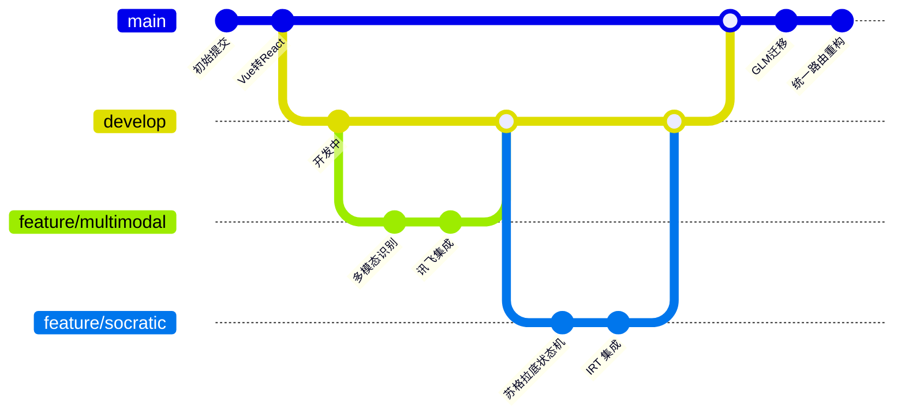
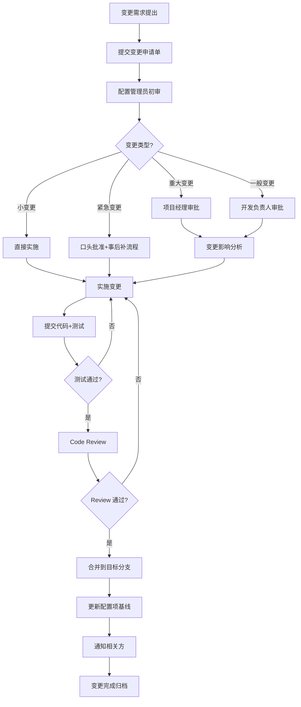

# 配置管理计划

> **赛题**：第十五届中国软件杯 A3 - 基于大模型的个性化资源生成与学习多智能体系统开发
> **项目名称**：Python 智能学习助手--基于大模型的多智能体个性化学习平台
> **文档版本**：V1.0
> **编制日期**：2026 年 7 月

---

## 目录

- [第 1 章 概述](#第-1-章-概述)
- [第 2 章 配置项识别](#第-2-章-配置项识别)
- [第 3 章 版本控制策略](#第-3-章-版本控制策略)
- [第 4 章 变更管理流程](#第-4-章-变更管理流程)
- [第 5 章 配置审计](#第-5-章-配置审计)
- [第 6 章 配置库管理](#第-6-章-配置库管理)
- [附录](#附录)

---

## 第 1 章 概述

### 1.1 文档目的

本配置管理计划依据 GB/T 8567-2016《计算机软件文档编制规范》编制，旨在规范 Python 智能学习助手项目开发过程中的配置管理活动，确保项目全生命周期中各配置项的完整性、一致性和可追溯性。

### 1.2 适用范围

本计划适用于项目开发、测试、部署、运维全过程，覆盖：

- 源代码（前后端）
- 配置文件
- 文档
- 测试用例与数据
- 依赖清单
- 部署脚本
- 数据库结构
- Prompt 模板

### 1.3 配置管理目标

| 目标 | 说明 |
|------|------|
| 完整性 | 所有配置项可识别、可追溯、不可丢失 |
| 一致性 | 配置项版本与依赖关系明确一致 |
| 可追溯性 | 任何变更可追溯到需求/缺陷/任务 |
| 可重现性 | 任意历史版本可重新构建部署 |
| 协同性 | 多人协作不冲突，变更可审查 |

### 1.4 配置管理组织

| 角色 | 职责 |
|------|------|
| 项目经理 | 配置管理计划审批，资源配置 |
| 配置管理员（CM） | 配置库维护、变更审核、审计执行 |
| 开发负责人 | 代码配置项识别、分支策略执行 |
| 测试负责人 | 测试配置项管理、版本验证 |
| 开发人员 | 遵守配置管理规范、提交变更申请 |

---

## 第 2 章 配置项识别

### 2.1 配置项分类

```mermaid
flowchart TB
    A[配置项] --> B1[源代码类]
    A --> B2[文档类]
    A --> B3[配置文件类]
    A --> B4[测试类]
    A --> B5[环境与依赖类]
    A --> B6[数据类]

    B1 --> C1[后端 Python 代码]
    B1 --> C2[前端 TypeScript/React 代码]
    B1 --> C3[Agent 实现]
    B1 --> C4[API 路由]
    B1 --> C5[ORM 模型]

    B2 --> C6[需求文档]
    B2 --> C7[设计文档]
    B2 --> C8[测试文档]
    B2 --> C9[用户手册]
    B2 --> C10[AI Coding 说明]

    B3 --> C11[.env 配置]
    B3 --> C12[config/ 配置]
    B3 --> C13[36 个 Prompt 模板]
    B3 --> C14[Dockerfile]
    B3 --> C15[docker-compose.yml]

    B4 --> C16[单元测试]
    B4 --> C17[E2E 测试]
    B4 --> C18[测试数据]

    B5 --> C19[requirements.txt]
    B5 --> C20[package.json]
    B5 --> C21[.env.example]

    B6 --> C22[知识库教材]
    B6 --> C23[知识图谱种子]
    B6 --> C24[题库]
```



### 2.2 配置项清单

#### 2.2.1 源代码配置项

| 配置项 ID | 名称 | 路径 | 类型 | 负责人 |
|----------|------|------|------|-------|
| CODE-BE-001 | 后端主程序 | main.py / start.py | Python | 后端组 |
| CODE-BE-002 | API 应用入口 | api/app.py | Python | 后端组 |
| CODE-BE-003 | API 路由模块 | api/routes/*.py（16 个） | Python | 后端组 |
| CODE-BE-004 | API Schema | api/schemas.py | Python | 后端组 |
| CODE-AG-001 | Agent 基类 | agents/base_agent.py | Python | AI 组 |
| CODE-AG-002 | 统一路由 Agent | agents/unified_router_agent.py | Python | AI 组 |
| CODE-AG-003 | 苏格拉底工作流 | agents/socratic_workflow.py | Python | AI 组 |
| CODE-AG-004 | 业务 Agent 集群 | agents/{quiz,code,mindmap,video,path,tutor,...}.py | Python | AI 组 |
| CODE-AI-001 | AI 引擎层 | ai/{adaptive_difficulty,learning_state,spaced_repetition,confidence_calibrator}.py | Python | AI 组 |
| CODE-DB-001 | 数据库引擎 | models/database.py | Python | 后端组 |
| CODE-DB-002 | ORM 模型 | models/*.py（16 个） | Python | 后端组 |
| CODE-UT-001 | 工具层 | utils/{llm_client,rag_utils,code_executor,behavior_tracker}.py | Python | 后端组 |
| CODE-GR-001 | LangGraph 编排 | graph/{workflow,checkpointer}.py | Python | AI 组 |
| CODE-CFG-001 | 配置层 | config/{settings,model_config,constants}.py | Python | 后端组 |
| CODE-FE-001 | 前端入口 | frontend/src/main.tsx | TypeScript | 前端组 |
| CODE-FE-002 | 路由配置 | frontend/src/router/index.tsx | TypeScript | 前端组 |
| CODE-FE-003 | 视图页面 | frontend/src/views/*.tsx（12 个） | TypeScript | 前端组 |
| CODE-FE-004 | UI 组件 | frontend/src/components/（13 个子目录） | TypeScript | 前端组 |
| CODE-FE-005 | 状态管理 | frontend/src/stores/*.ts（5 个） | TypeScript | 前端组 |
| CODE-FE-006 | SSE 流式处理 | frontend/src/composables/useSSE.ts | TypeScript | 前端组 |
| CODE-FE-007 | API 调用层 | frontend/src/api/*.ts（16 个） | TypeScript | 前端组 |

#### 2.2.2 文档配置项

| 配置项 ID | 名称 | 路径 | 状态 |
|----------|------|------|------|
| DOC-001 | 系统开发说明书 | 系统开发说明书.md | 受控 |
| DOC-002 | 测试说明书 | 测试说明书.md | 受控 |
| DOC-003 | AI Coding 工具使用说明 | AI_Coding工具使用说明.md | 受控 |
| DOC-004 | 用户手册 | 用户手册.md | 受控 |
| DOC-005 | 配置管理计划 | 配置管理计划.md | 受控 |
| DOC-006 | 质量保证计划 | 质量保证计划.md | 受控 |
| DOC-007 | 项目计划书 | 项目计划书.md | 受控 |
| DOC-008 | README | README.md | 受控 |
| DOC-009 | 项目进度报告 | progress.md | 非受控 |
| DOC-010 | 测试计划 | test_plan.md | 受控 |

#### 2.2.3 配置文件类

| 配置项 ID | 名称 | 路径 | 敏感性 |
|----------|------|------|-------|
| CFG-001 | 环境变量模板 | .env.example | 公开 |
| CFG-002 | 环境变量 | .env | 机密 |
| CFG-003 | 模型配置 | config/model_config.py | 公开 |
| CFG-004 | 全局常量 | config/constants.py | 公开 |
| CFG-005 | 应用设置 | config/settings.py | 公开 |
| CFG-006 | Prompt 模板 | config/prompts/*.txt（36 个） | 公开 |
| CFG-007 | Dockerfile | Dockerfile | 公开 |
| CFG-008 | docker-compose | docker-compose.yml | 公开 |
| CFG-009 | pytest 配置 | pytest.ini | 公开 |
| CFG-010 | 前端构建配置 | frontend/vite.config.ts | 公开 |
| CFG-011 | TypeScript 配置 | frontend/tsconfig.json | 公开 |
| CFG-012 | Tailwind 配置 | frontend/tailwind.config.js | 公开 |

#### 2.2.4 测试类配置项

| 配置项 ID | 名称 | 路径 |
|----------|------|------|
| TST-001 | 单元测试 | tests/*.py（9 个文件，137 用例） |
| TST-002 | 苏格拉底 E2E | test_socratic.py / test_e2e_socratic.py |
| TST-003 | 卡片 E2E | test_p0_cards.py / e2e_test_cards.py |
| TST-004 | 内容块 E2E | e2e_test_content_blocks.py |
| TST-005 | 测试 fixture | conftest.py |
| TST-006 | 测试数据 | data/question_bank.json |

#### 2.2.5 环境与依赖类

| 配置项 ID | 名称 | 路径 |
|----------|------|------|
| ENV-001 | Python 依赖 | requirements.txt |
| ENV-002 | 前端依赖 | frontend/package.json |
| ENV-003 | 前端锁文件 | frontend/package-lock.json |
| ENV-004 | Python 版本 | 3.10 |
| ENV-005 | Node 版本 | 20 LTS |

#### 2.2.6 数据类配置项

| 配置项 ID | 名称 | 路径 | 说明 |
|----------|------|------|------|
| DATA-001 | Python 教材 | data/knowledge_base/python_basics/*.md | 3 本教材 |
| DATA-002 | 知识图谱种子 | data/knowledge_catalog.py | 65 节点 + 68 边 |
| DATA-003 | 知识依赖 | data/knowledge_dependency.json | 依赖关系 |
| DATA-004 | 题库 | data/question_bank.json | 规则题库 |
| DATA-005 | 数据库 | data/database.db | 运行时数据 |
| DATA-006 | 向量库 | data/vector_db/ | ChromaDB 持久化 |
| DATA-007 | 用户记忆 | user_memory.json | 跨会话画像 |

### 2.3 配置项基线

项目设置以下基线：

| 基线名称 | 时机 | 包含内容 | 批准人 |
|---------|------|---------|-------|
| 需求基线 | 需求评审通过 | 需求规格说明书 | 项目经理 |
| 设计基线 | 设计评审通过 | 系统设计文档、数据库设计、API 设计 | 项目经理 |
| 代码基线 | 每次迭代结束 | 全部源代码、配置文件 | 开发负责人 |
| 测试基线 | 测试阶段开始 | 测试用例、测试数据、测试计划 | 测试负责人 |
| 产品基线 | 发布前 | 全部受控配置项 | 项目经理 |

---

## 第 3 章 版本控制策略

### 3.1 Git 版本控制

项目使用 Git 作为版本控制系统，托管于 GitHub。

**仓库地址**：`https://github.com/syb135792468-prog/syb111.git`

### 3.2 分支策略

采用简化的 Git Flow 模型：



| 分支类型 | 命名规范 | 用途 | 生命周期 |
|---------|---------|------|---------|
| `main` | main | 生产分支，可部署 | 永久 |
| `develop` | develop | 开发集成分支 | 永久 |
| `feature/*` | feature/功能名 | 功能开发 | 合并后删除 |
| `bugfix/*` | bugfix/缺陷号 | 缺陷修复 | 合并后删除 |
| `hotfix/*` | hotfix/缺陷号 | 生产紧急修复 | 合并后删除 |
| `release/*` | release/版本号 | 发布准备 | 永久 |

### 3.3 版本号规范

采用语义化版本号：`MAJOR.MINOR.PATCH`

| 版本号 | 说明 | 示例 |
|-------|------|------|
| MAJOR | 不兼容的 API 修改 | 1.0.0 -> 2.0.0 |
| MINOR | 向下兼容的功能新增 | 1.0.0 -> 1.1.0 |
| PATCH | 向下兼容的缺陷修复 | 1.0.0 -> 1.0.1 |

**当前版本**：V1.0.0

### 3.4 提交规范

#### 3.4.1 提交信息格式

```
<type>(<scope>): <subject>

<body>

<footer>
```

**type** 取值：

| 类型 | 说明 |
|------|------|
| feat | 新功能 |
| fix | 缺陷修复 |
| docs | 文档变更 |
| style | 代码格式（不影响功能） |
| refactor | 重构（非新增功能也非修复） |
| perf | 性能优化 |
| test | 测试相关 |
| build | 构建/依赖变更 |
| ci | CI 配置变更 |
| chore | 其他杂项 |

**scope** 取值（可选）：agent / api / models / ai / utils / frontend / config / docs / test

**示例**：

```
feat(agent): 新增苏格拉底导学工作流 11 节点状态机

- 实现 LangGraph StateGraph 编排
- 集成 IRT 自适应难度
- 支持 interrupt/Command 交互
- 添加安全阀防死循环机制

Closes #123
```

#### 3.4.2 提交粒度

- **小步提交**：每次提交对应一个独立逻辑变更
- **可独立构建**：每个提交应能成功构建与测试
- **原子性**：一个提交不混合多个无关变更

#### 3.4.3 提交频率

| 阶段 | 频率 |
|------|------|
| 功能开发中 | 每完成一个子功能提交 |
| 缺陷修复 | 修复一个提交一个 |
| 文档更新 | 每完成一节提交 |
| 重构 | 每个重构步骤提交 |

### 3.5 文件级版本控制

#### 3.5.1 Prompt 模板版本

每个 Prompt 模板文件在文件头维护版本注释：

```
# Prompt: tutoring_system
# Version: 1.2.0
# Last Updated: 2026-07-01
# Change: 增加画像适应提示词
```

#### 3.5.2 数据库结构版本

数据库结构变更通过 `_auto_migrate` 函数管理，变更记录在 `models/database.py` 的迁移逻辑中。

#### 3.5.3 API 版本

API 版本通过 URL 前缀 `/api` 控制。破坏性变更需新增 `/api/v2/` 前缀，保留旧版本兼容期。

---

## 第 4 章 变更管理流程

### 4.1 变更分类

| 变更类型 | 影响范围 | 审批级别 |
|---------|---------|---------|
| 重大变更 | 架构、核心 API、数据模型 | 项目经理 + 配置管理员 |
| 一般变更 | 功能模块、配置文件 | 开发负责人 |
| 小变更 | Bug 修复、样式调整 | 开发人员自查 |
| 紧急变更 | 生产故障修复 | 项目经理口头批准，事后补流程 |

### 4.2 变更流程



### 4.3 变更申请单

变更申请单包含以下内容：

| 字段 | 说明 |
|------|------|
| 变更 ID | 唯一标识（CR-YYYYMMDD-NNN） |
| 申请人 | 提出人 |
| 申请日期 | 提交日期 |
| 变更类型 | 重大/一般/小/紧急 |
| 变更内容 | 详细描述 |
| 变更原因 | 业务需求/缺陷修复/优化 |
| 影响配置项 | 受影响的配置项 ID 列表 |
| 影响分析 | 对功能/性能/进度的影响 |
| 回滚方案 | 变更失败时的恢复方案 |
| 审批人 | 项目经理/开发负责人 |
| 实施人 | 实际执行变更的人 |
| 验证人 | 验证变更结果的人 |
| 状态 | 申请中/已批准/实施中/已完成/已关闭/已驳回 |

### 4.4 代码变更规范

#### 4.4.1 分支创建

```bash
# 功能分支
git checkout develop
git pull origin develop
git checkout -b feature/socratic-workflow

# 缺陷修复分支
git checkout -b bugfix/quiz-kp-drift
```

#### 4.4.2 提交与推送

```bash
# 提交（遵循提交规范）
git add <specific-files>
git commit -m "feat(agent): 新增苏格拉底导学工作流"

# 推送
git push origin feature/socratic-workflow
```

#### 4.4.3 合并请求（PR）

- PR 标题遵循提交规范
- PR 描述包含：变更内容、测试方式、影响范围
- 至少 1 人 Code Review 通过
- CI 自动化测试通过
- 合并方式：squash merge（保持提交历史整洁）

### 4.5 文档变更规范

- 文档变更需同步更新版本号与日期
- 重大变更需在文档头变更记录中记录
- 受控文档变更需配置管理员审核

### 4.6 Prompt 模板变更规范

- Prompt 变更视为配置变更，需提交变更申请
- 变更前后需进行 A/B 对比测试
- 变更记录写入文件头注释
- 保留历史版本便于回滚

---

## 第 5 章 配置审计

### 5.1 审计目标

| 目标 | 说明 |
|------|------|
| 完整性审计 | 验证所有配置项都已纳入配置库 |
| 一致性审计 | 验证配置项版本与基线一致 |
| 可追溯性审计 | 验证变更记录与实际变更对应 |
| 合规性审计 | 验证配置管理活动符合规范 |

### 5.2 审计类型

| 类型 | 频率 | 审计人 |
|------|------|-------|
| 日常审计 | 每日 | 配置管理员 |
| 阶段审计 | 每个基线建立时 | 配置管理员 + 开发负责人 |
| 发布前审计 | 每次发布前 | 项目经理 + 配置管理员 |
| 专项审计 | 重大事件后 | 项目经理 |

### 5.3 审计内容

#### 5.3.1 完整性审计

| 检查项 | 检查方法 |
|-------|---------|
| 源代码是否全部入库 | `git status` 无未跟踪文件 |
| 文档是否齐全 | 对照配置项清单逐项核查 |
| 配置文件是否受控 | .env 不入 git，.env.example 入 git |
| Prompt 模板是否完整 | 36 个 .txt 文件齐全 |
| 测试用例是否覆盖 | 对照测试计划核查 |

#### 5.3.2 一致性审计

| 检查项 | 检查方法 |
|-------|---------|
| 代码与文档一致 | 文档描述的 API 与代码实现一致 |
| 前后端版本一致 | frontend/dist 与后端 API 版本匹配 |
| 依赖清单一致 | requirements.txt 与实际依赖一致 |
| 数据库结构与模型一致 | ORM 模型与实际数据库表结构一致 |

#### 5.3.3 可追溯性审计

| 检查项 | 检查方法 |
|-------|---------|
| 每个提交关联任务/缺陷 | 提交信息含 Closes #xxx |
| 每个变更有申请单 | 变更记录可查 |
| 每个基线有审批记录 | 基线建立记录可查 |
| 每个 PR 有 Review 记录 | PR 评论可查 |

### 5.4 审计报告

审计完成后输出审计报告，包含：

| 章节 | 内容 |
|------|------|
| 审计概述 | 审计时间、范围、审计人 |
| 审计依据 | 配置管理计划、配置项清单 |
| 审计结果 | 各项检查的通过/不通过 |
| 不符合项 | 详细描述与整改建议 |
| 整改计划 | 整改责任人、完成时间 |
| 审计结论 | 通过/有条件通过/不通过 |

### 5.5 不符合项管理

| 严重度 | 处理方式 |
|-------|---------|
| 严重 | 立即停止发布，24 小时内整改 |
| 一般 | 限期整改（1 周内） |
| 轻微 | 记录跟踪，下次迭代整改 |

---

## 第 6 章 配置库管理

### 6.1 配置库结构

```
PyCharmMiscProject/
├── .git/                       # Git 版本控制
├── .gitignore                  # Git 忽略规则
├── .env.example                # 环境变量模板（受控）
├── .env                        # 环境变量（不入 git）
│
├── agents/                     # Agent 层（受控）
├── ai/                         # AI 引擎层（受控）
├── api/                        # API 层（受控）
├── config/                     # 配置层（受控）
│   └── prompts/                # Prompt 模板（受控）
├── graph/                      # LangGraph 编排（受控）
├── models/                     # 数据模型（受控）
├── utils/                      # 工具层（受控）
├── services/                   # 服务层（受控）
├── tests/                      # 单元测试（受控）
├── frontend/                   # 前端代码（受控）
│   └── src/
│       ├── components/
│       ├── views/
│       ├── stores/
│       ├── composables/
│       ├── api/
│       └── router/
│
├── data/                       # 数据层
│   ├── knowledge_base/         # 教材（受控）
│   ├── knowledge_catalog.py    # 知识图谱种子（受控）
│   ├── question_bank.json      # 题库（受控）
│   ├── database.db             # 运行时数据库（不入 git）
│   └── vector_db/              # 向量库（不入 git）
│
├── docs/                       # 文档（受控）
│   ├── 系统开发说明书.md
│   ├── 测试说明书.md
│   ├── 用户手册.md
│   ├── 配置管理计划.md
│   ├── 质量保证计划.md
│   └── AI_Coding工具使用说明.md
│
├── scripts/                    # 脚本（受控）
│   ├── build_kb.py
│   └── init_knowledge_graph.py
│
├── .claude/                    # Claude Code 配置（不入 git）
├── backup/                     # 备份（不入 git）
├── logs/                       # 日志（不入 git）
├── generated/                  # 生成产物（不入 git）
│
├── Dockerfile                  # Docker 配置（受控）
├── docker-compose.yml          # Docker Compose（受控）
├── requirements.txt            # Python 依赖（受控）
├── pytest.ini                  # pytest 配置（受控）
├── conftest.py                 # pytest fixture（受控）
├── main.py                     # 主程序（受控）
└── start.py                    # 启动脚本（受控）
```

### 6.2 .gitignore 配置

```gitignore
# 环境与密钥
.env
*.key
*.pem

# 运行时数据
data/database.db
data/database.db.bak_*
data/vector_db/
user_memory.json

# 日志
logs/
*.log

# 备份
backup/
.dbg/
.trae/

# AI 工具配置
.claude/memory/

# 构建产物
frontend/dist/
frontend/node_modules/
__pycache__/
*.pyc
.venv/

# 测试产物
.pytest_cache/
htmlcov/
.coverage

# IDE
.idea/
.vscode/
*.iml
```

### 6.3 访问控制

| 角色 | 读权限 | 写权限 |
|------|-------|-------|
| 项目经理 | 全部 | 全部 |
| 配置管理员 | 全部 | 全部 |
| 开发负责人 | 全部 | 全部 |
| 开发人员 | 全部 | feature/bugfix 分支 |
| 测试人员 | 全部 | 测试相关文件 |
| 外部人员 | 无 | 无 |

### 6.4 备份策略

| 备份类型 | 频率 | 保留期 | 存储位置 |
|---------|------|-------|---------|
| Git 远程仓库 | 实时 | 永久 | GitHub |
| 数据库备份 | 每日 | 30 天 | backup/ |
| user_memory 备份 | 每次修改前 | 永久 | backup/user_memory_*.json |
| 配置库全量备份 | 每周 | 12 周 | 本地 + 云存储 |

### 6.5 灾难恢复

| 场景 | 恢复方式 |
|------|---------|
| 代码误删 | Git 历史恢复 |
| 数据库损坏 | 从最近备份恢复 |
| user_memory 损坏 | 从最新备份恢复 |
| 配置库丢失 | 从 Git 远程仓库克隆 |
| 向量库损坏 | 重新运行 `scripts/build_kb.py` |

---

## 附录

### 附录 A：变更申请单模板

```markdown
# 变更申请单 CR-YYYYMMDD-NNN

## 基本信息
- 申请人：xxx
- 申请日期：YYYY-MM-DD
- 变更类型：[重大/一般/小/紧急]
- 优先级：[高/中/低]

## 变更内容
- 变更配置项：[配置项 ID 列表]
- 变更描述：[详细描述]

## 变更原因
[业务需求/缺陷修复/性能优化/其他]

## 影响分析
- 功能影响：[影响哪些功能]
- 性能影响：[性能变化]
- 进度影响：[工期变化]
- 兼容性影响：[是否兼容旧版本]

## 回滚方案
[变更失败时的恢复步骤]

## 审批
- 审批人：xxx
- 审批日期：YYYY-MM-DD
- 审批意见：[同意/驳回/有条件同意]

## 实施记录
- 实施人：xxx
- 实施日期：YYYY-MM-DD
- 实施步骤：[详细步骤]

## 验证记录
- 验证人：xxx
- 验证日期：YYYY-MM-DD
- 验证结果：[通过/不通过]
- 验证说明：[详细说明]
```

### 附录 B：配置审计检查表

| 序号 | 检查项 | 检查方法 | 结果 | 备注 |
|------|-------|---------|------|------|
| 1 | 源代码全部入库 | git status 无未跟踪 | □通过 □不通过 | |
| 2 | 文档齐全 | 对照清单核查 | □通过 □不通过 | |
| 3 | .env 不入 git | .gitignore 配置正确 | □通过 □不通过 | |
| 4 | Prompt 模板完整 | 36 个 .txt 文件 | □通过 □不通过 | |
| 5 | 代码与文档一致 | API 描述与实现一致 | □通过 □不通过 | |
| 6 | 依赖清单一致 | requirements.txt 准确 | □通过 □不通过 | |
| 7 | 提交信息规范 | 遵循 type(scope):subject | □通过 □不通过 | |
| 8 | 每个提交关联任务 | Closes #xxx | □通过 □不通过 | |
| 9 | 每个 PR 有 Review | Review 评论可查 | □通过 □不通过 | |
| 10 | 备份策略执行 | 按频率备份 | □通过 □不通过 | |

### 附录 C：配置管理工具

| 工具 | 用途 | 版本 |
|------|------|------|
| Git | 版本控制 | 2.40+ |
| GitHub | 远程仓库托管 | - |
| Docker | 容器化 | 24+ |
| Docker Compose | 多容器编排 | 2.20+ |
| pytest | 测试框架 | 8+ |
| Vite | 前端构建 | 6+ |

---

**编制人**：[团队名称]

**审核人**：[指导教师]

**日期**：2026 年 7 月
